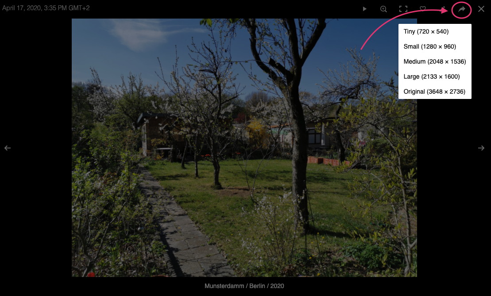
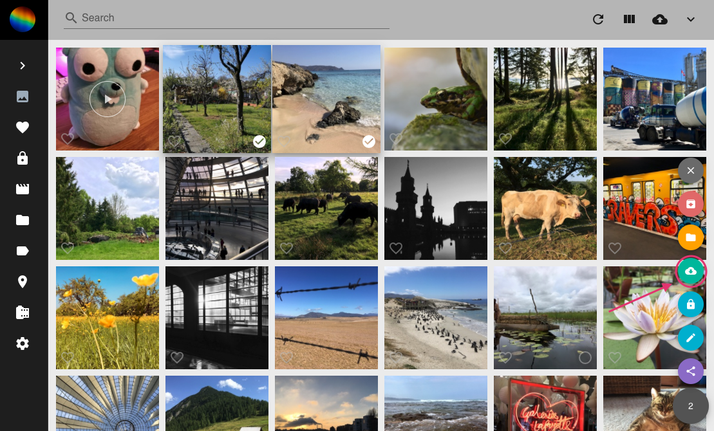

# Download #
PhotoPrisms download functionality lets you download your photos in 5 different sizes.

### Download single photo ###

1. Click on the photo.

    
    
2. In fullscreen mode click :material-download:.
3. Select a size.
    
    

### Download multiple photos ###

1. Select photos.
2. Click on the context menu.
3. Click :material-cloud-download:. Photos will be downloaded in original size.

    

!!! tip
    You can select many photos at once using shift.