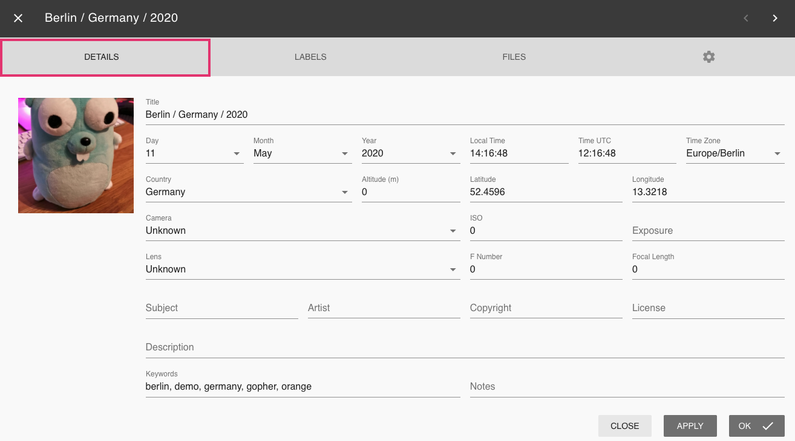
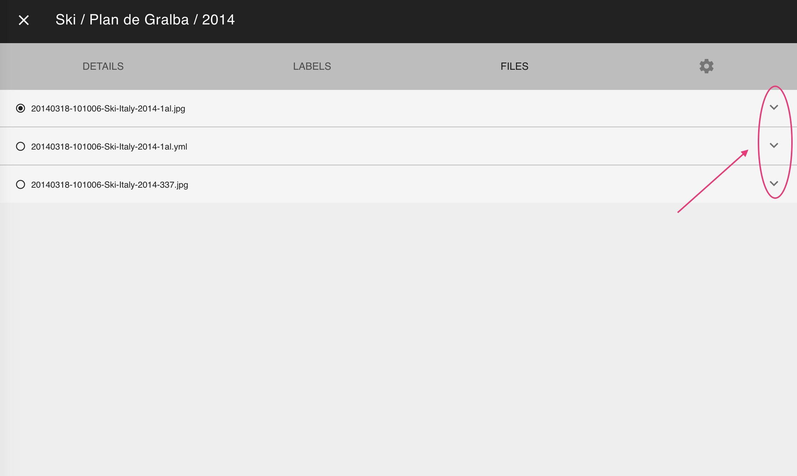

# Edit photo details #
PhotoPrisms *edit dialogue* enables you to add/edit various types of metadata related to your photos/videos.

During [*indexing*](../index.md) PhotoPrism collects as much data as possible from sidecar files and the photo itself.

### Open the edit dialogue ###

#### From card view ####

1. Click on the photos title, time or camera information

    

#### From full screen mode ####

1. In the upper right corner click :material-pencil:

    

#### From any view ####

1. Select one or multiple photos
2. Click on context menu
3. Click :material-pencil:

### Edit Details ###
In the edit dialogue's *Detail tab* you can view and edit the following data:

* Title
* Day
* Month
* Year
* UTC time
* UTC date
* Time zone
* Latitude
* Longitude
* Altitude
* Country
* Camera
* ISO
* Exposure
* Lens
* F Number
* Focal Length
* Subject
* Artist
* Copyright
* License
* Description
* Keywords
* Notes

*Apply* saves changes. *Ok* saves changes and closes edit dialogue.

!!! info
    Lots of metadata like labels, keywords, title, location, camera details are generated by PhotoPrism itself during indexing. 
    Once you change data manually PhotoPrism always keeps your data even if you index again.
    
!!! tip
    Every keyword can be used in PhotoPrisms search to find photos or videos.
    
### Edit Labels ###
In the edit dialogue's *Label tab* you can view and edit [*labels*](labels.md).

### Edit Files ###
In the edit dialogue's *Files tab* you see all files that belong to a photo.

In PhotoPrism a photo can consist of multiple files like a *raw file* + a *jpeg version* of this raw file + a related *xmp or json file*.

To open file details click :material-chevron-down:.

In case you have [*grouped files*](stacks.md) you can change the primary file or ungroup files using the respective buttons.

