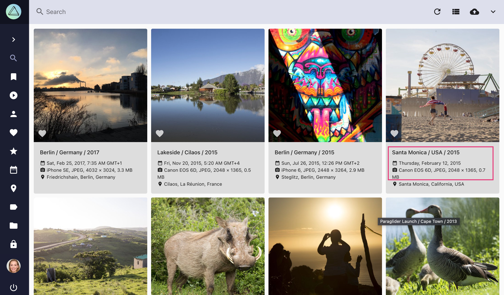
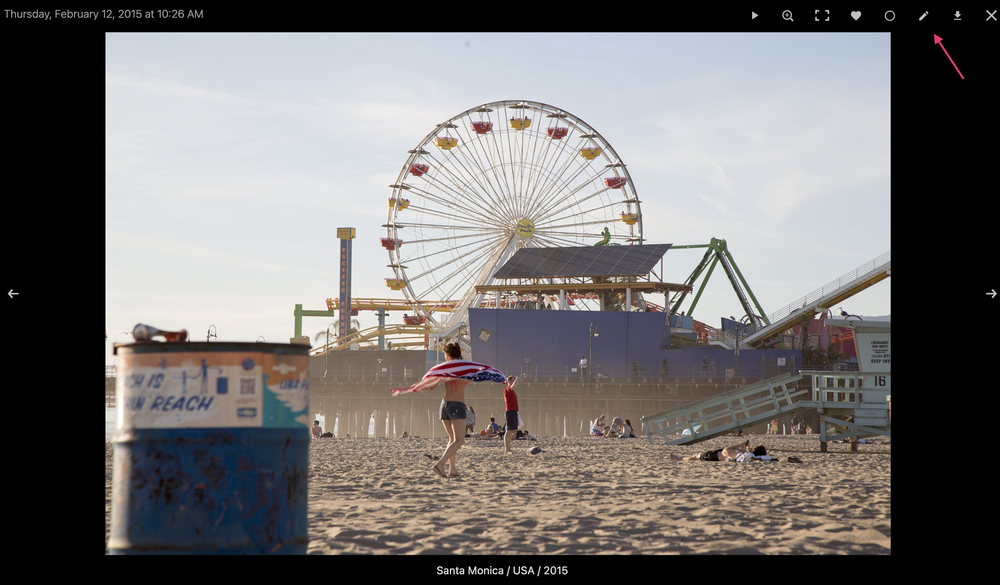
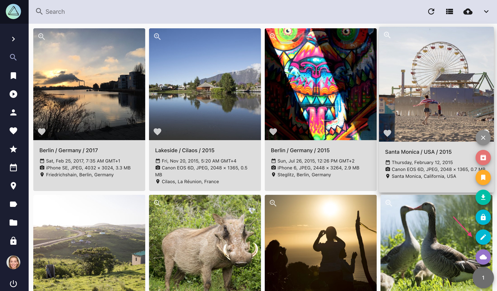
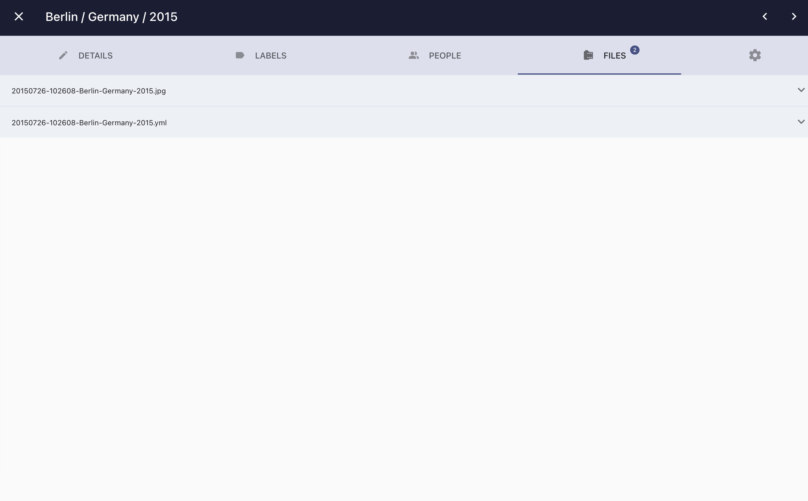
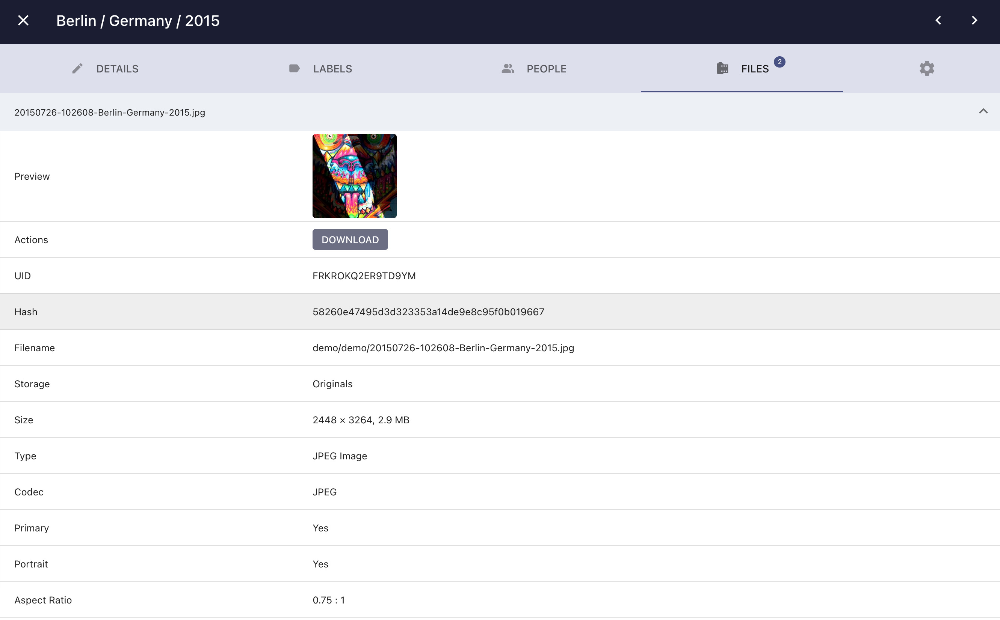

# Viewing and Editing Metadata

When you click on a title in the cards view or :material-pencil: in the full screen viewer, you can see all the metadata related to a picture and perform changes to it if you have permission to do so.

### Open the Dialog ###

=== "Cards View"
     1. Click on the title, date/time, or camera details of a picture

    { class="shadow" }

=== "Full Screen Viewer"
     1. Click on :material-pencil: in the upper right corner

    { class="shadow" }

=== "Context Menu"
     1. Select one or multiple pictures
     2. Click on context menu
     3. Click :material-pencil:

    { class="shadow" }

### Picture Details ###

In the *Details* tab, you can view and edit general information such as title, date, location, camera, lens, description, and copyright:

{ class="shadow" }

Much of this information is automatically recognized and updated while indexing. If you edit these fields, the changed values will be preserved and are not overwritten even when you reindex your library.

To quickly set new coordinates, you can paste them into *Latitude* or *Longitude* if they have the format *48.265684, 7.721380*.

Clicking the *Apply* button saves the changes you have made, but does not close the dialog, while the *Done* button saves your changes and closes the dialog.

!!! note ""
    When performing a text search, words in the *Title*, *Description*, and *Keywords* fields can be found, while *Notes* are private and will be ignored.
    
#### Geolocation Plugin ####

Geolocation Plugin is an [freely available extension](https://github.com/andyvalerio/photoprism-geolocation) that makes it easy to change latitude and longitude of a photo by selecting places on a graphical map. It can be [installed through the Chrome web store](https://chrome.google.com/webstore/detail/geolocation-plugin-for-ph/oggmpodnbdcmfiognbkkeffacpeaifch).

{ class="shadow" }
    
### Related Labels ###

In the *Labels* tab, you can [view, add and edit labels](labels.md) and see whether they have been recognized automatically or added manually.

### Related People ###

In the edit dialog's *People* tab you can view and [edit people](people.md).

### Related Files ###

In the edit dialog's *Files* tab you see all files that belong to a photo.

In PhotoPrism a photo can consist of multiple files like a *raw file* + a *jpeg version* of this raw file + a related *xmp or json file*.

{ class="shadow" }

To open file details click :material-chevron-down:.

{ class="shadow" }

In case you have [*stacked files*](stacks.md) you can change the primary file, delete not primary files, or unstack files using the action buttons.

