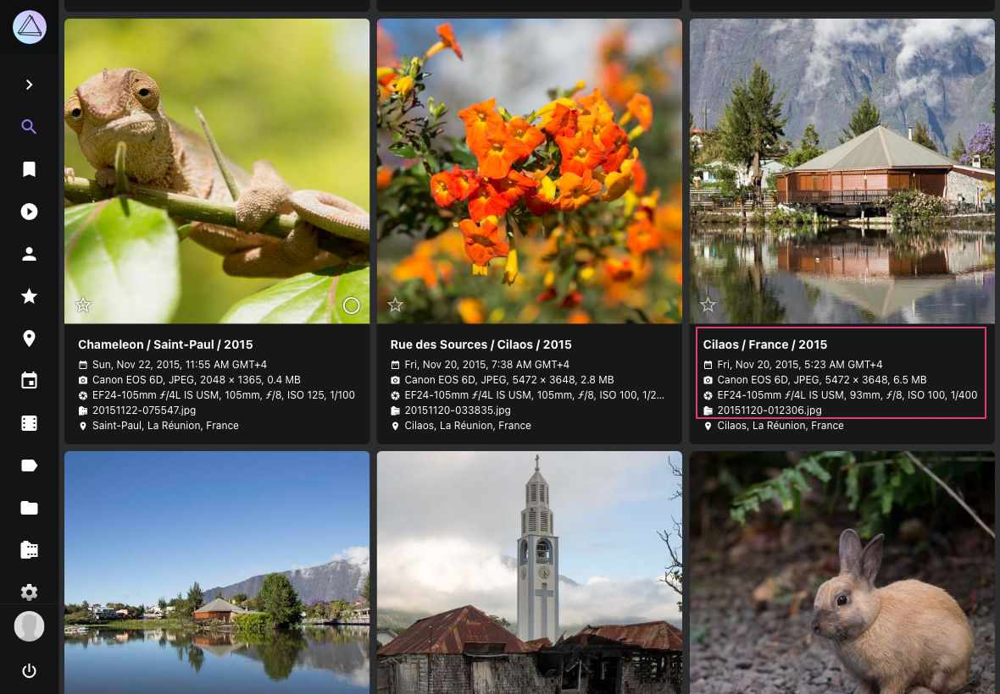
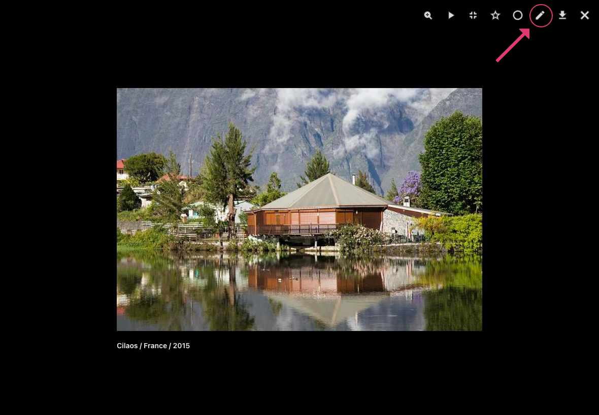
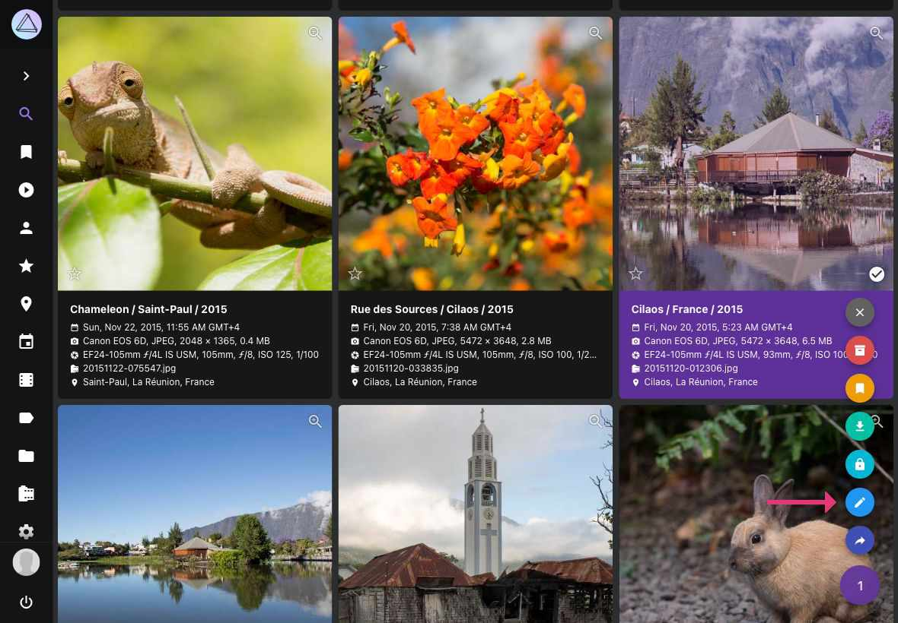
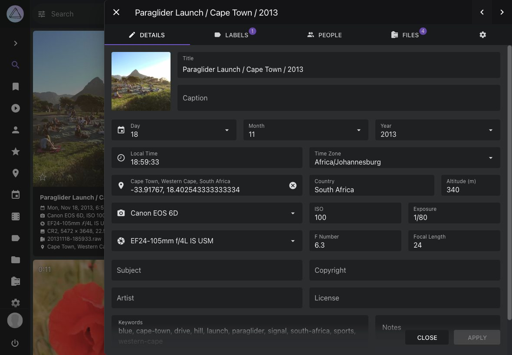
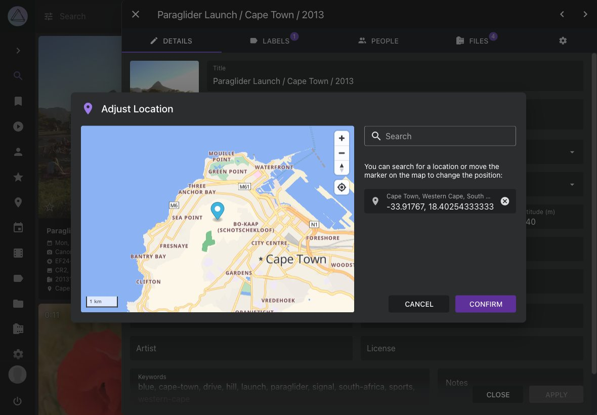

# Viewing and Editing Picture Details

When you click on a title in the cards view or :material-pencil: in the full screen viewer, you can see all the information related to a picture and perform changes to it if you have permission to do so.

=== "Cards View"
     1. Click on the title, date/time, or camera details of a picture

    { class="shadow" }

=== "Full Screen Viewer"
     1. Click on :material-pencil: in the upper right corner

    { class="shadow" }

    !!! tip "Keyboard Shortcut"
        In the fullscreen viewer, you can quickly open the edit dialog by pressing **Ctrl + E**.
=== "Context Menu"
     1. Select one or multiple pictures
     2. Click on context menu
     3. Click :material-pencil:

    { class="shadow" }

### Details ###

In the *Details* tab, you can view and edit general metadata such as title, date, location, camera, lens, caption, and copyright:

{ class="shadow" }

Much of this information is automatically recognized and updated while indexing. If you edit these fields, the changed values will be preserved and are not overwritten even when you reindex your library.

To quickly set new coordinates, you can paste them into the *Location* field if they have the format *48.265684, 7.721380*. Alternatively, you can click on the location marker icon next to this field to open the built-in location component and select a location visually.

Clicking the *Apply* button saves the changes you have made, but does not close the dialog, while the *Close* button closes the dialog without saving additional changes.

!!! note ""
    When performing a search, text in the *Title*, *Caption*, and *Keywords* fields can be found, while *Notes* are private and will be ignored.
    
**Location Selection**

PhotoPrism includes a location component that allows you to easily change the location coordinates of a picture by selecting its location on a map. Simply click on the :material-map-marker: icon next to the *Location* field to open the interactive map interface. You can also search for locations by typing city or street names directly in the map component.

{ class="shadow" }

!!! note ""
    With this built-in functionality, the [external geolocation browser plugin](https://github.com/andyvalerio/photoprism-geolocation) is no longer needed. We thank our community for their valuable contribution that inspired this feature!
    
### Labels ###

In the *Labels* tab, you can [view, add and edit labels](labels.md) and see whether they have been recognized automatically or added manually.

### People ###

Open the *People* tab to see [whose face has been recognized](people.md#change-people-assignments) in the picture and [assign names to faces](people.md#assign-names-to-faces) that have not yet been recognized.

### Files ###

The *Files* tab shows you all the files that belong to a picture. If it is a RAW image, you might for example also see a JPEG version of it and an XMP sidecar file:

{ class="shadow" }

Click on :material-chevron-down: to see additional details such as file size, type, and codec: 

{ class="shadow" }

If there is [more than one JPEG or PNG file](stacks.md), a button in the file details will allow you to change the primary image displayed as a preview in albums and search results. You can also delete non-primary files or [unstack files](stacks.md) by clicking on the action buttons.