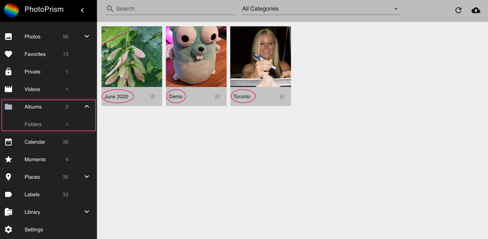

# Folders #
We automatically display all folders of your *originals directory* in the *Folders section*.
In case you add new files to your *originals directory* your folders will be updated.

The context menu allows you to perform the following actions:

## Delete folder ##
1. Select folder
2. Open context menu
3. Click :material-delete:
4. Confirm

!!! hint
    Only the representation of the folder will be deleted. Your files stay untouched.

## Download folder as zip ##
1. Select folder
2. Open context menu
3. Click :material-download:

## Create album from folder ##
1. Select folder
2. Open context menu
3. Click :material-folder:
4. Select existing album or enter new album name
5. Click *add to album*
