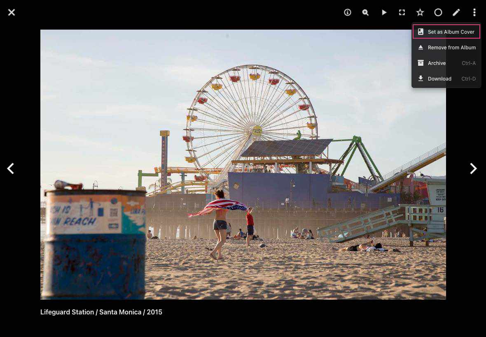

# Folders #
We automatically display all folders of your *originals directory* in the *Folders section*.
In case you add new files to your *originals directory* your folders will be updated.

{ class="shadow" }

The context menu allows you to perform the following actions:

## Download Folders ##
1. Select folder
2. Open context menu
3. Click :material-download:

## Create Albums from Folders ##
1. Select folder
2. Open context menu
3. Click :material-bookmark:
4. Select existing album or enter new album name
5. Click *add to album*

### Set Folder Cover ###

To set a cover image for a folder:

1. Open the folder by clicking on it in the Folders section.
2. Click on the photo you want to use as the cover.
3. When the photo opens, click :material-dots-vertical: in the upper right corner.
4. Select **Set as Album Cover** from the menu.

    { class="shadow" }

This will set the selected photo as the cover image for the folder.
