# Labels #
PhotoPrism uses labels to classify images.
Other tools use the term tags instead of labels.
Labels are set automatically when adding new photos. 
You can manually add new labels or edit/remove the ones that have been created by us.

In *Labels* you find all labels of your photos and videos. 
You can star labels by clicking :material-star:. Starred labels will be listed first.

PhotoPrism also attaches each generated label to a broader group (or category) of labels. For example, there is a general category 'vehicle' which will include labels such as 'cab', 'catamaran', 'lifeboat' and 'bullet train'. These broad label categories cannot be edited, but can be used in a search, in an identical way to all other labels.

You may wish to see these broad label categories in addition to the usual labels in the *Labels* pages. Clicking the icon in the upper right-hand corner will switch between turning them on :material-unfold-more-horizontal: ('Show More') and off :material-unfold-less-horizontal: ('Show Less'). You can also include these label categories as part of a more complex search filter - the label categories from your photos will appear in the search filter bar as a drop-down selection under the option 'All Categories'.

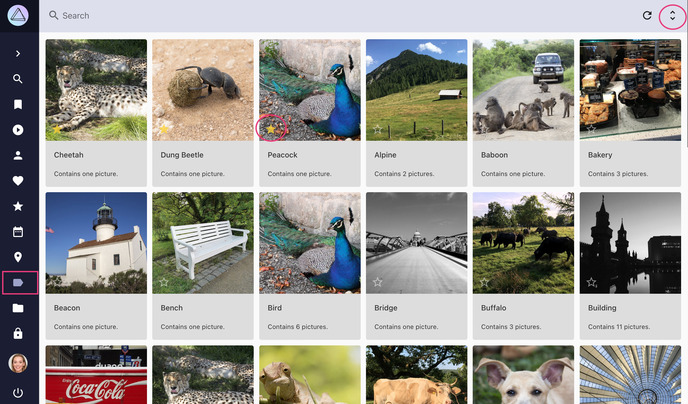{ class="shadow" }

### View all Photos with a Label ###
1. Go to *Labels*
2. Click on the label you are interested in

    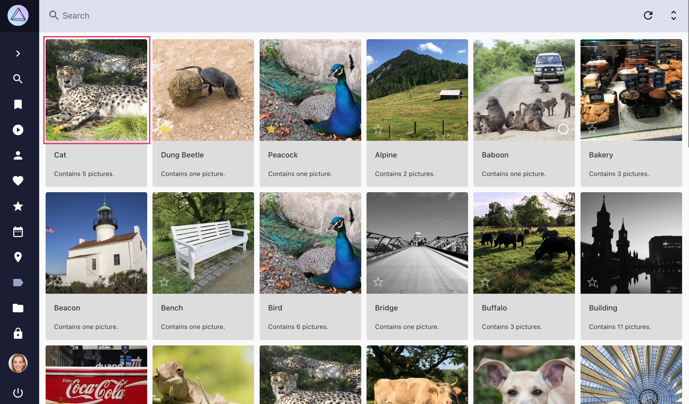{ class="shadow" }
    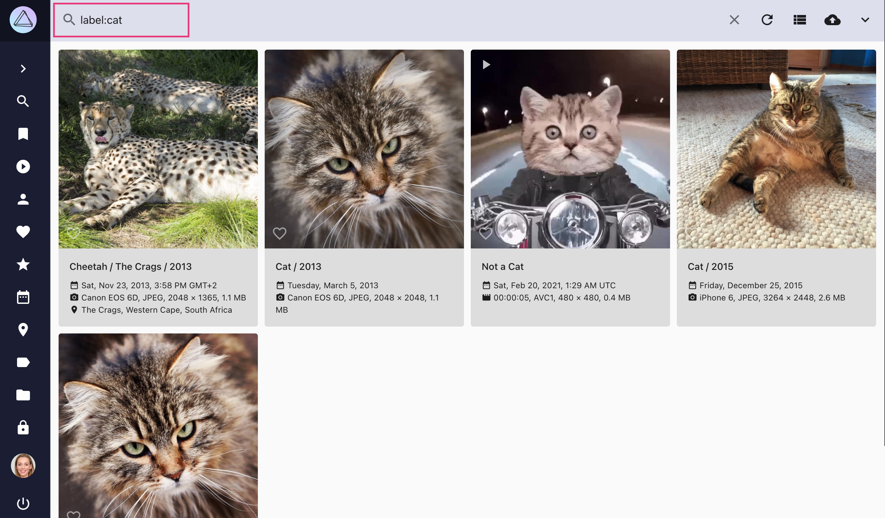{ class="shadow" }

!!! info ""
    Alternatively you can use the search field in Photos/Videos. You search for photos with a special label like this: `label:dog`.

### Add Labels to Photos ###

1. Go to the photo [*edit dialog*](edit.md)
2. Go to *Labels* tab
3. Click on the *label field* in the last row of the label table
4. Enter a label name
5. Click :material-plus: on the right side of this row

    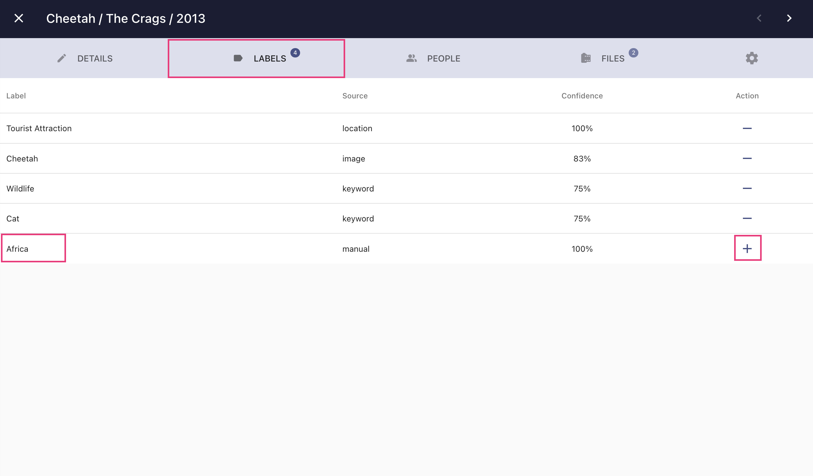{ class="shadow" }
    
### Remove/Delete Labels from Photos ###

Labels that have been set automatically can be removed.
Manually added labels can be deleted.

1. Go to the photo [*edit dialog*](edit.md)
2. Go to *Labels* tab
3. Click the :material-minus:/:material-delete: button of the label you want to remove/delete

    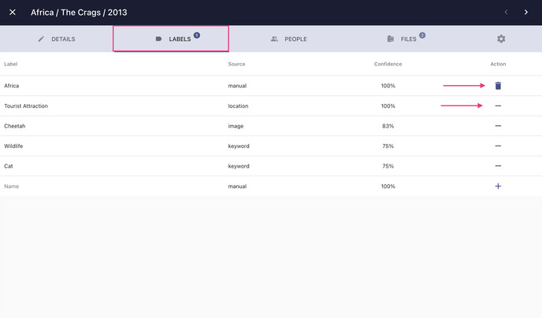{ class="shadow" }
    
!!! info ""
    Removed labels have a confidence of 0% and can be activated again at any time by clicking *add*.
    
   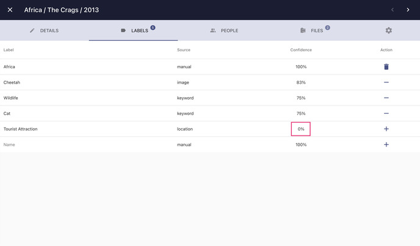{ class="shadow" }

!!! info ""
    You can hide Labels in [Settings](../settings/general.md)

### Rename Labels ###

1. Go to the photo [*edit dialog*](edit.md) of any photo that has the label you want to rename

    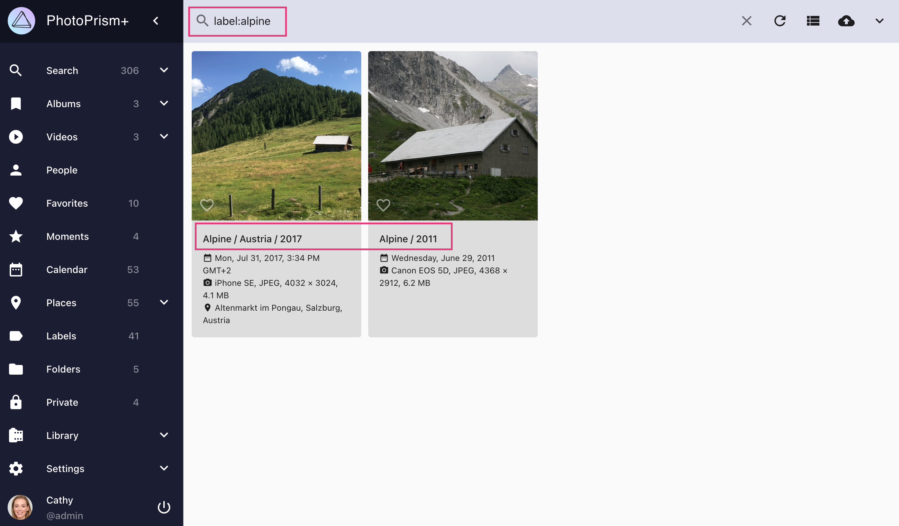{ class="shadow" }
    
2. Go to *Labels* tab
3. Click on the *label name* you want to change
4. Change the name and click *enter*

    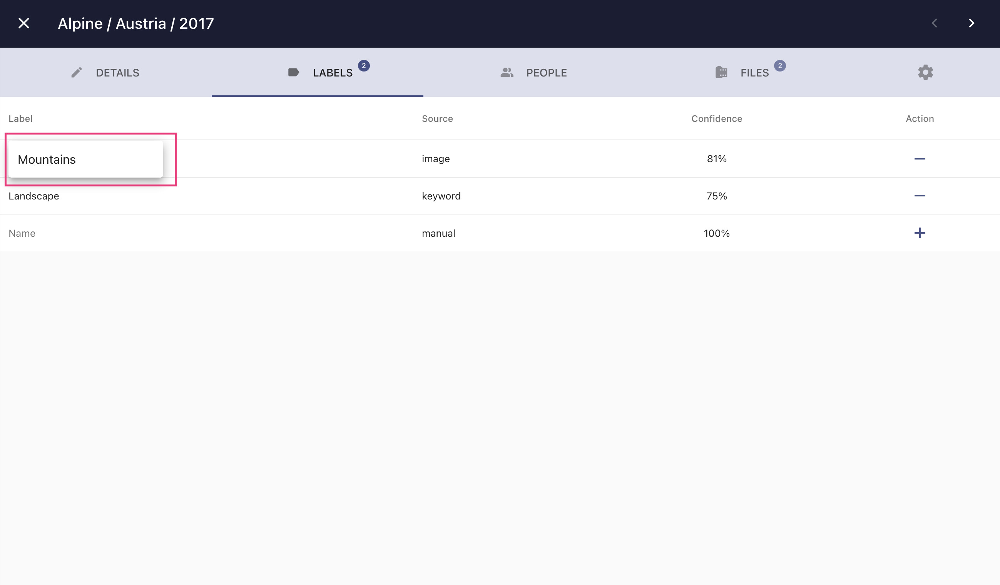{ class="shadow" }
    
    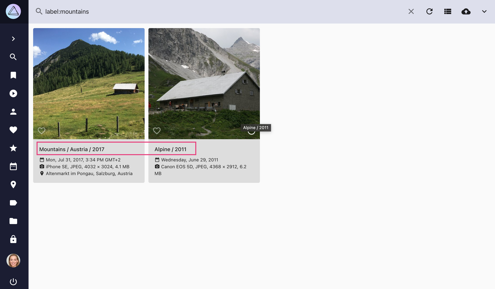{ class="shadow" }
    
5. The changes will be applied to all photos with this label after the next  [*indexing*](../index.md)

    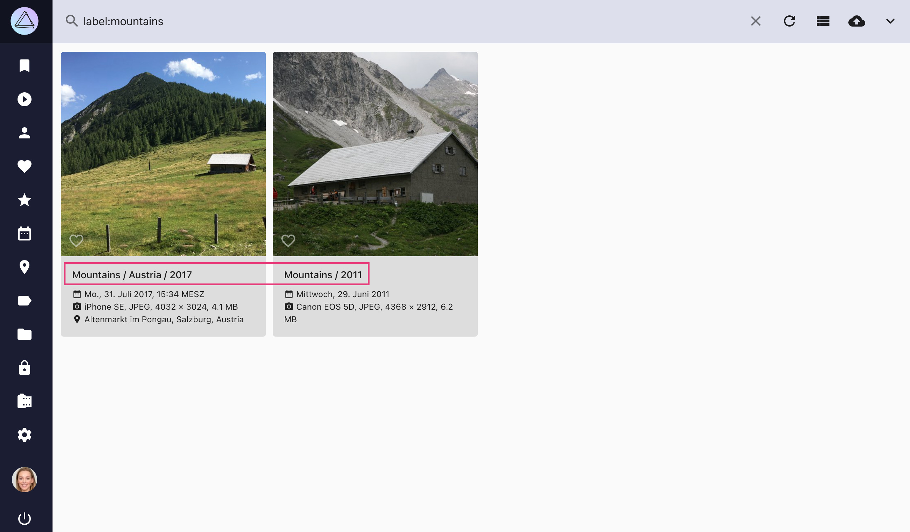{ class="shadow" }

!!! attention ""
    Be aware this change applies to all photos that have this label.

### Delete Labels ###
You can permanently delete a label. No file will get a deleted label set during indexing.

1. Go to *Labels*
2. Select the label you want to delete
3. Open the context menu
4. Click :material-delete:

    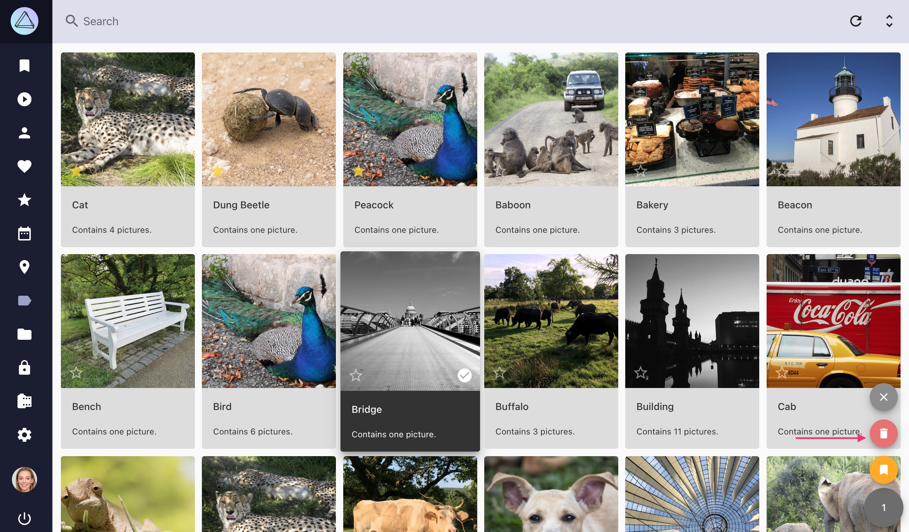{ class="shadow" }

5. Confirm

    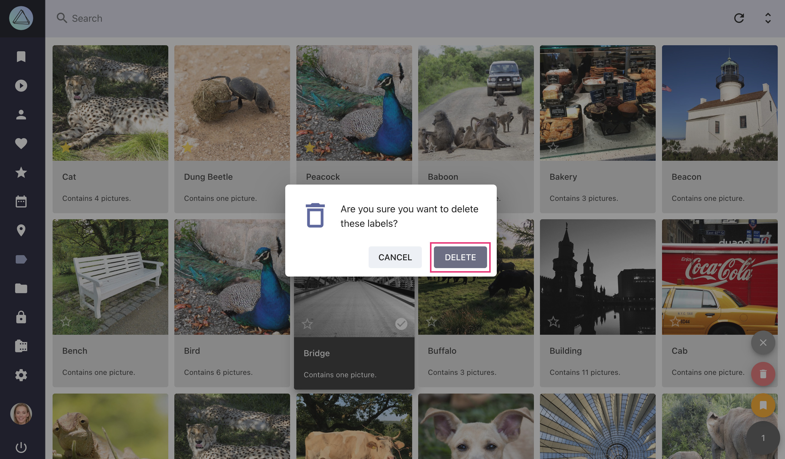{ class="shadow" }

!!! attention ""
    In case you want a deleted label to appear again, you need to add it to one photo and then index all files again.

