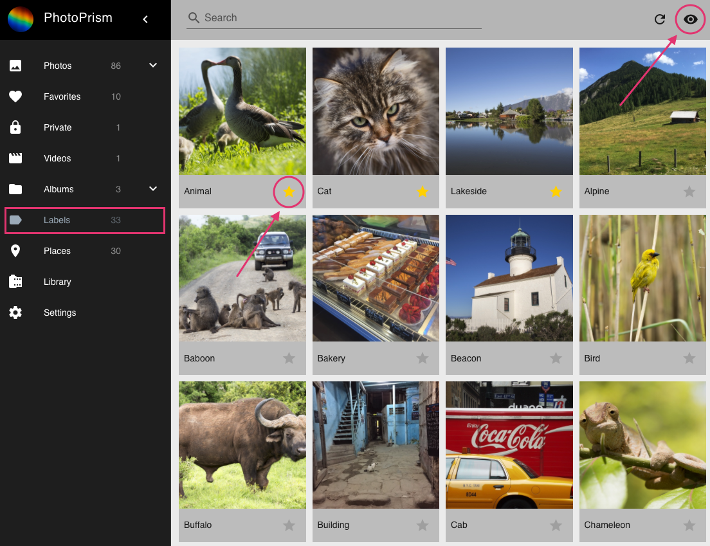
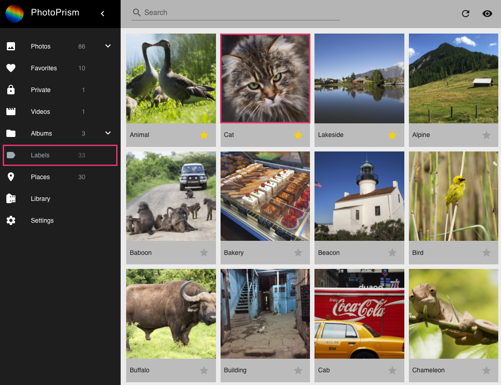
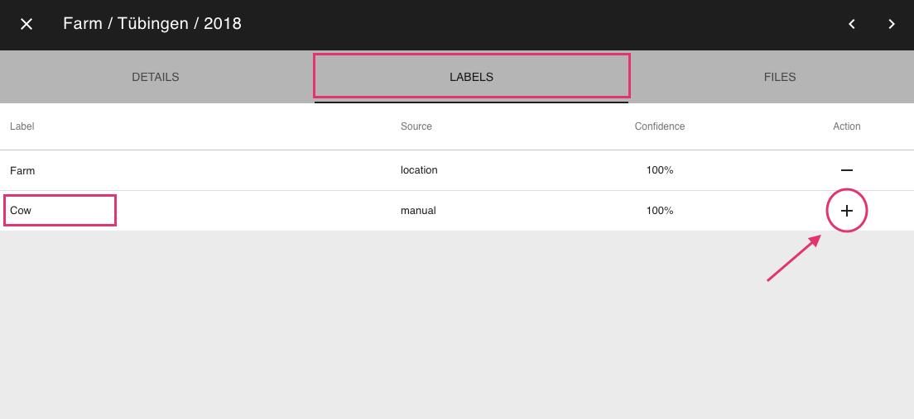
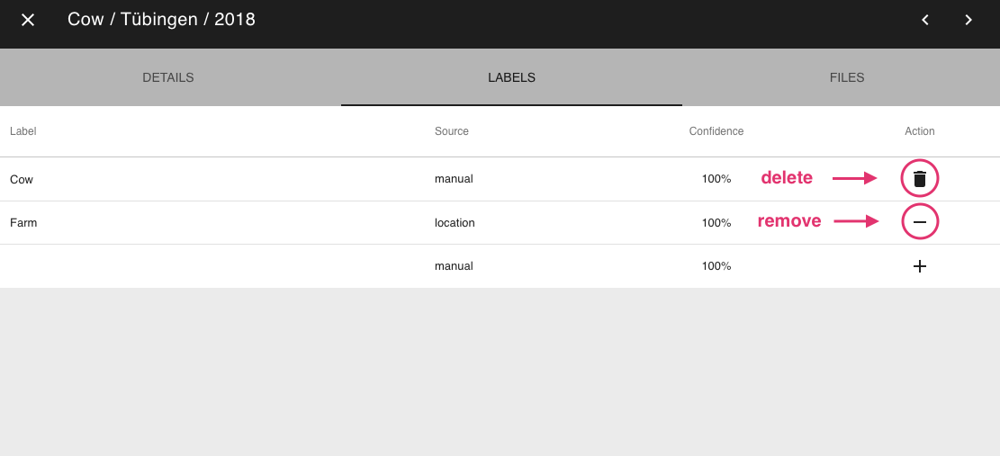
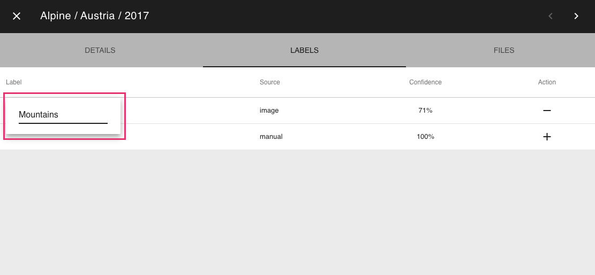
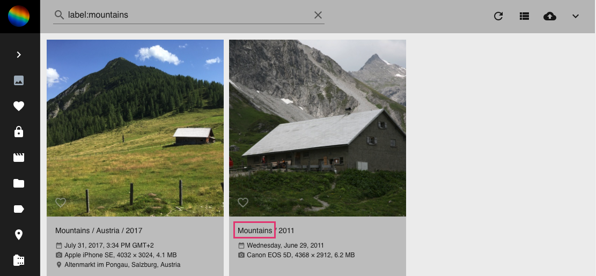

# Labels #
PhotoPrism uses labels to classify images.
Other tools use the term tags instead of labels.
Labels are set automatically when adding new photos. 
You can manually add new labels or edit/remove the ones that have been created by us.

In Labels you find all labels of your photos and videos. 
You can star labels by clicking on the star. Stared labels will be listed first.

To see only labels with a high priority click on the eye button in the upper right corner.

### View all photos with a certain label ###

1. Go to Labels.
2. Click on the label you are interested in.

    
    

!!! info
    Alternatively you can use the search field in Photos/Videos. You search for photos with a special label like this: `label:dog`.

### Add label to a photo/video ###

1. Go to the photo [edit dialogue](edit.md).
2. Go to Labels tab.
3. Click on the label field in the last row of the label table.
4. Enter a label name.
5. Click add on the right side of this row.

    
    
### Remove/delete label from a photo/video ###

Labels that have been set automatically can be removed.
Manually added labels can be deleted.

1. Go to the photo [edit dialogue](edit.md).
2. Go to Labels tab.
3. Click the remove/delete button of the label you want to remove/delete.

    
    
!!! info
    Removed labels have a confidence of 0% and can be activated again at any time by clicking add.
    
   

!!! info
    You can hide Labels in the [settings](../settings/ui.md)

### Rename a label ###

1. Go to the photo [edit dialogue](edit.md) of any photo that has the label you want to rename.

    
    
2. Go to Labels tab.
3. Click on the label name you want to change.
4. Change the name and click enter.

    
    
    
    
5. The changes will be applied to all photos with this label after the next  [indexing](../index.md)

    

!!! attention
    Be aware this change applies to all photos that have this label.

