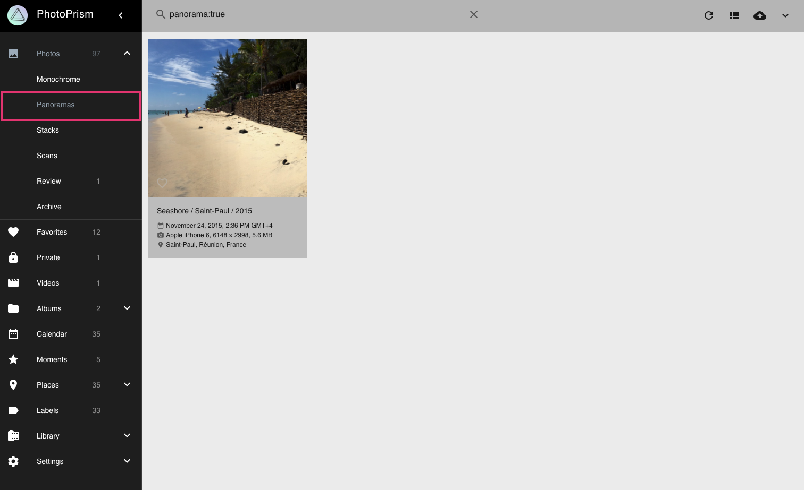
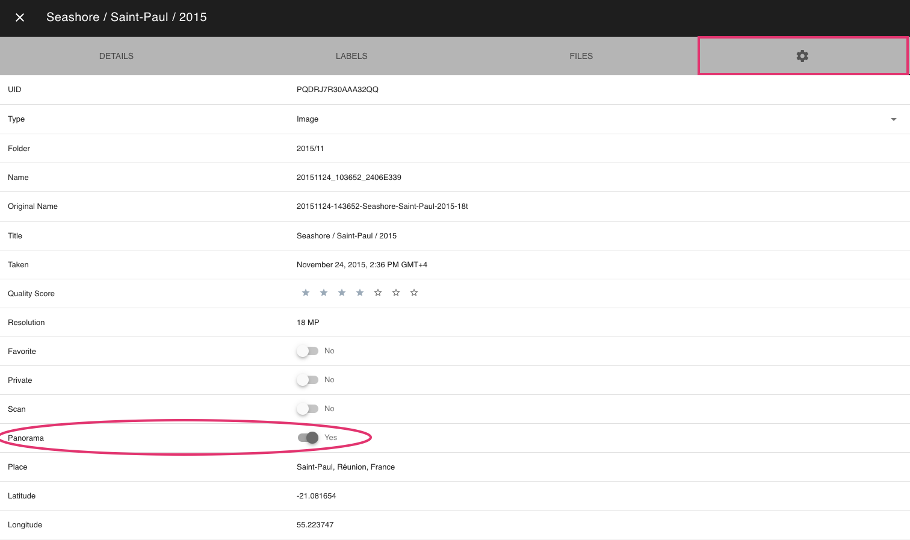

# Panoramas #
PhotoPrism automatically marks photos with an aspect ratio of 2/1 or higher as *panorama*.
You can view all your panorama images in the *Panorama section*.

## Edit panorama flag ##

 1. Open the [*photo edit dialogue*](edit.md)
 2. Click :material-cog:
 3. Set or unset the panorama flag

