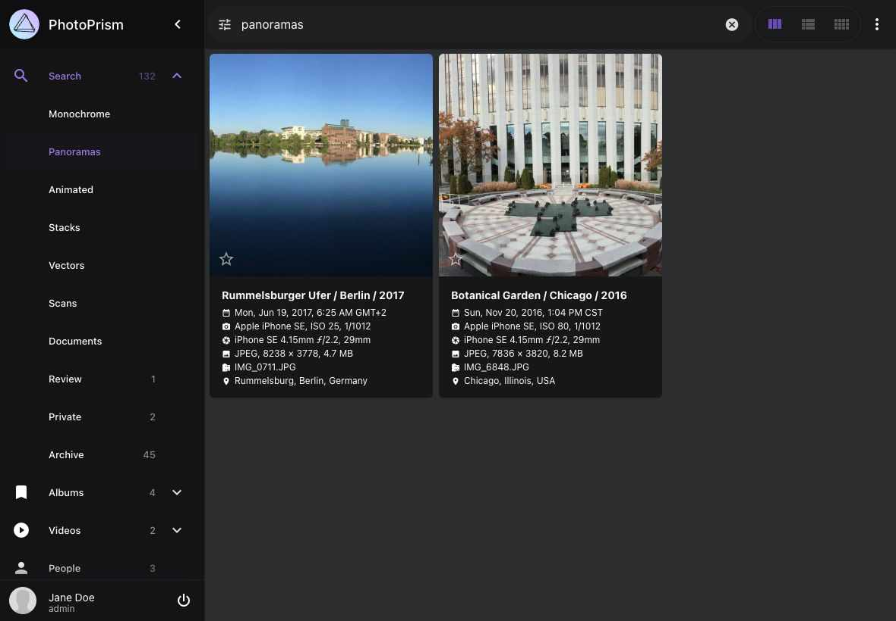
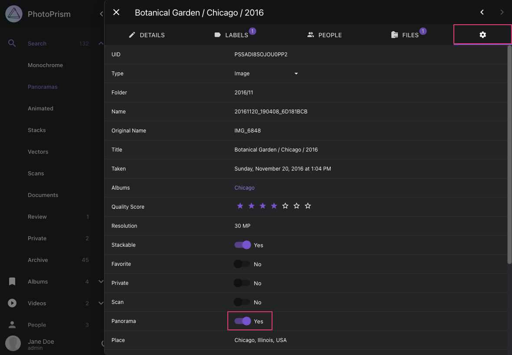

# Viewing Panoramas #

PhotoPrism marks pictures with an aspect ratio of about 2:1 or wider as *panoramas*, so they appear
in search results next to your other pictures and videos. Equirectangular 360° photos and videos
open in an interactive sphere viewer instead of being shown as a flat, distorted image, letting you
look around and zoom in without any separate 360° mode to switch on.

## Finding Panoramas ##

Navigate to *Search > Panoramas* to browse everything that has been marked as a panorama.
You can also limit any search to panoramas with the `panorama:yes` filter.
[Learn more ›](../search/filters.md#filter-reference)

{ class="shadow" }

## Using the 360° Viewer ##

Open an equirectangular photo or video by clicking it in search results. The viewer detects suitable
media automatically and shows the following controls:

<video class="shadow screencast" controls muted loop playsinline preload="metadata" poster="../img/panorama-360-2607.jpg">
  <source src="../img/panorama-360-2607.mp4" type="video/mp4">
  Your browser does not support embedded videos.
</video>

#### :material-cursor-move: Look Around ####

Drag with the mouse or one finger to change the viewing direction.

#### :material-magnify-plus-outline: Zoom ####

Use the scroll wheel, or pinch with two fingers on a touch screen, to zoom in and out.

#### :material-play-circle-outline: Playing 360° Videos ####

360° videos are played inside the sphere, so you can keep looking around while the video is running.
Use the playback controls to pause, resume, and mute it.

#### :material-chevron-double-right: Other Pictures ####

Dragging horizontally pans the sphere instead of switching to the next picture, so use the arrow
buttons at the left and right edge of the screen to move to the previous or next file.

## Supported Files ##

Only *equirectangular* content — a full sphere flattened into a single frame with an aspect ratio of
about 2:1 — can be displayed interactively:

- pictures are recognized by the `equirectangular` projection type stored in their
  [Exif](../../developer-guide/metadata/exif/index.md) or [XMP](../../developer-guide/metadata/xmp.md)
  metadata, which most 360° cameras write when saving a file; `GPano` metadata is accepted as well
- videos often carry no projection metadata that can be read, so a video is displayed in the sphere
  viewer if it has been marked as *panorama* and its frame size is roughly 2:1
- other projection types, such as cubemaps and cylindrical panoramas, as well as ultra-wide videos,
  are shown as regular pictures because they would be distorted when rendered as a sphere

!!! note ""
    Rendering a sphere requires a browser with [WebGL](https://caniuse.com/webgl) support, which is
    enabled by default in all current browsers. Note that manually marking faces on 360° content is
    not supported yet.

## Image Quality ##

Since you can zoom deep into a 360° picture, details are lost quickly when the rendered preview is
too small. If you have high-resolution originals, we therefore recommend increasing the
[static and dynamic size limits](../settings/advanced.md#static-and-dynamic-size-limits) to a value
that matches your files — sizes up to 16K UHD (15360×8640) are supported. The resolution of
transcoded videos is configured separately with the
[`PHOTOPRISM_FFMPEG_SIZE`](../../getting-started/advanced/transcoding.md) option.

Bear in mind that larger previews need more storage and take longer to generate, so pick the
smallest size that still looks good on your screens.

## Panorama Flags ##

If a 360° file is not detected automatically — for example, a spherical video whose metadata does
not include a projection type — you can set the *panorama* flag manually:

 1. Open the [*photo edit dialog*](edit.md)
 2. Click :material-cog:
 3. Set or unset the panorama flag

{ class="shadow" }

!!! tldr ""
    Removing the panorama flag from a 360° video also removes it from the sphere viewer, as the flag
    is what identifies videos as spherical when their metadata does not include a projection type.
    Pictures with an `equirectangular` projection type are not affected by this.
