PhotoPrism automatically detects faces and clusters them.

Each time you assign a name to a face or change an existing assignment, PhotoPrism improves face clusters intelligently.

## People Section ##
The people section shows you recognized persons as well as new face clusters.

To star a person click :material-star:. Stared persons appear first.

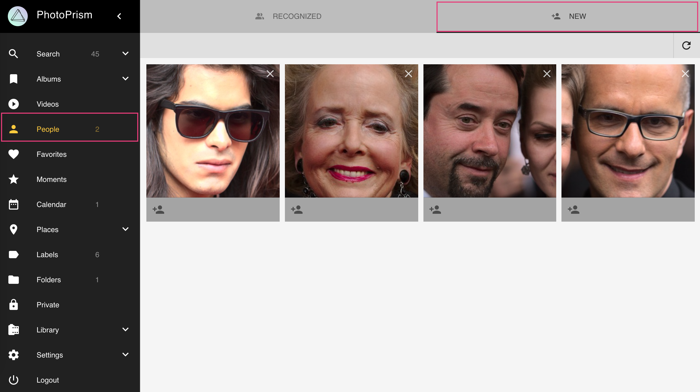

!!!info
    As not all faces belong to a cluster, there might be more faces than visible in the New section.
    You find all photos with faces that are not assigned to a person using the search filter `face:new`.
    The photo [*edit dialogue*](edit.md) shows all faces of a photo independent from whether they are clustered or not.

## Assign Names to Faces ##
1. Go to *People*
2. Go to *New*
3. Click on the input field
4. Start typing a name
5. Press *enter*

<!--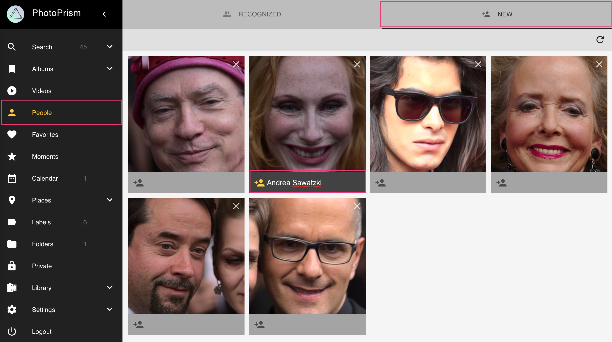-->

OR

1. Open the photo [*edit dialogue*](edit.md)
2. Go to the *People* tab
3. Click on the input field
4. Start typing a name
5. Press *enter*

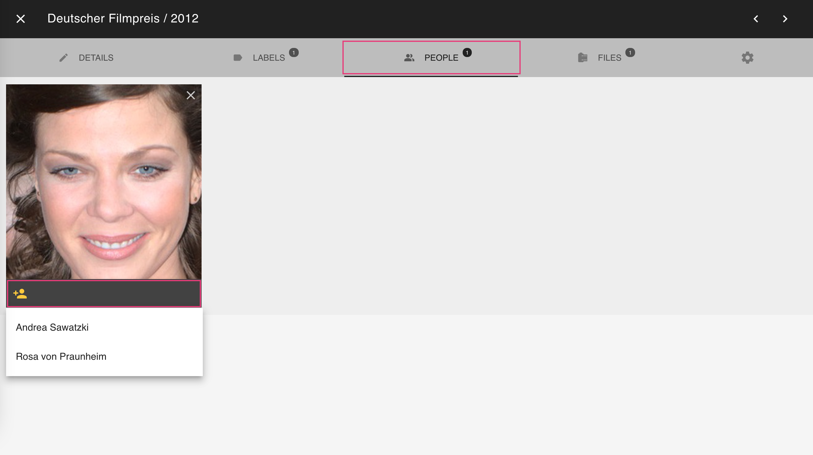

The person you just added will appear under *Recognized*

## Hiding People ##
You can hide a person in the *Recognized* section by clicking :material-close: in the upper right corner.

!!! example ""
    **This is an early-access feature to [say thanks to our sponsors](https://github.com/photoprism/photoprism/blob/develop/SPONSORS.md) and contributors.**
    We'll let you know how to enable it when you sign up on [Patreon](https://www.patreon.com/photoprism) or [GitHub Sponsors](https://github.com/sponsors/photoprism).
    Your continued support helps us fund operating costs, external services like satellite maps,
    and develop new features. Thank you very much! 💜

!!! attention
    Pictures of this person continue to be visible in search results and albums.

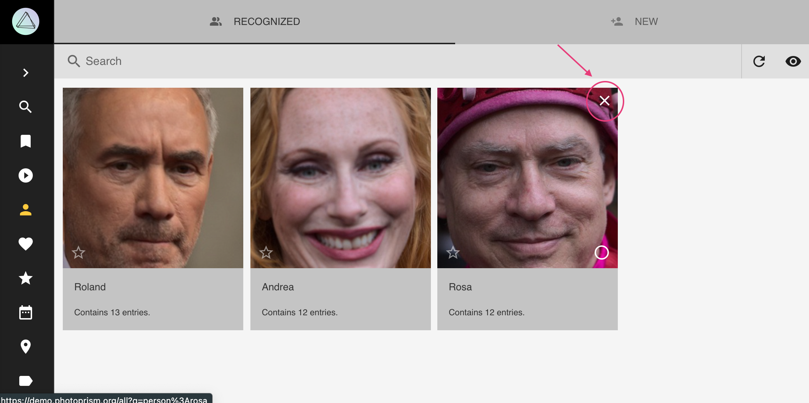

To see all people including hidden ones click :material-eye:.

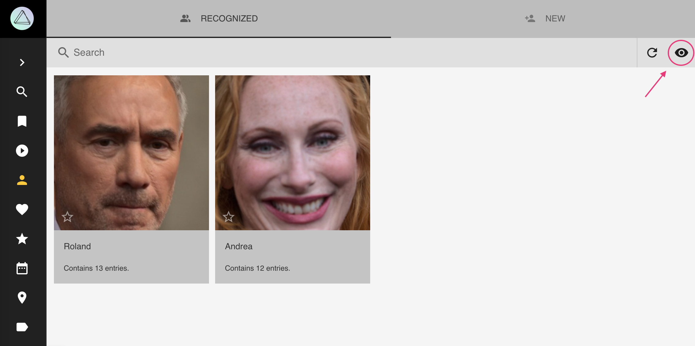

Hidden people can be recovered by clicking :material-eye-off:

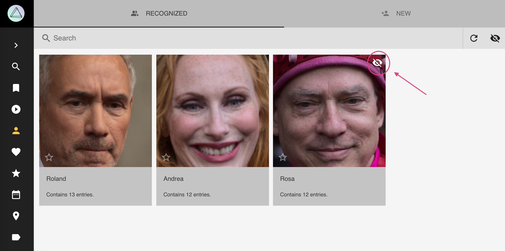

## Hiding Faces ##
You can hide face clusters from the *New* section, in the same way you [hide people](#hiding-people) from the *Recognized* section.

## View all Photos of a Person ##
1. Go to *People*
2. Go to *Recognized*
3. Click on the person you want to view

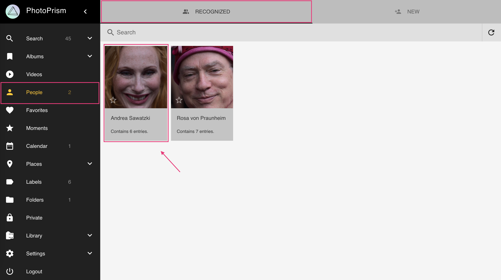

OR

1. Go to *Search*
2. Search for person:"jane-doe"

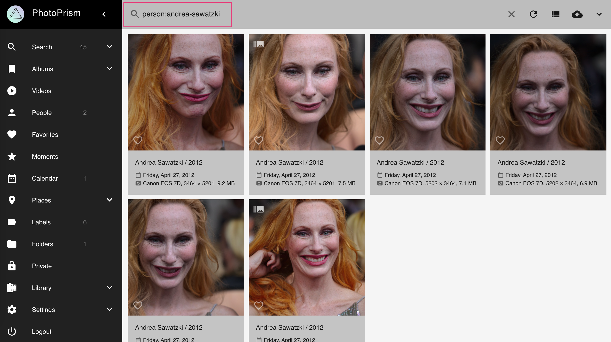

## Rename People ##
To rename all photos of a person:

1. Go to *People*
2. Go to *Recognized*
3. Click on the persons name
4. Type in a new name
5. Press *enter*

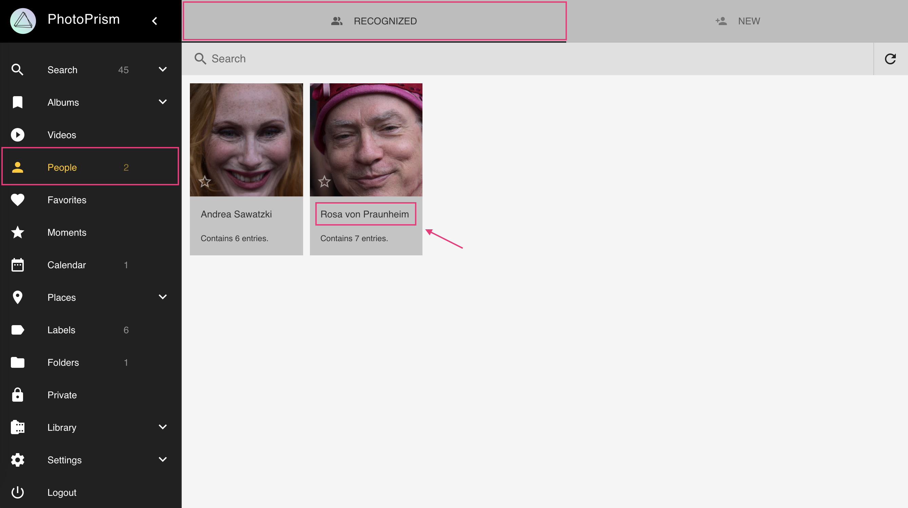

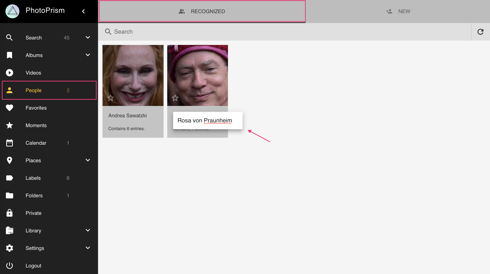

## Change People Assignments ##
In case the wrong person is assigned to a photo you can easily reject this. 

!!!attention
    Each time you reject a face, the face clusters are updated in the background.

1. Open the photo [*edit dialogue*](edit.md)
2. Go to the *People* tab
3. Click :material-eject:
4. Then enter a new name or leave it empty

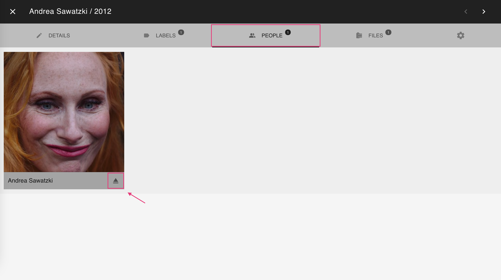

## Remove Wrong Faces ##
In case PhotoPrism detected something wrong as face (false positives), you can remove it.

1. Open the photo [*edit dialogue*](edit.md)
2. Go to the *People* tab
3. Click :material-close:

You might undo this action before a reload.

## Download all Photos of a Person ##
1. Go to *People*
2. Select a person
3. Open context menu
4. Click :material-download:

## Create Albums from People ##
1. Go to *People*
2. Select a person
3. Open context menu
4. Click :material-bookmark:
5. Select existing album or enter new album name
6. Click *add to album*

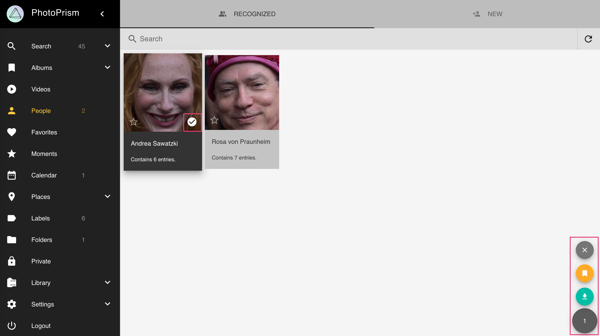

## Search ##
You can find photos with people on it using the following queries:

- `people`, `faces` or `faces:true` will result in all photos with people 
- `faces:false` will show all photos without people
- `faces:3` will show all photos with at least 3 people on it
- `person:"John Doe"` or `subject:"John Doe"` will show all photos of the person with the exact name John Doe
- `people:"John"` or `subjects:"John"` will show all photos of people with a name like John e.g. John Doe and John Smith

The person/subject and people/subjects filters can be used with & and | (see [search](search.md) for more details). Filters may be combined.

`person:"John Doe&Jane Doe" faces:3` will show all photos with John and Jane Doe and one other person.

## Coming Soon ##
- Manual face tagging
- Import of xmp face tags
- Save people in backups
- Option to exclude people from library

