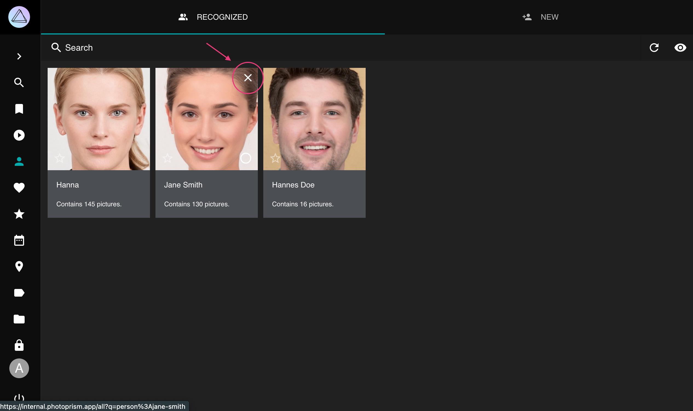
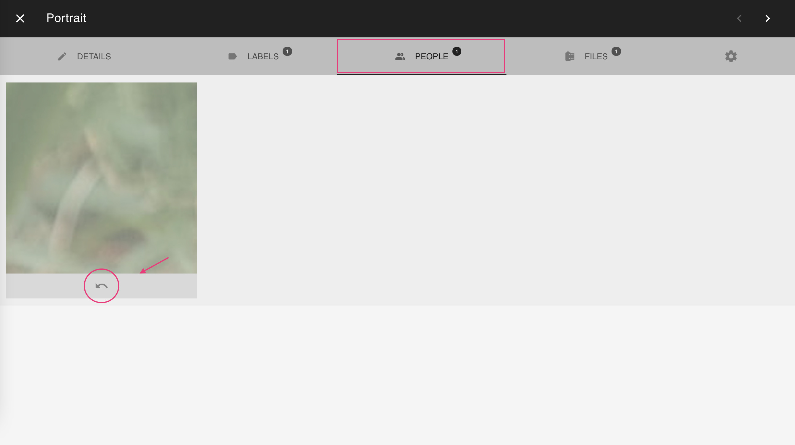

# Face Recognition

Our [latest version](../../release-notes.md) includes facial recognition that lets you find pictures
of your family and friends. Be ready to discover long forgotten shots! New faces are detected as
you scan your library. They are then grouped by similarity, so you can quickly match them to people.

!!! note ""
    Recognition does not start until your library has been fully scanned. Searching and updating faces
    temporarily causes a high CPU load and may take a while, depending on your hardware and the number of
    images you have.

!!! tldr ""
    Existing clusters are automatically optimized in the background, for example, when new
    faces are detected, you have reported a bad match, or new files are added to your library.

## Recognized & New People ##

The people section shows you recognized people as well as new face clusters.

To star a person click :material-star:. Stared persons appear first.

{ class="shadow" }
{ class="shadow" }

### Why doesn't the New Faces page show all faces? ###

The 'New Faces' page only shows automatically recognized face clusters, as there may be thousands
of unknown faces in your library, including random movie actors or faces on shampoo bottles.

You can use the `face:new` search filter to find images with unknown people.
We recommend combining this filter with other filters like year or location
when searching for specific people. The *People* tab in the photo [edit dialog](edit.md)
shows all faces, so you can name them or report a bad match by pressing the :material-eject: button.

### When a face was not detected... ###

There can be several reasons why a face was not detected:

- You may need to wait until indexing is complete, as face recognition will not begin until your library has been scanned
- Only the primary file in stacks will be searched for faces
- Faces can be smaller than the minimum size configured
- Our face detection did not scan the image thoroughly enough
- Reducing the resolution or quality of generated [thumbnails](../settings/advanced.md) negatively impacts face detection and recognition results, just like when you cannot see properly
- Contrast plays a major role, so a bright face with gray hair on a gray background may be less obvious to our face detection than it is to you
- In very rare cases an actual face may match a blacklist of false positives, like background noise and food that looks like a face

!!! tldr "" 
    Recognition compares the similarity of faces. The similarity threshold for a face is reduced when 
    you report a bad match.

## Assign Names to Faces ##

=== "From People"
     1. Go to *People*
     2. Go to *New*
     3. Click on the input field
     4. Start typing a name
     5. Press *enter*

        { class="shadow" }

=== "From Photo Edit dialog"

      1. Open the photo [*edit dialog*](edit.md)
      2. Go to the *People* tab
      3. Click on the input field
      4. Start typing a name
      5. Press *enter*

        { class="shadow" }

The person you just added will appear under *Recognized*

## Hiding People ##

You can hide a person in the *Recognized* section by clicking :material-close: in the upper right corner.
Pictures of this person continue to be visible in search results and albums.

!!! example ""
    **This currently is a sponsor feature to thank everyone who supports the development of this application.**
    You will learn how to enable it when you sign up on [Patreon](https://link.photoprism.app/patreon) or [GitHub Sponsors](https://link.photoprism.app/sponsor).
    We encourage all users to [back our mission](https://photoprism.app/membership) as this [helps us provide more features](https://photoprism.app/kb/oss) to the public. Thank you! :octicons-heart-fill-24:{ .heart .purple }

{ class="shadow" }

To see all people including hidden ones click :material-eye:.

{ class="shadow" }

Hidden people can be recovered by clicking :material-eye-off:

{ class="shadow" }

## Hiding Faces ##
You can hide face clusters from the *New* section, in the same way you [hide people](#hiding-people) from the *Recognized* section.

## View all Photos of a Person ##
=== "From People"
      1. Go to *People*
      2. Go to *Recognized*
      3. Click on the person you want to view

        { class="shadow" }

=== "From Search"
      1. Go to *Search*
      2. Search for person:"jane-doe"

        { class="shadow" }

## Rename People ##
To rename all photos of a person:

1. Go to *People*
2. Go to *Recognized*
3. Click on the persons name
4. Type in a new name
5. Press *enter*

{ class="shadow" }

{ class="shadow" }

## Change People Assignments ##

You may report bad matches by pressing the :material-eject: button underneath a face in the *People* tab.
This will remove the name. You can either leave it blank or enter the name of a different person.

!!! attention ""
    When you reject a match, the corresponding face cluster will be updated in the background so that similar 
    issues can be resolved automatically.

1. Open the photo [*edit dialog*](edit.md)
2. Go to the *People* tab
3. Click :material-eject:
4. Then enter a new name or leave it empty

{ class="shadow" }

## Remove Faces ##
In case PhotoPrism detected something wrong as face (false positives), or in case you just don't want to keep a face on the people tab you're not interested in, you can remove it.

1. Open the photo [*edit dialogue*](edit.md)
2. Go to the *People* tab
3. Click :material-close:

{ class="shadow" }

You might undo this action before a reload.

{ class="shadow" }

## Download all Photos of a Person ##
1. Go to *People*
2. Select a person
3. Open context menu
4. Click :material-download:

## Create Albums from People ##
1. Go to *People*
2. Select a person
3. Open context menu
4. Click :material-bookmark:
5. Select existing album or enter new album name
6. Click *add to album*

{ class="shadow" }

## Search ##
You can find photos with people on it using the following queries:

- `people`, `faces` or `faces:true` will result in all photos with people 
- `faces:false` will show all photos without people
- `faces:3` will show all photos with at least 3 people on it
- `person:"John Doe"` or `subject:"John Doe"` will show all photos of the person with the exact name John Doe
- `people:"John"` or `subjects:"John"` will show all photos of people with a name like John e.g. John Doe and John Smith

The person/subject and people/subjects filters can be used with & and | (see [search](../search/filters.md) for more details). Filters may be combined.

`person:"John Doe&Jane Doe" faces:3` will show all photos with John and Jane Doe and one other person.

{ class="shadow" }

## Known Issues ##

For all known issues, see [Getting Started > Known Issues > Face Recognition](../../known-issues.md#face-recognition).

### Legacy Hardware ###

Face recognition can be slow (or even crash) on [old devices](../../getting-started/troubleshooting/performance.md#legacy-hardware) due to insufficient resources.

*Like most applications, PhotoPrism has [certain requirements](../../getting-started/index.md#system-requirements) and our development process does not include testing on unsupported or unusual hardware.*

### Asian Faces and Children

It is a known issue that children and Asian-looking faces cannot be recognized reliably. Detection without automatic recognition should not be affected by that.

This is because the model we use was trained with North American images, which unfortunately do not include many Asians. The absence of children in the training data comes from the fact that parents do not usually share such images under a public license (and may not have the right to do so).

*We will continue to improve our models over time as our resources allow.*

### Background Worker ###

Face recognition was developed and tested under the assumption that the [background worker](../../getting-started/config-options.md#index-workers) runs every 15 minutes, unless the backend is busy with other tasks like indexing. It has not been tested with much longer intervals and is not designed for that.

PhotoPrism's background worker groups new faces by similarity, compares faces with clusters, and optimizes existing clusters as needed. Without these routine tasks, the number of faces to be processed becomes too large. The first and next time the worker runs, it can then cause a heavy server load until all the faces, face clusters, and related pictures have been updated. The longer you wait, the more CPU is required and the longer it takes.

An important reason for the worker to run independently of actual changes in the main instance is that some users change the database content directly or run additional instances, for example for indexing. It is a problem that can be solved, but it takes time. If we were to ignore this and don't run the worker at all times, it could lead to many additional support requests, further reducing the amount of time we can spend on development. 

*The handling of changes in multiple instances will be improved over time so that the worker can be run less frequently in future releases.*

!!! info "Upcoming Features"
    - manual tagging of faces
    - importing of XMP face tags
    - excluding people when browsing your pictures
    - automatic backup of tagged people in YAML files

*[face clusters]: A cluster is a group of faces expected to belong to the same person based on the similarity
