# Face Recognition

PhotoPrism includes facial recognition that lets you find pictures
of your family and friends. Be ready to discover long forgotten shots! New faces are detected as
you scan your library. They are then grouped by similarity, so you can quickly match them to people.

!!! note ""
    Recognition does not start until your library has been fully scanned. Searching and updating faces
    temporarily causes a high CPU load and may take a while, depending on your hardware and the number of
    images you have.

!!! tldr ""
    Existing clusters are automatically optimized in the background, for example, when new
    faces are detected, you have reported a bad match, or new files are added to your library.

## Recognized & New People ##

The people section shows you recognized people as well as new face clusters.

To star a person click :material-star:. Starred persons appear first.

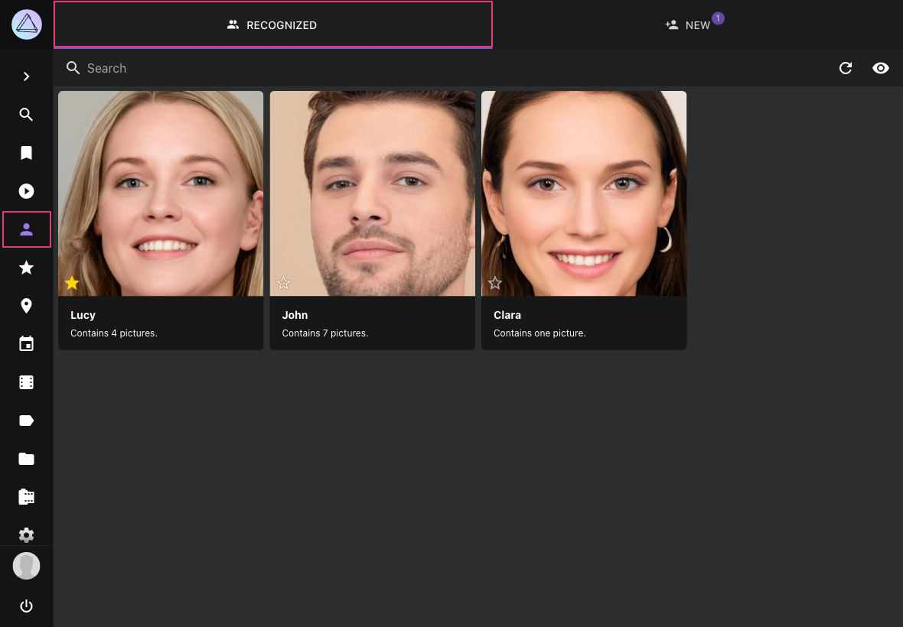{ class="shadow" }
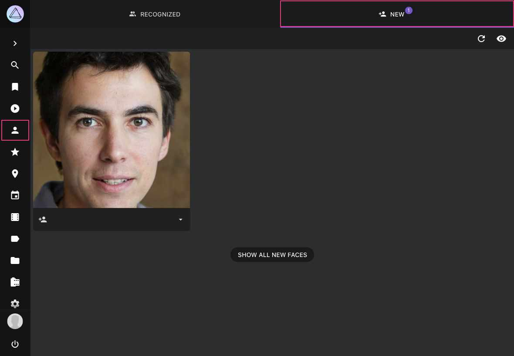{ class="shadow" }

### Why doesn't the New Faces page show all faces? ###

The 'New Faces' page only shows automatically recognized face clusters, as there may be thousands
of unknown faces in your library, including random movie actors or faces on shampoo bottles.

You can use the `face:new` search filter to find images with unknown people.
We recommend combining this filter with other filters like year or location
when searching for specific people. The *People* tab in the photo [edit dialog](edit.md)
shows all faces, so you can name them or report a bad match by pressing the :material-eject: button.

### When a face was not detected... ###

There can be several reasons why a face was not detected:

- Our [latest release](../../release-notes.md#november-30-2025) includes better face detection. After updating, perform a [complete rescan](https://docs.photoprism.app/user-guide/library/originals/#when-should-complete-rescan-be-selected) or run `photoprism faces index` [in a terminal](https://docs.photoprism.app/getting-started/docker-compose/#opening-a-terminal) to detect more faces that were previously missed
- You may need to wait until indexing is complete, as face recognition will not begin until your library has been scanned
- Only the primary file in stacks will be searched for faces
- Faces can be smaller than the minimum size configured
- Our face detection did not scan the image thoroughly enough
- Reducing the resolution or quality of generated [thumbnails](../settings/advanced.md) negatively impacts face detection and recognition results, just like when you cannot see properly
- Contrast plays a major role, so a bright face with gray hair on a gray background may be less obvious to our face detection than it is to you
- In very rare cases, an actual face may be considered a false positive and thus be ignored

!!! tldr ""
    Recognition compares the similarity of faces. The similarity threshold for a face is reduced when
    you report a bad match.

## Assign Names to Faces ##

=== "From People"
     1. Go to *People*
     2. Go to *New*
     3. Click on the input field
     4. Start typing a name
     5. Press *enter*

        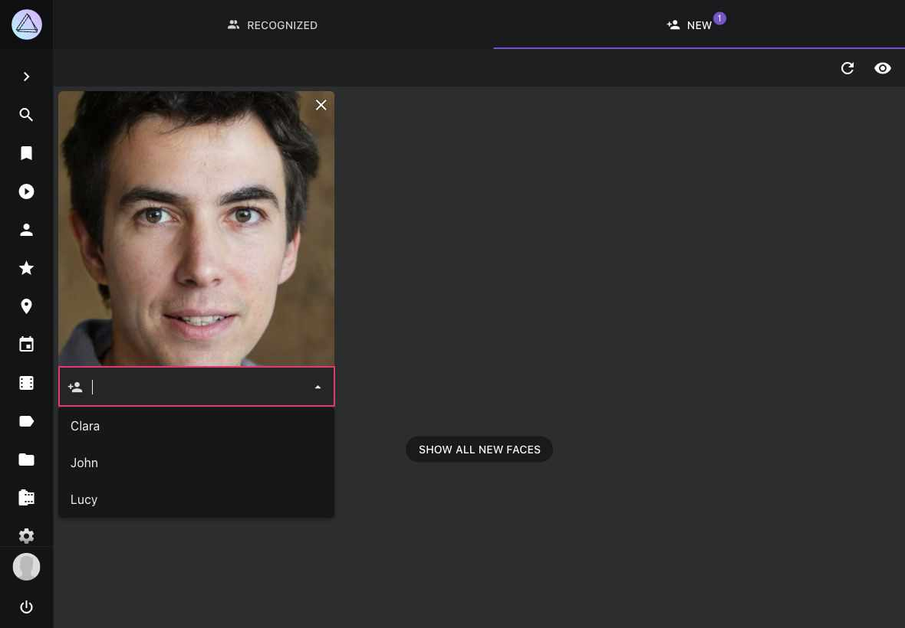{ class="shadow" }

=== "From Photo Edit dialog"

      1. Open the photo [*edit dialog*](edit.md)
      2. Go to the *People* tab
      3. Click on the input field
      4. Start typing a name
      5. Press *enter*

        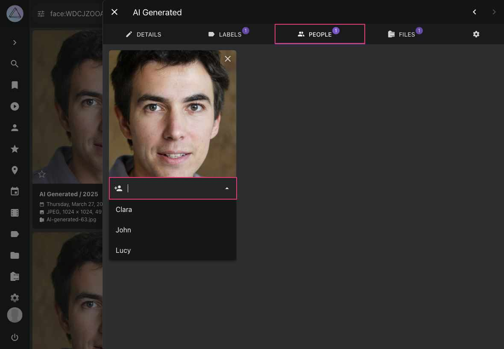{ class="shadow" }

      You can also assign names to faces directly from the [Info Sidebar](info-sidebar.md) of the full-screen viewer, which is the only place where you can manually mark a face that PhotoPrism missed during automatic detection.

The person you just added will appear under *Recognized*

!!! tip ""
    If you have already named faces in another application such as Adobe Bridge, Lightroom, digiKam, ACDSee, or Windows, PhotoPrism can import those names from XMP metadata while indexing instead of you entering them again. Enable [*Import Faces from XMP*](../settings/advanced.md#import-faces-from-xmp) to use this.

## Change Cover for a Person ##
1. Go to the [people tab](./edit.md#people) on the photo edit dialog of the photo that contains the face that should be used as the cover
2. Hover over :material-dots-vertical: in the upper right corner of the face
3. Click *Set as Cover Image*

{ class="shadow" }

## Hiding People ##

You can hide a person in the *Recognized* section by clicking :material-close: in the upper right corner.
Pictures of this person continue to be visible in search results and albums.
Hiding a person also withholds their name from accounts that may not see private content, as described
under [Private & Hidden People](#private-hidden-people).

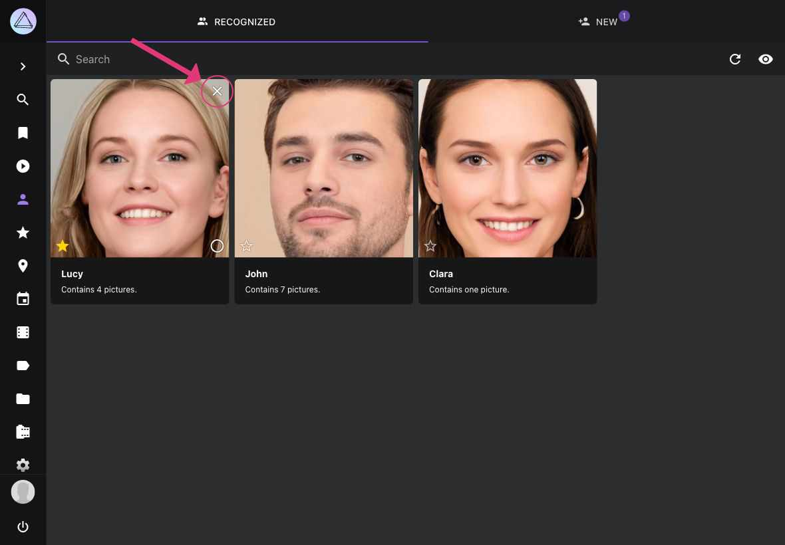{ class="shadow" }

To see all people including hidden ones click :material-eye:.

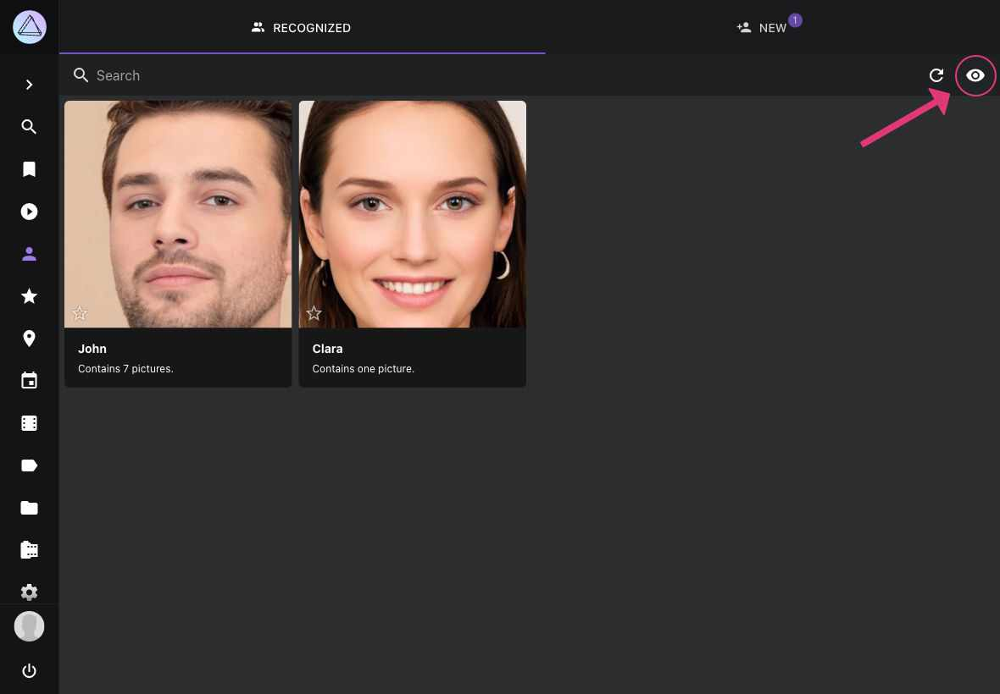{ class="shadow" }

Hidden people can be recovered by clicking :material-eye-off:

{ class="shadow" }

## Hiding Faces ##
You can hide face clusters from the *New* section, in the same way you [hide people](#hiding-people) from the *Recognized* section.

## Private & Hidden People ##

Some people in a shared library should not be named to every account. Open a person's *Edit* dialog
to mark them **Private** or **Hidden**:

| Option      | Effect                                                                 |
|-------------|------------------------------------------------------------------------|
| **Private** | Withholds the person from accounts that may not see private content.   |
| **Hidden**  | The same, and also leaves the person out of *Recognized* for everyone. |

Setting **Hidden** is the same as [hiding a person](#hiding-people) with :material-close:.
*Viewers*, as well as *Guests* and *Visitors* opening a share link, do not see the names of people
marked private or hidden; *Admins* and *Users* see them as usual and can change both options.
[Learn more ›](../users/roles.md)

For an account that may not see them, a withheld person does not appear under *People* or in the name
suggestions when tagging a face, is not named in a picture's *People* list, and their face region is
not shown there. Their name is also kept out of automatically generated titles, captions, and search
keywords; pictures that already carry it are updated by the next maintenance pass, so allow a few
minutes for those.

!!! note ""
    **Their pictures stay visible.** Only the name and the face region are withheld, so anyone who may
    browse the library still sees the pictures. This is not encryption, and it is not a password prompt.

## View all Photos of a Person ##
=== "From People"
      1. Go to *People*
      2. Go to *Recognized*
      3. Click on the person you want to view

        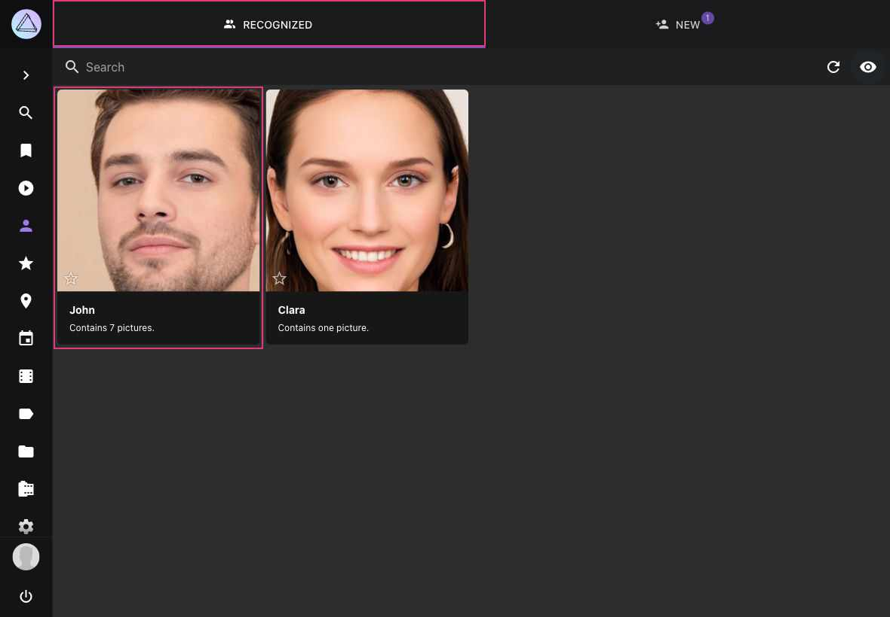{ class="shadow" }

=== "From Search"
      1. Go to *Search*
      2. Search for person:"john"

        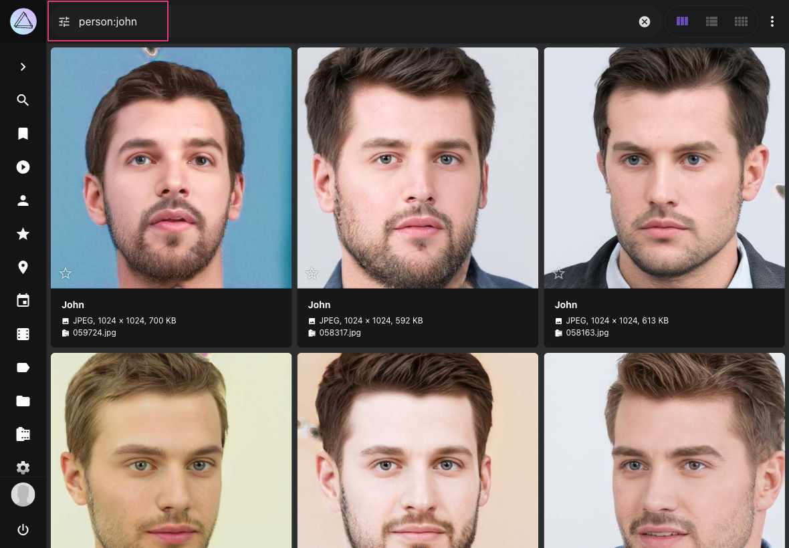{ class="shadow" }

## Rename People ##
To rename all photos of a person:

1. Go to *People*
2. Go to *Recognized*
3. Click on the persons name
4. Type in a new name
5. Click *save*

{ class="shadow" }

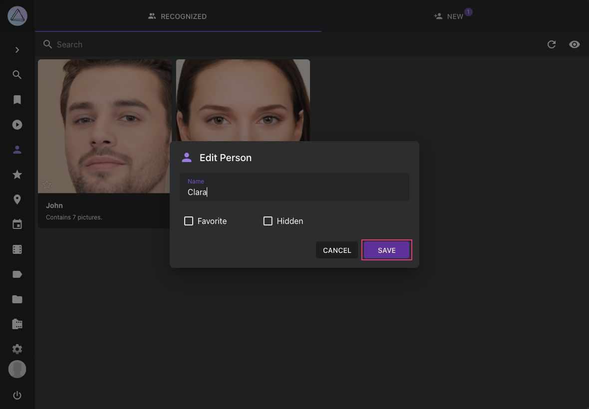{ class="shadow" }

## Change People Assignments ##

You may report bad matches by pressing the :material-eject: button underneath a face in the *People* tab.
This will remove the name. You can either leave it blank or enter the name of a different person.

!!! danger ""
    When you reject a match, the corresponding face cluster will be updated in the background so that similar
    issues can be resolved automatically.

1. Open the photo [*edit dialog*](edit.md)
2. Go to the *People* tab
3. Click :material-eject:
4. Then enter a new name or leave it empty

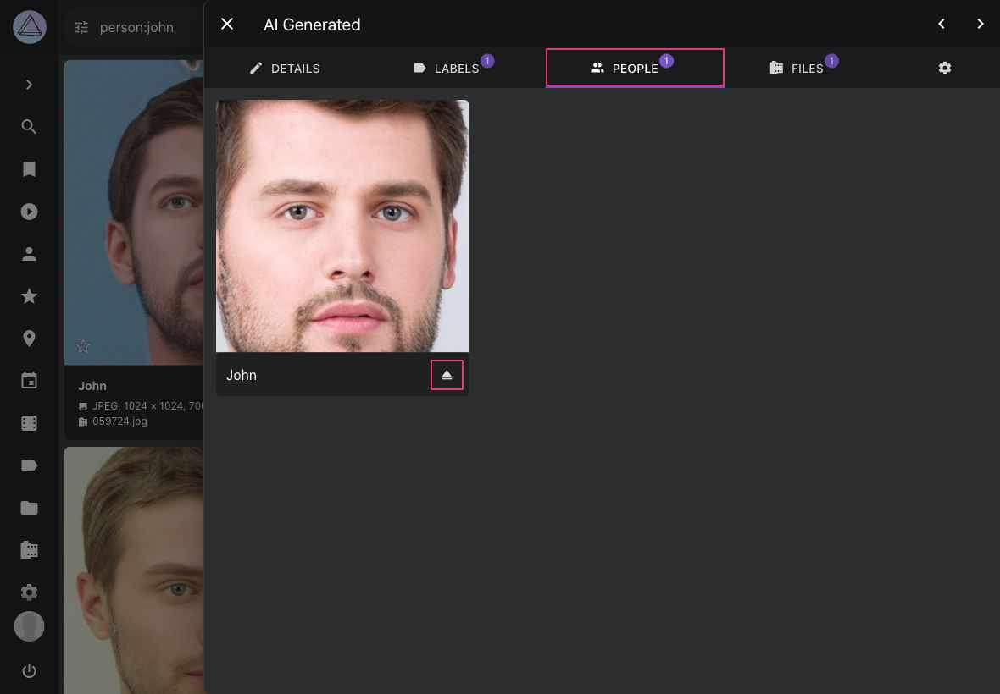{ class="shadow" }

You can also change people assignments from the [Info Sidebar](info-sidebar.md) of the full-screen viewer.

## Remove Faces ##
In case PhotoPrism detected something wrong as face (false positives), or in case you just don't want to keep a face on the people tab you're not interested in, you can remove it.

1. Open the photo [*edit dialogue*](edit.md)
2. Go to the *People* tab
3. Click :material-close:

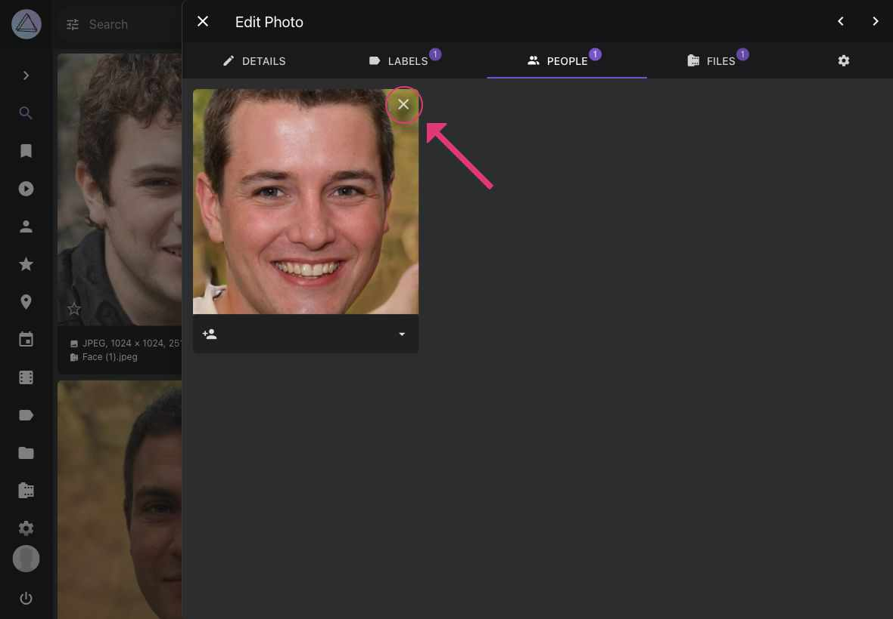{ class="shadow" }

You might undo this action before a reload.

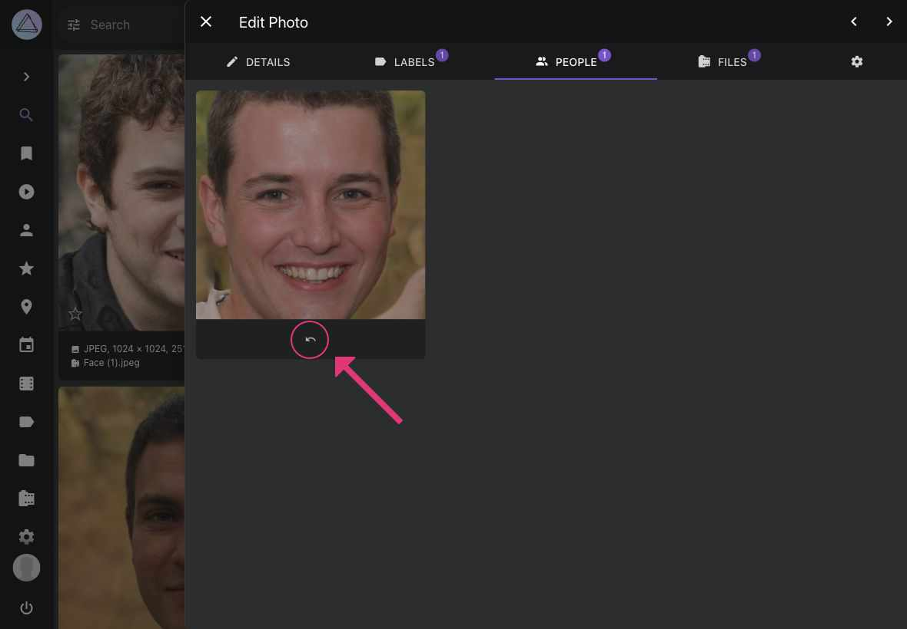{ class="shadow" }

Faces can also be removed from the [Info Sidebar](info-sidebar.md) of the full-screen viewer.

## Download all Photos of a Person ##
1. Go to *People*
2. Select a person
3. Open context menu
4. Click :material-download:

{ class="shadow" }

## Create Albums from People ##
1. Go to *People*
2. Select a person
3. Open context menu
4. Click :material-bookmark:
5. Select existing album or enter new album name
6. Click *add to album*

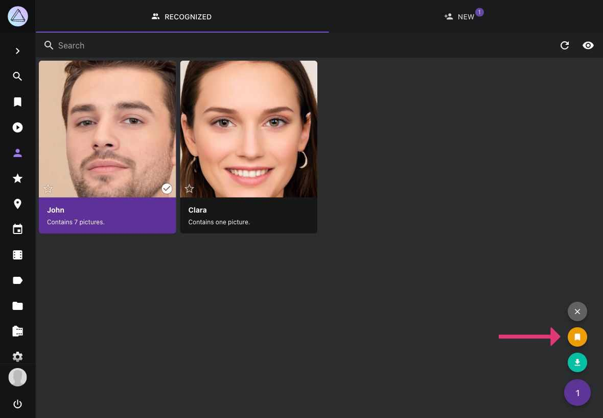{ class="shadow" }

## Search ##
You can find photos with people on it using the following queries:

- `people`, `faces` or `faces:true` will result in all photos with people
- `faces:false` will show all photos without people
- `faces:3` will show all photos with at least 3 people on it
- `person:"John Doe"` or `subject:"John Doe"` will show all photos of the person with the exact name John Doe
- `people:"John"` or `subjects:"John"` will show all photos of people with a name like John e.g. John Doe and John Smith

The person/subject and people/subjects filters can be used with & and | (see [search](../search/filters.md) for more details). Filters may be combined.

`person:"John Doe&Jane Doe" faces:3` will show all photos with John and Jane Doe and one other person.

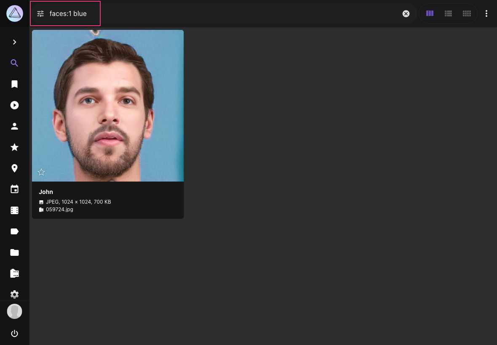{ class="shadow" }

## Known Issues ##

Automatic recognition has limits: it is less reliable for young children and for pictures of the same person taken many years apart, faces that are not upright are often not detected at all, and older hardware can be slow. See [Known Issues > Face Recognition](../../known-issues.md#face-recognition) for the full list and the reasons behind it.

If faces are missing, people are grouped incorrectly, names do not stick, or tagging is slow, work through the checklists under [Troubleshooting > Face Recognition](../../getting-started/troubleshooting/face-recognition.md).

!!! info "Upcoming Features"
    - automatic backup of tagged people in YAML files

*[face clusters]: A cluster is a group of faces expected to belong to the same person based on the similarity
