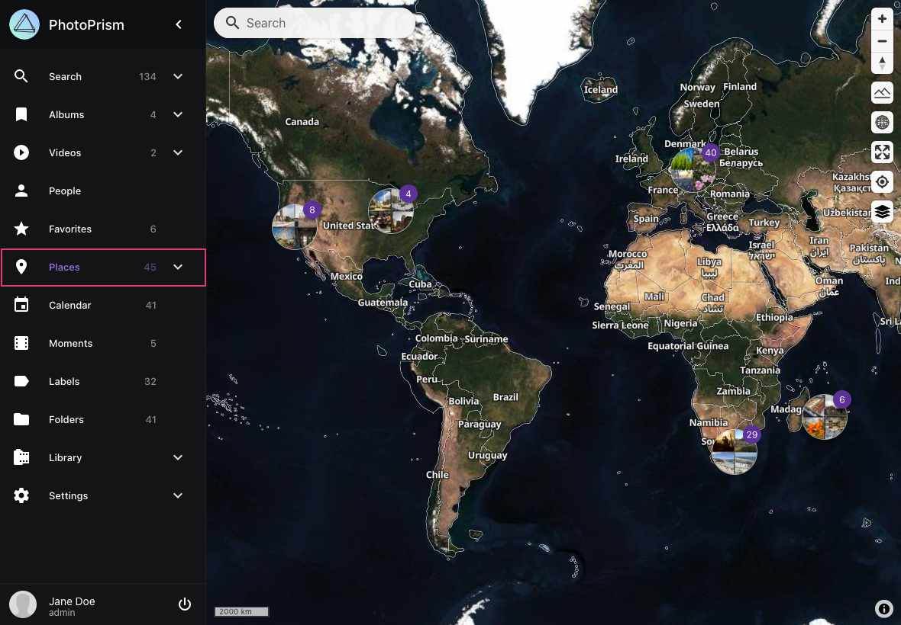
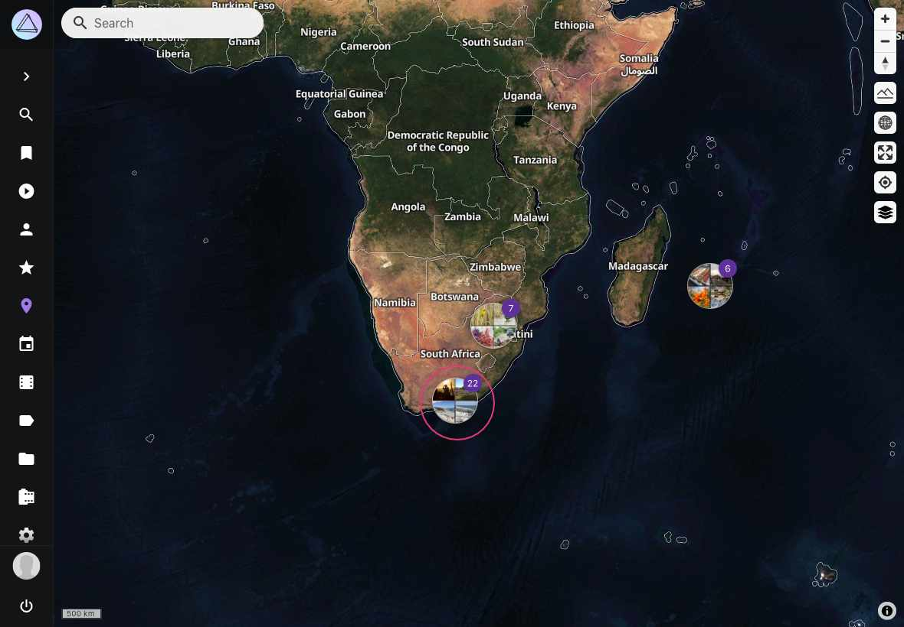
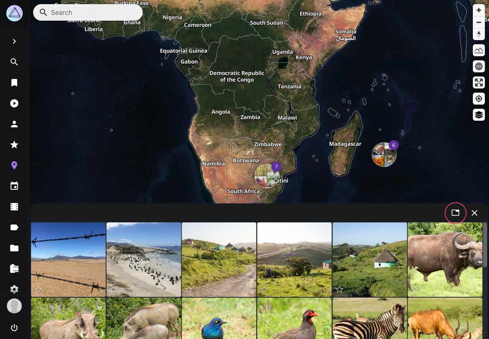
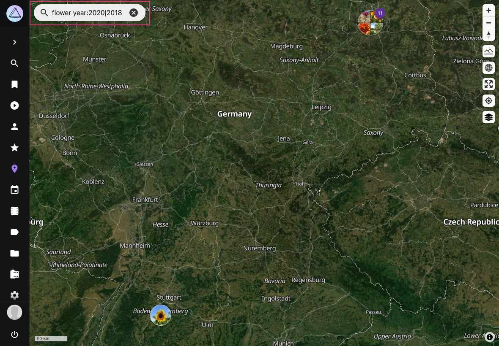
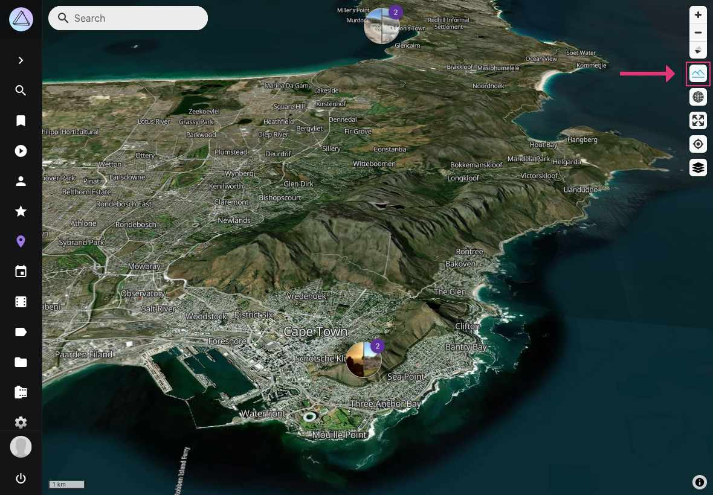
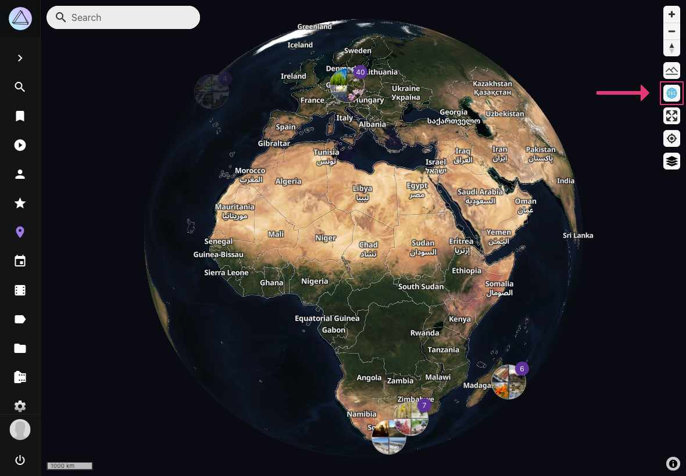
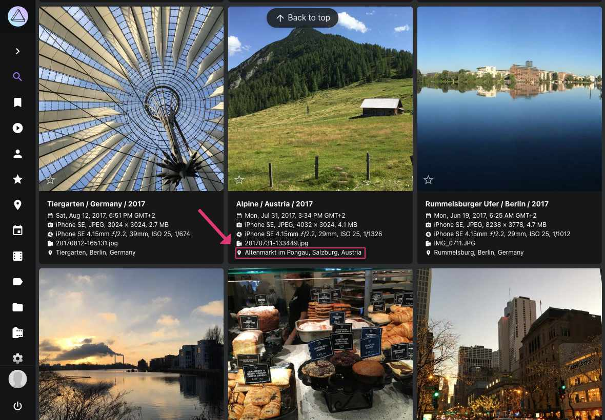
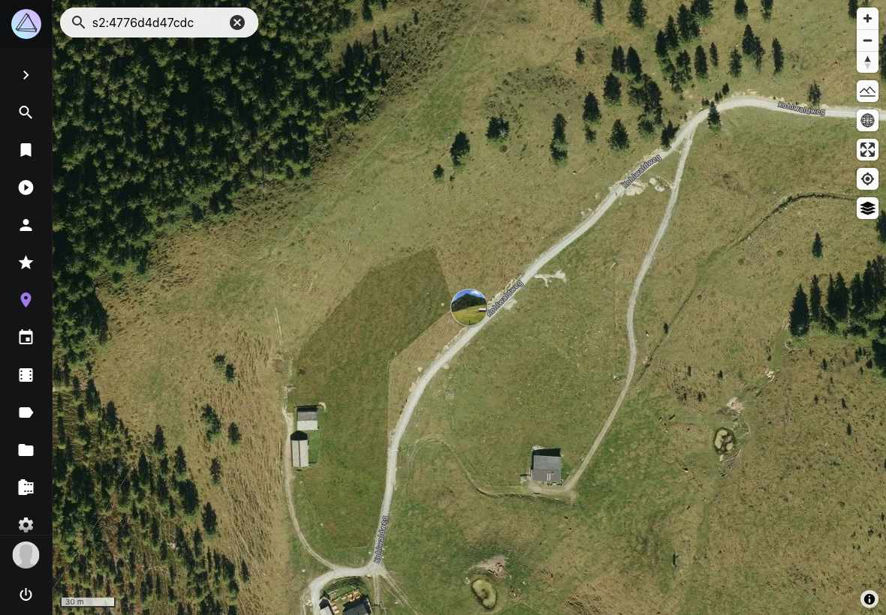

# Places #

*Places* displays all photos with GPS information on a world map.

!!! info ""
    The Places feature requires a browser with WebGL support. Most modern browsers support WebGL, but some older browsers or browsers with hardware acceleration disabled may not be able to display the map properly.

{ class="shadow" }

You can  set a default map style in [settings](../settings/general.md) or choose between different styles by clicking :material-layers-triple:.

Clicking on a cluster, opens the cluster overlay. 

{ class="shadow" }

{ class="shadow" }

To open photos from this location in the search click :material-tab:. 

To clear the location filter click :material-map-marker-off-outline:.

{ class="shadow" }

## Search

When using the search only photos matching the search term are shown on the map. You can use most of our [search filters](../search/filters.md) on the map as well.

{ class="shadow" }

## Enable Terrain Mode

Our "Satellite", "Outdoor" and "Topography" maps can also be viewed in 3D.

To enable terrain mode click :material-image-filter-hdr-outline:. To change the perspective, you can hold down the right mouse button and move it.

{ class="shadow" }

## 3D Earth View

PhotoPrism now offers an immersive 3D Earth view that provides a globe-like perspective of your photo locations. This feature allows you to visualize your photos in a more realistic, three-dimensional representation of the world.

To enable the 3D Earth view:

1. Click on :material-earth: to toggle the 3D Earth view

When in 3D Earth view, you can:

- Rotate the globe by clicking and dragging
- Zoom in and out using the scroll wheel or pinch gestures
- Tilt the view by holding the right mouse button and moving it

The 3D Earth view works with all map styles and can be combined with terrain mode for an even more detailed visualization of your photo locations.

{ class="shadow" }

## Open Photo from Search in Places

To navigate directly from the cards results view to the location of a picture on the world map, click on its location.

   { class="shadow" }
   { class="shadow" }

