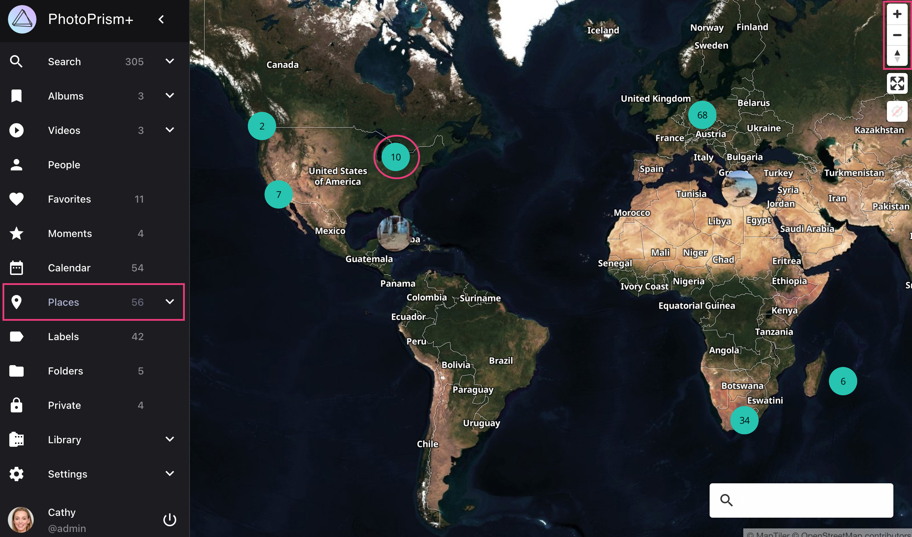
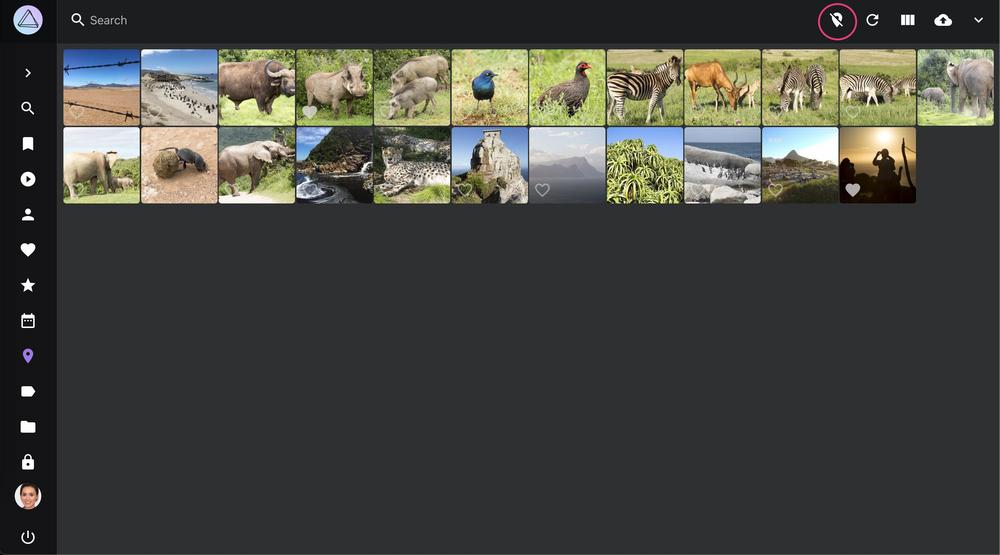
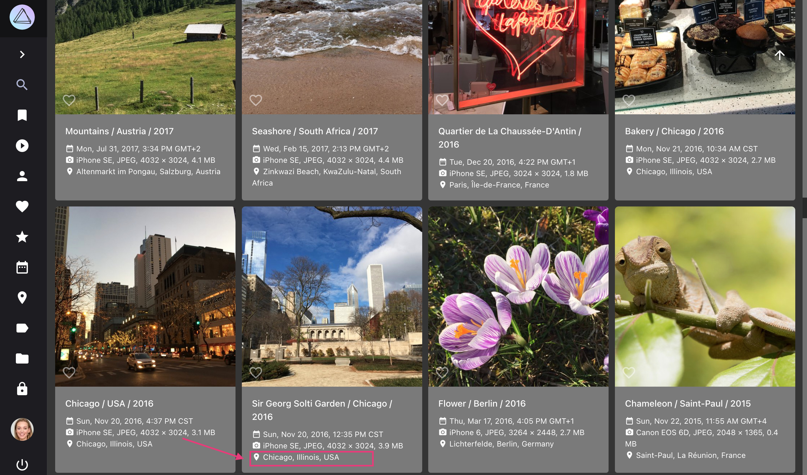
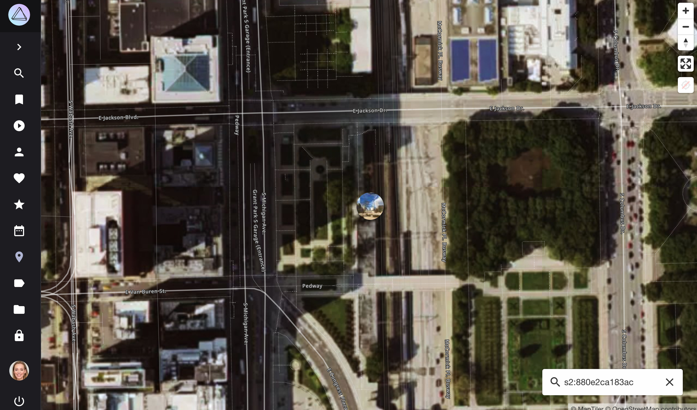

# Places #

*Places* displays all photos with GPS information on a world map.

{ class="shadow" }

You can  set a default map style in [settings](../settings/general.md) or choose between different styles by clicking :material-layers-triple:.

Clicking on a cluster, opens the cluster overlay. 

{ class="shadow" }

{ class="shadow" }

To open photos from this location in the search click :material-tab:. 

To clear the location filter click :material-map-marker-off-outline:.

{ class="shadow" }

## Search

When using the search only photos matching the search term are shown on the map. You can use most of our [search filters](../search/filters.md) on the map as well.

{ class="shadow" }

## Enable Terrain Mode

Our "Satellite", "Outdoor" and "Topography" maps can also be viewed in 3D.

To enable terrain mode click :material-image-filter-hdr-outline:. To change the perspective, you can hold down the right mouse button and move it.

{ class="shadow" }

## Open Photo from Search in Places
To switch from a photos card view directly to the location of a photo on the world map click on the location.

   { class="shadow" }
   { class="shadow" }

