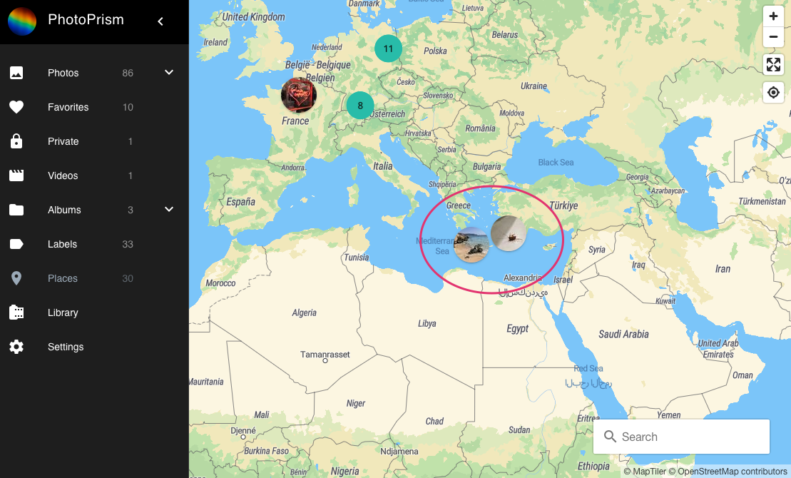
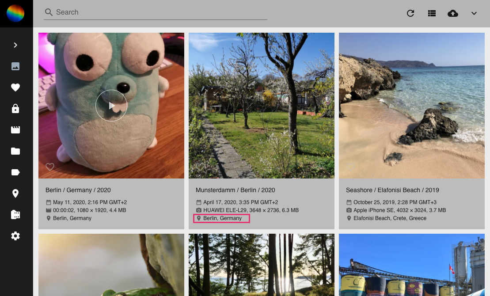

# Places #
*Places* displays all photos with GPS information on a world map.

You can zoom either by using :material-plus: or :material-minus: or by clicking on a photo or photo collector (the blue circles with a photo count inside).

When using the search only photos matching the search term are shown on the map.

You can choose between different map styles like streets or topographic in the [settings](../settings/general.md).

!!! tip ""
    To switch from a photos card view directly to the location of a photo on the world map click on the location.

   
   
