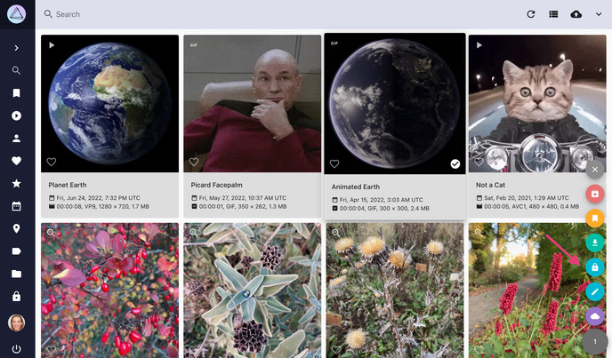
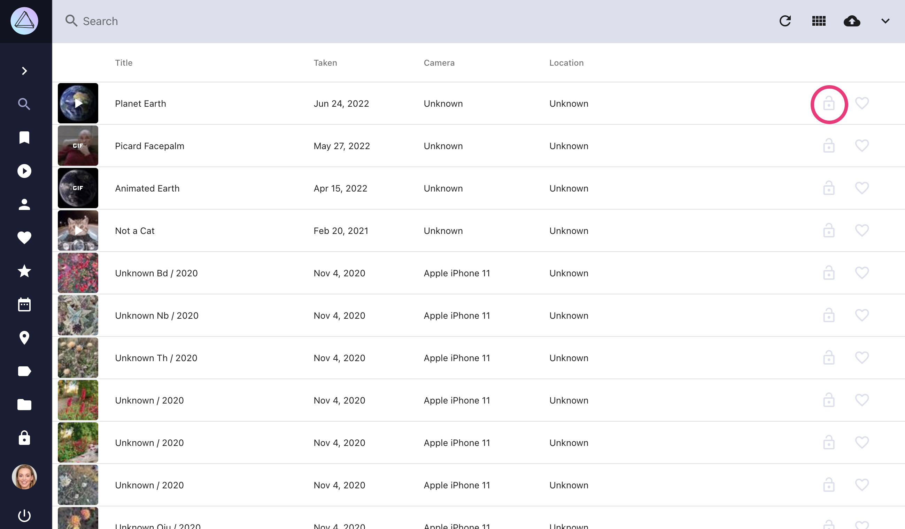

# Hiding Private Photos #
## What does private mean? ##
Some of your photos might be private for personal reasons. 
Our private functionality provides you with a solution to hide private photos or videos from some sections.
This way you can let family and friends browse through your photos without risking that they see photos you do not want them to see.

By default, photos marked as private will not appear in the following sections:

 * Search
 * Videos
 * People
 * Favorites
 * Places
 * Labels
 * Autogenerated Albums (Moments, Calendar, States, Folders)
 * Shared Albums

Private photos will be displayed in the private section, in user generated albums and within the file browser.
 
!!! info ""
    In case you want private content to appear everywhere you can configure that in [Settings](../settings/general.md).
 
## Toggle Private Flag ##
=== "Using Context Menu"
      1. Go to *Search*
      2. Select photos/videos
      3. Click context menu
      4. Click :material-lock:

        { class="shadow" }

=== "From List View"
     1. Go to *Search*
     2. Make sure you are in *list view*
     3. Click :material-lock-open: or :material-lock: on the right

        { class="shadow" }
