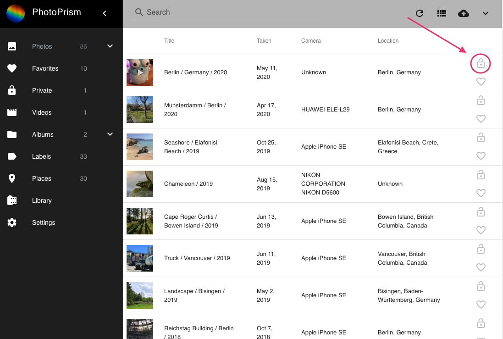
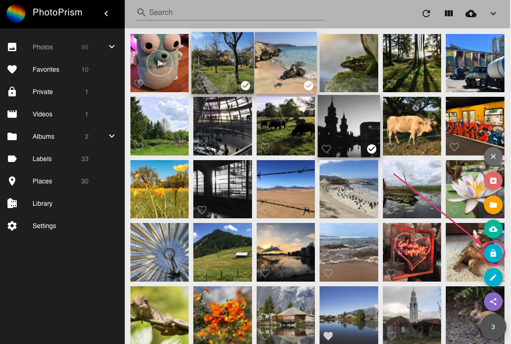

# Hide your private photos #
### What does private mean? ###
Some of your photos might be private for personal reasons. 
Our private functionality provides you with a solution to hide private photos or videos from some sections.
This way you can let family and friends browse through your photos without risking that they see photos you do not want them to see.

By default, photos marked as private will not appear in the following sections:

 * Photos
 * Videos
 * Labels
 * Places
 * Favorites
 * Shared albums
 
!!! info
    In case you want private content to appear everywhere you can configure that in [Settings](../settings/ui.md).
 
#### Mark single photos/videos as private ####

1. Go to *Photos*
2. Make sure you are in *list view*
3. Click :material-lock-open: on the right

#### Mark multiple photos as private ####

1. Go to *Photos*
2. Select photos/videos
3. Click context menu
4. Click :material-lock:

#### Remove the private flag from single photo ####

1. Go to *Private*
2. Make sure you are in *list view*
3. Click :material-lock: on the right

#### Remove the private flag from multiple photos/videos ####

1. Go to *Private*
2. Select photos/videos
3. Click context menu
4. Click :material-lock:

