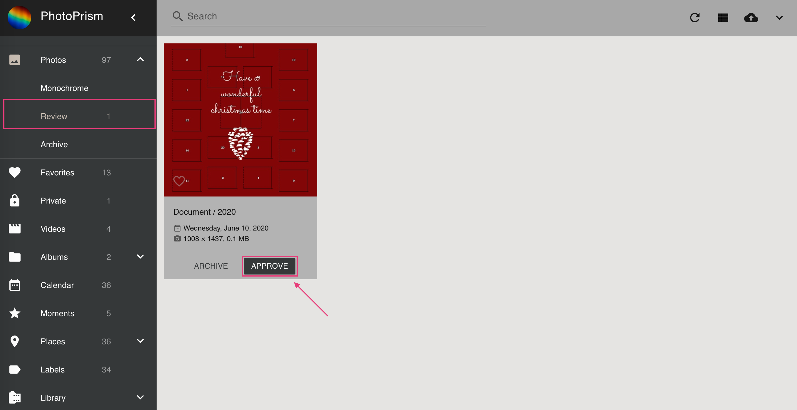

# Reviewing Non-Photographic and Low-Quality Images #
When adding new photos a quality score from 1 to 5 is created automatically.
Photos with a quality score lower than 3 do not appear in *Photos* until you approve them (unless the quality filter was disabled
in [*Settings*](../settings/general.md))

The quality score depends on the following:

* Known date and/or GPS coordinates
* At least 2 MP resolution if taken after 2012
* Photo not classified as info or screenshot
* Photo is favorite, was edited or approved

!!! info ""
    In case you do not need the review mechanism you can turn it off in [Settings](../settings/general.md)

### Approve Photos ###
=== "Edit Dialog"
     1. Open the photo's  [*edit dialog*](edit.md)
     2. Click *approve*

        { class="shadow" }

=== "Card View"
     1. Go to *Review* and make sure you are in *card view*
     2. Click *approve*

        { class="shadow" }

=== "Context Menu"
     1. Go to *Review* 
     2. Select photos and open the context menu
     3. Click :material-check:

!!! attention ""
    The quality score is constantly updated. 
    If you add date or location information to a photo or like it, the quality score increases automatically. 
    In case the new score is equal or greater than 3 the photo is approved automatically.

