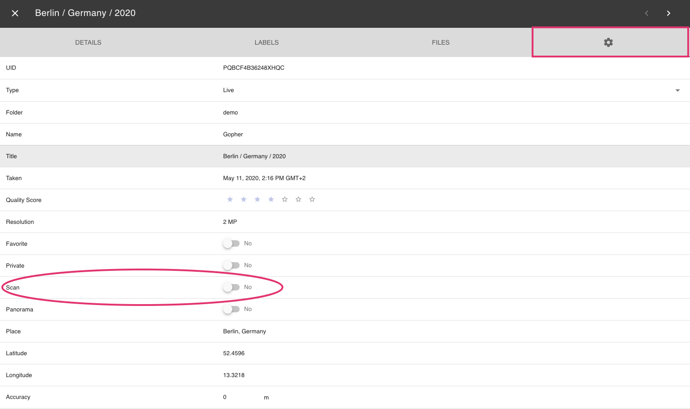

# Scans #
You can mark scanned photos as *scans* within the photo edit dialogue.

We aim to automatically mark scans in the future.

## Set scan flag ##

 1. Open the [*photo edit dialogue*](edit.md)
 2. Click :material-cog:
 3. Set or unset the scan flag

