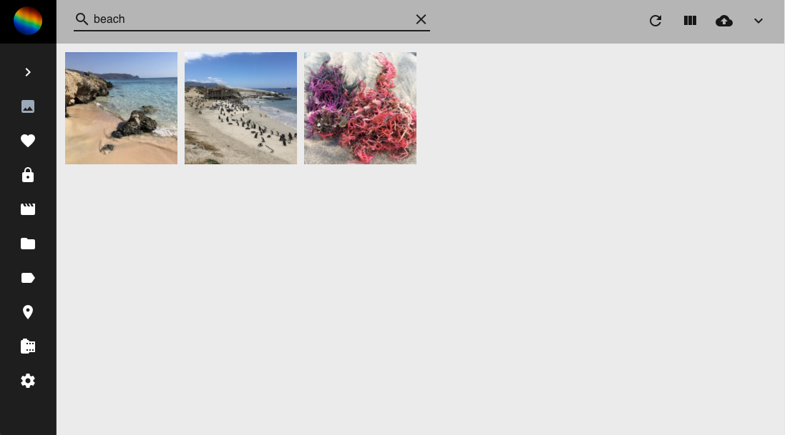
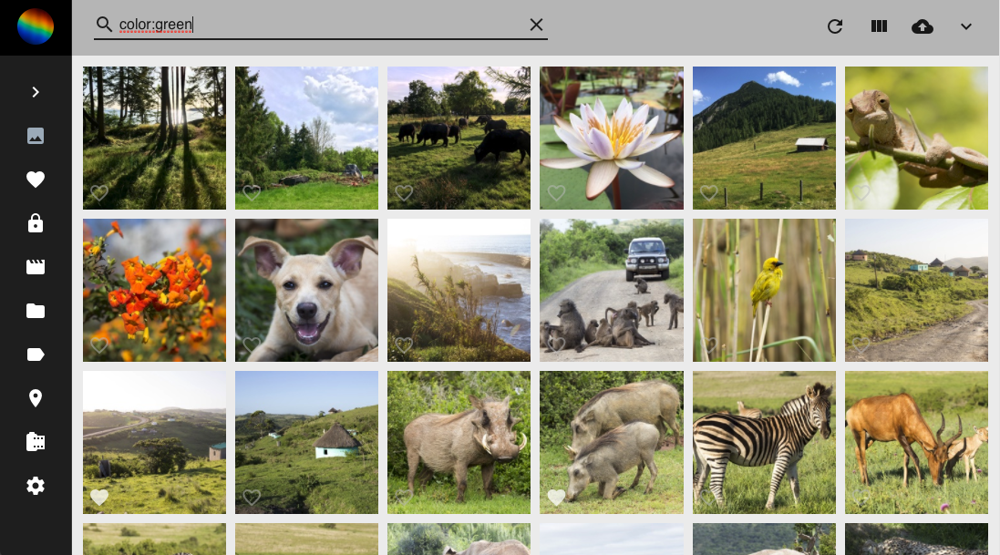

# Search #
In all sections you can use the *search bar* to find certain photos, videos, albums or labels.

You can search for all kind of things:

* Objects that are displayed on the photo
* The main color of the photo
* The filename or foldername of a photo
* Location where the photo has been taken
* ...

Just try it!

   

!!! tip
    In case you want to search for multiple things at once, enter the terms separated by a space.
    
    A search for `cat blue berlin` will find all photos that either display a cat, have blue as main color or have been taken in Berlin.

## Filters ##
Additionally to the search you can set filters for:

* Country
* Year
* Order
* Camera
* Lens
* Color
* Category

In case you set multiple filters only photos are shown in the search result that fulfill all filter criteria.

 

!!! tip
    You can use filters as well in the search bar like this:
    
    `label:cat`
    `color:green`
    `type: live`
    
    You find the full list of filters below.
    
   

# Search filter #
PhotoPrism allows you to use multiple filters in its search.
    
| Filter      | Examples |
| ----------- | ----------- |
| after      |    2006-01-02    |
| archived     |    true, false    |
| before      |   2009-01-02     |
| chroma     |   5     |
| color  | purple, magenta, pink, red, orange, gold, yellow, lime, green, teal, cyan, blue, brown, white, grey, black       |
| country     | "de" |
| day     |  23    |
| error     |    true, false    |
| favorite     |    true, false    |
| fmax     |    4.5  |
| fmin     |    1.8    |
| folder | "2020/Holiday" |
| geo | true, false |
| hidden     |    true, false    |
| label      |    cat    |
| lat     |    38.300457    |
| lng     |   8.931358   |
| month     |  5    |
| mono     |    true, false  |
| name     | "IMG_9831-112*", "IMG_9831-112" |
| original     | "IMG_9831-112*", "IMG_9831-112" |
| panorama     |    true, false    |
| path | "2020/Holiday" |
| photo | true, false |
| portrait     |    true, false  |
| primary | true, false |
| private     |    true, false    |
| quality     |   1, 2, 3, 4, 5   |
| review     |   true, false   |
| scan     |    true, false    |
| stack     |    true, false    |
| state     | "Baden-Württemberg", "Baden*" |
| title     | "Holiday*", "Holiday / 2012" |
| type     |   image, video, raw, live     |
| unsorted     |    true, false    |
| video | true, false |
| year     |  2012    |

