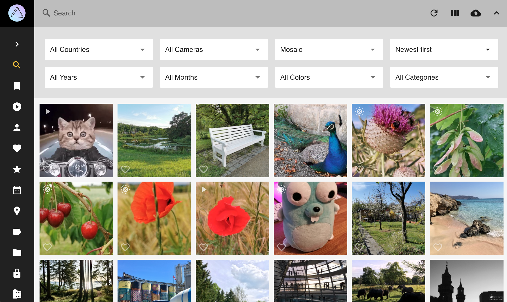
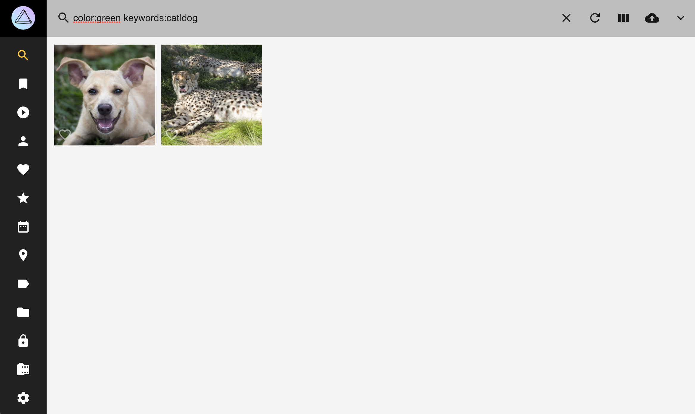

# Search #
In all sections you can use the *search bar* to find certain photos, videos, albums or labels.

You can search for all kind of things:

* People on the photo
* Objects that are displayed on the photo
* The main color of the photo
* The filename or foldername of a photo
* Location where the photo has been taken
* ...

Just try it!

 

## Search Filter ##
Additionally to the search you can set the following filters using the filter bar:

* Country, Year, Month, Order, Camera, Color, Category

In case you set multiple filters only photos, that fulfill all filter criteria, are shown in the search result.

 

!!! tip ""
    You can use filters in the search bar like this:
    
    `label:cat`
    `color:green`
    `type:live`
    
    You find the full list of filters below.
    
   

## AND Search ##
To combine different filters use a space as separator:

```
mono:true review:false
```

The search result shows photos that are monochrome **and** not in review.

Additionally some filters can be used with &:

```bigquery
keywords:buffalo&water
```

Or:

```bigquery
keywords:"buffalo & water"
```

This query will show all photos that have the keywords water **and** buffalo.

& is supported by the following filters:

* albums, keywords, subject/person, subjects/people.

!!!info ""
    The label filter does not support &. You can use the keywords filter instead, as all labels are keywords as well.

## OR Search ##
An OR search is possible using `|`:

```
label:cat|dog
```

This will show all photos that have either the label cat **or** dog.

The following filters work with |:

* albums, color, country, day, month, year, keywords, label, path, state, subject/person, subjects/people, title, type, name, filename, original, hash

## Wildcard ##
The `*` character will act as a wildcard:

```
name:"IMG_23*"
```

This will show all photos which name start with `IMG_23`.


```
name:"*_23*"
```

This will show all photos which name contain `_23`, like `IMG_2356.MOV` , `2021_02_23.jpg`, etc.

!!!info ""
    Wildcards can be combined with & or |: `filename:"*IMG123*|*_22F6FC19.jpg"`

## Search Filter Overview ##
PhotoPrism allows you to use multiple filters in its search.

|  Filter   |   Type    |                     Examples                      |                                                                    Notes                                                                    |
|-----------|-----------|---------------------------------------------------|---------------------------------------------------------------------------------------------------------------------------------------------|
| fmax      | decimal   | fmax:1.245                                        |                                                                                                                                             |
| fmin      | decimal   | fmin:1.245                                        |                                                                                                                                             |
| lat       | decimal   | lat:1.245                                         |                                                                                                                                             |
| lng       | decimal   | lng:1.245                                         |                                                                                                                                             |
| chroma    | number    | chroma:-1 chroma:2                                |                                                                                                                                             |
| dist      | number    | dist:-1 dist:2                                    | Distance to coordinates (radius in kilometre). Only applicable in combination with the lat/lng filters.                                     |
| quality   | number    | quality:0 quality:3                               | Options: 0, 1, 2, 3, 4, 5                                                                                                                   |
| album     | string    | album:berlin                                      | Single name with * wildcard                                                                                                                 |
| albums    | string    | albums:"South Africa & Birds"                     | Album names can be combined with & and \|                                                                                                    |
| camera    | string    | camera:canon                                      |                                                                                                                                             |
| color     | string    | color:"red\|blue"                                  | Can be combined with \|. Options: purple, magenta, pink, red, orange, gold, yellow, lime, green, teal, cyan, blue, brown, white, grey, black |
| country   | string    | country:"de\|us"                                   | Can be combined with \|.                                                                                                                     |
| day       | string    | day:3\|13                                          | Can be combined with \|.                                                                                                                     |
| faces     | string    | faces:yes faces:no faces:3                        | 3 means minimum 3 faces                                                                                                                     |
| filename  | string    | filename:"2021/07/12345.jpg"                      | Can be combined with \|.                                                                                                                     |
| folder    | string    | folder:2020/Holiday, folder:"*/2020"              | Same as path. Can be combined with \|.                                                                                                       |
| hash      | string    | hash:2fd4e1c67a2d                                 | Can be combined with \|.                                                                                                                     |
| keywords  | string    | keywords:"buffalo&water"                          | Keywords can be combined with & and \|                                                                                                       |
| label     | string    | label:cat\|dog                                     | Can be combined with \|.                                                                                                                     |
| lens      | string    | lens:ef24                                         |                                                                                                                                             |
| month     | string    | month:7\|10                                        | Can be combined with \|.                                                                                                                     |
| name      | string    | name:"IMG_9831-112", name:"IMG_9831-112*"         | Can be combined with \|.                                                                                                                     |
| original  | string    | original:"IMG_9831-112", original:"IMG_9831-112*" | Can be combined with \|. Only applicable when files have been imported                                                                       |
| path      | string    | path:2020/Holiday, path:"*/2020"                  | Same as folder. Can be combined with \|.                                                                                                     |
| people    | string    | people:"Jane & John"                              | Same as subjects. Names can be combined with & and \|                                                                                        |
| person    | string    | person:"Jane Doe & John Doe"                      | Same as subject. Only exact matches. Names can be combined with & and \|                                                                     |
| state     | string    | state:"Baden-Württemberg"                         | Can be combined with \|.                                                                                                                     |
| subject   | string    | subject:"Jane Doe & John Doe"                     | Same as person. Only exact matches. Names can be combined with & and \|                                                                      |
| subjects  | string    | subjects:"Jane & John"                            | Same as people. Names can be combined with & and \|                                                                                          |
| title     | string    | title:"Lake*"                                     | Can be combined with \|.                                                                                                                     |
| type      | string    | type:raw                                          | Can be combined with \|. Options: image, video, raw, live, animated                                                                          |
| uid       | string    | uid:pqbcf5j446s0futy                              |                                                                                                                                             |
| year      | string    | year:1990\|2003                                    | Can be combined with \|.                                                                                                                     |
| animated  | switch    | animated:yes                          | Animated GIFs                                                                                                                               |
| archived  | switch    | archived:yes                         |                                                                                                                                             |
| error     | switch    | error:yes                                |                                                                                                                                             |
| favorite  | switch    | favorite:yes                          |                                                                                                                                             |
| geo       | switch    | geo:yes                                    |                                                                                                                                             |
| hidden    | switch    | hidden:yes                             |                                                                                                                                             |
| landscape | switch    | landscape:yes                       |                                                                                                                                             |
| live      | switch    | live:yes                                  | Live Photos, Short Videos                                                                                                                   |
| mono      | switch    | mono:yes                                  |                                                                                                                                             |
| panorama  | switch    | panorama:yes                          | Aspect Ratio > 1.9:1                                                                                                                        |
| photo     | switch    | photo:yes                                | No Videos                                                                                                                                   |
| portrait  | switch    | portrait:yes                          |                                                                                                                                             |
| primary   | switch    | primary:yes                            |                                                                                                                                             |
| private   | switch    | private:yes                            |                                                                                                                                             |
| public    | switch    | public:yes                              |                                                                                                                                             |
| raw       | switch    | raw:yes                                    | RAW Images                                                                                                                                  |
| review    | switch    | review:yes                             |                                                                                                                                             |
| scan      | switch    | scan:yes                                  | Scanned Images, Documents                                                                                                                   |
| square    | switch    | square:yes                              |                                                                                                                                             |
| stack     | switch    | stack:yes                                |                                                                                                                                             |
| unsorted  | switch    | unsorted:yes                         |                                                                                                                                             |
| vector    | switch    | vector:yes                              | Vector Graphics                                                                                                                             |
| video     | switch    | video:yes                                |                                                                                                                                             |
| after     | timestamp | after:"2022-01-30 15:23:42"                       | Taken after this date                                                                                                                       |
| before    | timestamp | before:"2022-01-30 15:23:42"                      | Taken before this date                                                                                                                      |


!!! question "Why can't I play live photos or find stacks when I search for specific images?"
    Our search API and user interface perform a file search. This is intentional since "stacks" can contain files of different types and properties, such as color.

    For example, there may be color and monochrome versions. Now, when you search for them or sort them by color, the user interface must display individual files. Otherwise, the results showing a color image/video when you filter by monochrome would make no sense.
    
    Likewise, if you search for `filename.mp4.*`, you will find only JPEGs without video, because the video file extension is `.mp4` without an extra dot at the end.

    We recommend using the `path:` and/or `name:` filters with wildcards if searching for individual files limits the search results too much. Most users will want to find all related files so that they can be displayed together, e.g. as live photos consisting of a video and an image.
    
    You can combine these filters with other filters such as `live` to ensure that the results include only pictures with a specific media type. Alternatively, you can use the `filename:` filter with a more permissive wildcard that excludes the file extension.
