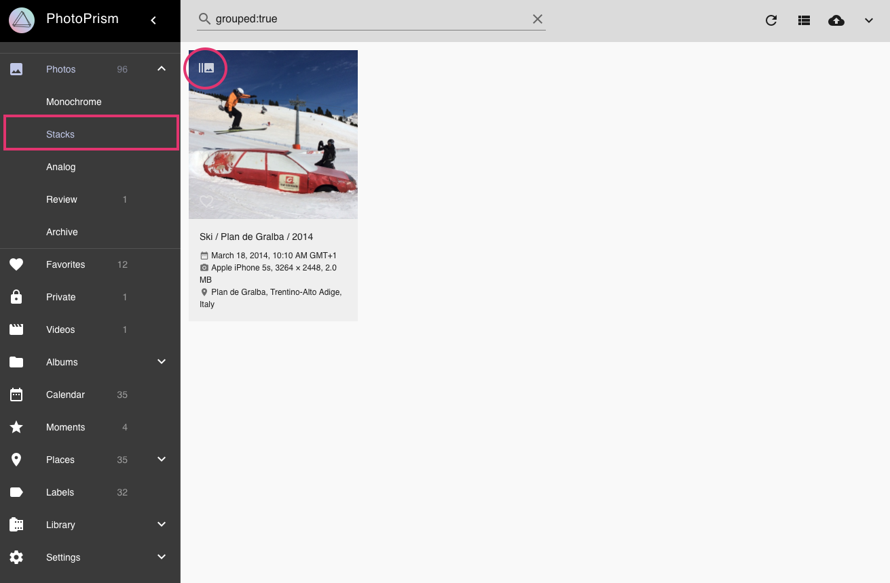
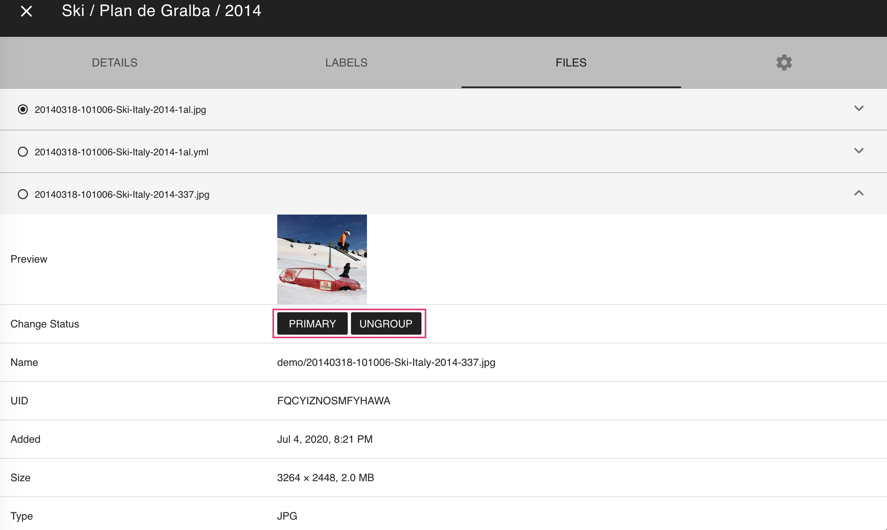
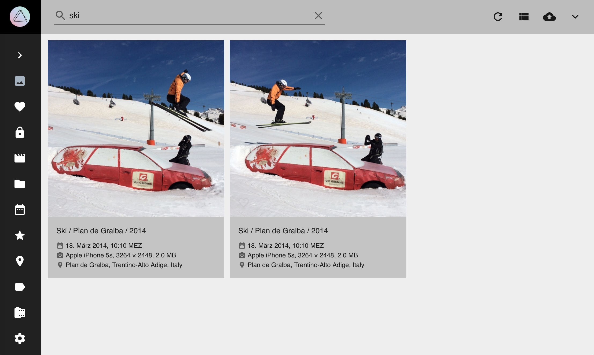

# Stacks #

## Grouped Files ##

In case you have "Grouped Sequentials" enabled in [*Settings*](../settings/ui.md) you might have photos that consist of more than one JPEG file.
Grouped files are displayed in *Stacks*.

!!! info
    Files are grouped in two cases:
    
    1. Filenames are related: 'IMG_1234 (2)' or 'IMG_1234 copy 2' are assumed to belong to the same photo.
    2. Photos that have been taken at the same location AND in the same second.

### Browse through related files ###

1. Click on *sequence*

    
    
2. Use arrows to see all photos of the sequence

     
   

### Change primary file ###
The JPEG file marked as *primary* is used in our views. It is listed first in the files tab.

To change the primary file:

1. Open the photos [*edit dialogue*](edit.md)

2. Open *Files* tab

3. Click :material-chevron-down: of the file you want to set as primary
        
4. Click *primary*

       

### Ungroup files ###
1. Open the photos [*edit dialogue*](edit.md)

2. Open *Files* tab

3. Click :material-chevron-down: of the JPEG file that is not marked as primary
        
4. Click *ungroup*

      

Now, both files appear in our views.

