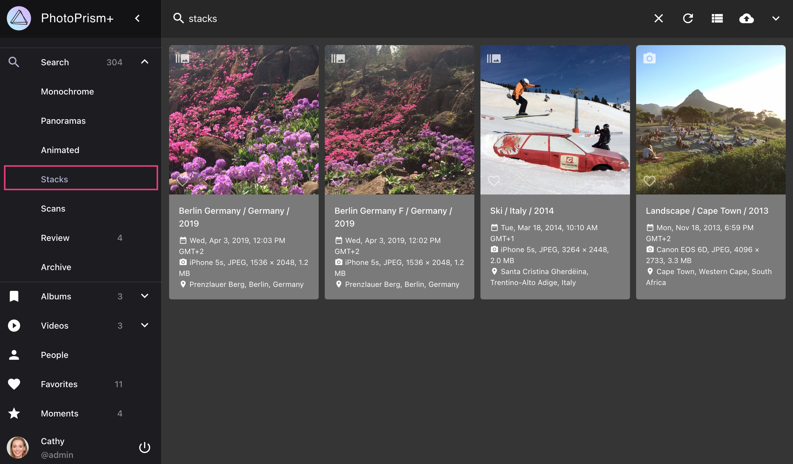
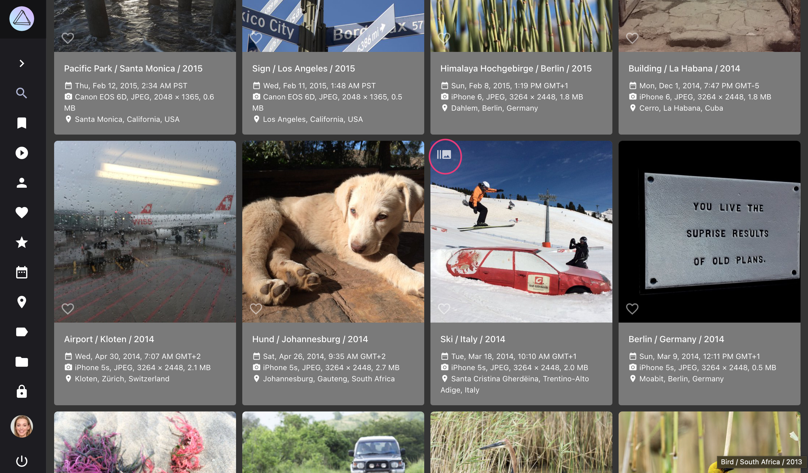
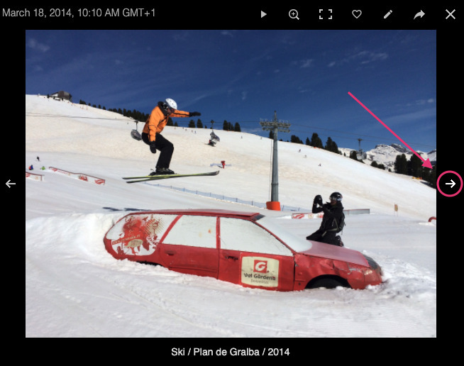
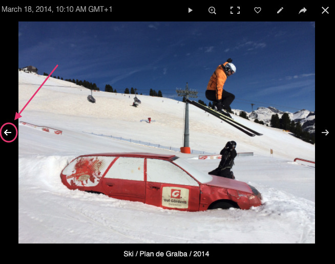
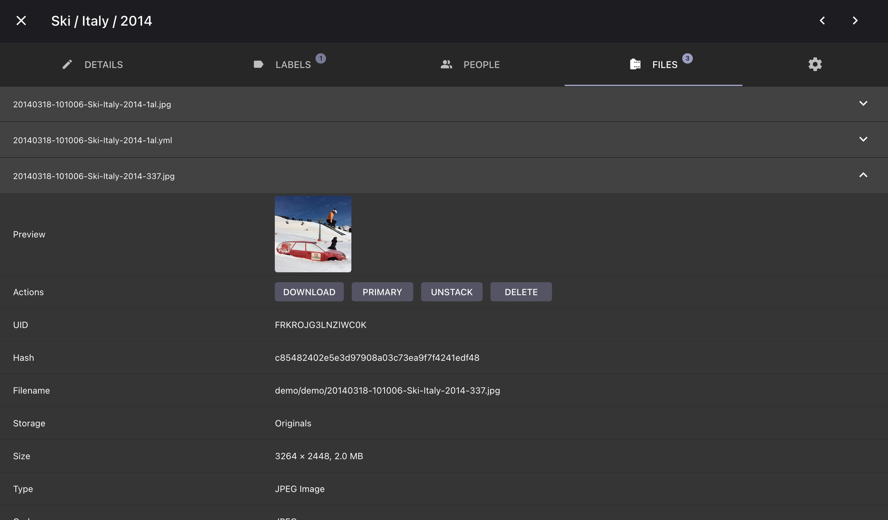
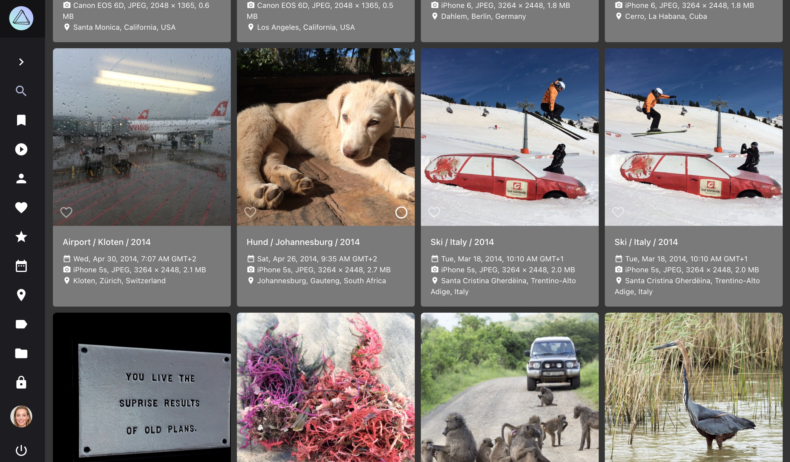

# Stacks

Stacks are groups of files that have the same origin but differ in quality, format, size, or color. Go to *[Settings > Library](../settings/library.md)* to change the stacking settings for your library.

To see all images with a group of related files, open *Stacks* in the expanded *Search* navigation:

{ class="shadow" }

Note that *[Videos](video.md)* and *[Live Photos](video.md#live-photos)*, which always have a preview image stacked with them, will not be displayed on the *Stacks* page.

## For what reasons can files be stacked?

1. Files sharing exactly the same file and folder name will always be stacked, for example `/2018/IMG_1234.jpg` and `/2018/IMG_1234.avi`
2. Files with related, sequential names like `/2018/IMG_1234 (2).jpg` and `/2018/IMG_1234 (3).jpg` may be stacked as well (optional)
3. Pictures were taken at the same GPS position and second (optional)
4. Image metadata contains the same *Unique Image ID* or *XMP Instance ID* (optional)

You can change the behaviour for 2 - 4 in [*Settings*](../settings/library.md).

!!! attention ""
    If you change the stacking settings, already stacked files will not be unstacked automatically.

## Browse Related Files

1. Click on :material-camera-burst:

    { class="shadow" }
    
2. Use arrows to see all photos of the sequence

    { class="shadow" } { class="shadow" }
   

## Change Primary Files

The JPEG file marked as *primary* is used in our views. It is listed first in the files tab.

To change the primary file:

1. Open the photos [*edit dialog*](edit.md)

2. Open *Files* tab

3. Click :material-chevron-down: of the file you want to set as primary
        
4. Click *primary*

      { class="shadow" } 

## Unstack Files

1. Open the photos [*edit dialog*](edit.md)

2. Open *Files* tab

3. Click :material-chevron-down: of the JPEG file that is not marked as primary
        
4. Click *unstack*

   { class="shadow" }

Now, both files appear in our views.

{ class="shadow" }

## Delete Non-Primary Files

1. Open the photos [*edit dialog*](edit.md)

2. Open *Files* tab

3. Click :material-chevron-down: of the JPEG file that is not marked as primary
        
4. Click *delete*

5. Confirm

   { class="shadow" } 
