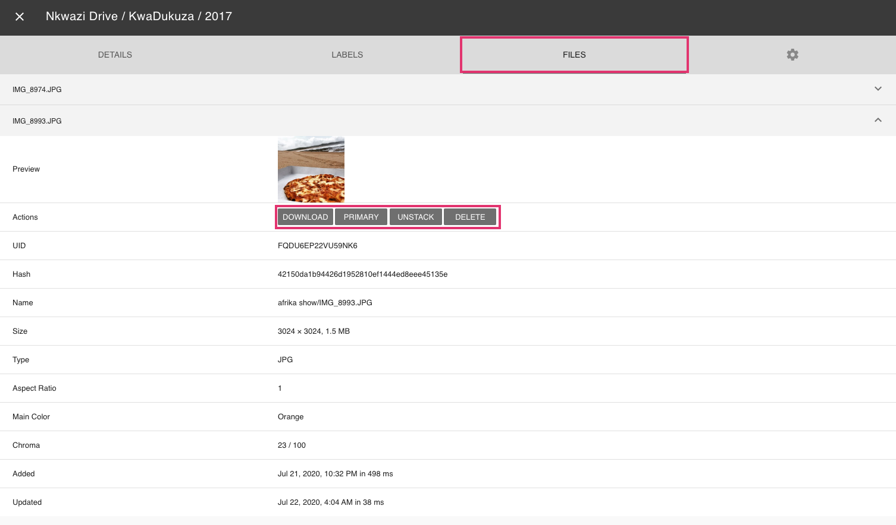

# Stacks #

If you have enabled "Stacks" in  [*Settings*](../settings/general.md), you may come across photos that have more than 
one JPEG file associated with them. Grouped files are displayed in *Stacks*.

### For what reasons can files be stacked? ###

 1. Files sharing exactly the same file and folder name will always be stacked, for example `/2018/IMG_1234.jpg` and `/2018/IMG_1234.avi`
 2. Files with related, sequential names like `/2018/IMG_1234 (2).jpg` and `/2018/IMG_1234 (3).jpg` may be stacked as well (optional)
 3. Metadata suggests files have been taken at the same location and second (optional)
 4. File metadata contains the same unique image or instance identifier (optional)
 
 You can change the behaviour for 2 - 4 in [*Settings*](../settings/general.md).

### Browse Related Files ###

1. Click on :material-camera-burst:

    
    
2. Use arrows to see all photos of the sequence

     
   

### Change Primary Files ###

The JPEG file marked as *primary* is used in our views. It is listed first in the files tab.

To change the primary file:

1. Open the photos [*edit dialog*](edit.md)

2. Open *Files* tab

3. Click :material-chevron-down: of the file you want to set as primary
        
4. Click *primary*

       

### Unstack Files ###

1. Open the photos [*edit dialog*](edit.md)

2. Open *Files* tab

3. Click :material-chevron-down: of the JPEG file that is not marked as primary
        
4. Click *unstack*

      

Now, both files appear in our views.

### Permanently Remove Non-Primary Files ###

1. Open the photos [*edit dialog*](edit.md)

2. Open *Files* tab

3. Click :material-chevron-down: of the JPEG file that is not marked as primary
        
4. Click *delete*

5. Confirm

      