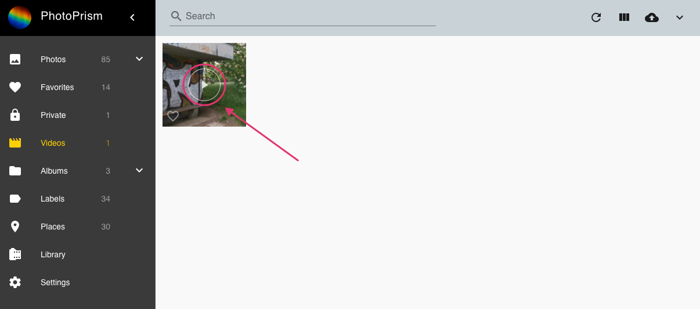

# Browsing and Playing Videos

Navigate to *Videos* to browse all your videos. To play a video, click :material-play:.

Please note that not all [video and audio formats](https://caniuse.com/?search=video%20format) can be [played with every browser](../../getting-started/troubleshooting/browsers.md). For example, [AAC](https://caniuse.com/aac "Advanced Audio Coding") - the default audio codec for [MPEG-4 AVC / H.264](https://caniuse.com/avc "Advanced Video Coding") - is supported natively in Chrome, Safari, and Edge, while it is only optionally supported by the OS in Firefox and Opera.

{ class="shadow" }

## Live Photos ##

Short videos up to 3 seconds are categorized and displayed as *Live Photos*, regardless of your phone's make and model.
You can recognize this by the :material-adjust: icon that appears in the upper left corner.

Move the mouse cursor over the thumbnail to play the video without changing the view.
You can limit a search to *Live Photos* by using the `type:live` filter or the keyword `live`.

{ class="shadow" }

## Transcoding ##

PhotoPrism may use [*ffmpeg*](https://www.ffmpeg.org/documentation.html) to transcode
common video formats to [MPEG-4 AVC](https://en.wikipedia.org/wiki/MPEG-4).

Videos in MPEG-4 AVC format can be played natively by virtually all modern browsers.

OGV, VP8, VP9, AV1, WebM and HEVC videos will be streamed directly in case they are supported by your browser and if they do not exceed the configured [bitrate limit](../../getting-started/config-options.md#file-converters).
Otherwise those formats will be transcoded as well.

When needed videos are transcoded on demand. This can cause unacceptable delays when large video files
are played for the first time.

In that case, you may [run the following command in a terminal](../../getting-started/docker-compose.md#command-line-interface)
to pre-transcode all video originals if needed:

```
docker-compose exec photoprism photoprism convert
```

!!! note ""
    Make sure that there is enough disk space available on your server before transcoding all video files, as this may
    require a significant amount of extra storage.

!!! tldr ""
    HEVC/H.265 video files can have a `.mp4` file extension too, which is often associated with AVC only. This is because
    MP4 is a *container* format, meaning that the actual video content may be compressed with H.264, H.265, or something
    else. The file extension doesn't really tell you anything other than that it's probably a video file.

*[HEVC]: High Efficiency Video Coding / H.265