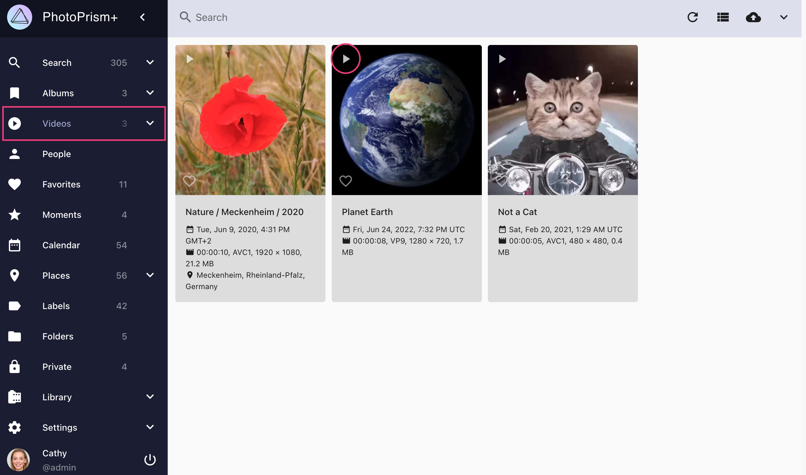

# Browsing and Playing Videos

Navigate to *Videos* to browse all your videos. To play a video, click :material-play:.

Please note that not all [video and audio formats](https://caniuse.com/?search=video%20format) can be [played with every browser](../../getting-started/troubleshooting/browsers.md). For example, [AAC](https://caniuse.com/aac "Advanced Audio Coding") - the default audio codec for [MPEG-4 AVC / H.264](https://caniuse.com/avc "Advanced Video Coding") - is supported natively in Chrome, Safari, and Edge, while it is only optionally supported by the OS in Firefox and Opera.

{ class="shadow" }

!!! tldr ""
    In case [FFmpeg is disabled](../settings/advanced.md#disable-ffmpeg) or not installed, videos cannot be indexed because still images cannot be created.
    You should also have [Exiftool enabled](../../getting-started/config-options.md#feature-flags) to extract metadata such as duration, resolution, and codec.

## Live Photos ##

Short videos up to 3 seconds are categorized and displayed as *Live Photos*, regardless of your phone's make and model.
You can recognize this by the :material-adjust: icon that appears in the upper left corner.

Move the mouse cursor over the thumbnail to play the video without changing the view.
You can limit a search to *Live Photos* by using the `type:live` filter or the keyword `live`.

{ class="shadow" }

## Transcoding ##

For maximum browser compatibility, PhotoPrism can transcode video codecs and containers [supported by FFmpeg](https://www.ffmpeg.org/documentation.html) to [MPEG-4 AVC](https://en.wikipedia.org/wiki/MPEG-4), as well as extract still images for thumbnail creation:

- if [FFmpeg is disabled](../settings/advanced.md#disable-ffmpeg) or not installed, indexing and importing videos is not possible because still images cannot be created
- if [Exiftool is disabled](../../getting-started/config-options.md#feature-flags) or not installed, indexing and importing videos is only partially possible because the video metadata cannot be extracted and thus the duration, resolution, and codec are unknown
- [MPEG-4 AVC](https://en.wikipedia.org/wiki/MPEG-4) videos can be [played natively by most modern browsers](https://caniuse.com/mpeg4) and are not re-encoded, even if they exceed the [configured bitrate limit](../../getting-started/advanced/transcoding.md#bitrate-limiting); to reduce the size of AVC videos, you can manually replace the original files with a smaller version or wait for a future release that offers this functionality
- OGV, VP8, VP9, AV1, WebM, and HEVC videos will be streamed directly if they are supported by your browser and do not exceed the [configured bitrate limit](../../getting-started/advanced/transcoding.md#bitrate-limiting)
- other formats must always be transcoded

**If necessary, videos are transcoded on demand. This can cause unacceptable delays when large video files are played for the first time.**

In this case, you can [run the following command in a terminal](../../getting-started/docker-compose.md#command-line-interface) to pre-transcode all video files as needed:

```
docker compose exec photoprism photoprism convert
```

Our setup guide for advanced users explains how to [configure hardware video transcoding](../../getting-started/advanced/transcoding.md).

!!! note ""
    Make sure that there is enough disk space available on your server before transcoding all video files, as this may
    require a significant amount of extra storage.

!!! tldr ""
    HEVC/H.265 video files can have a `.mp4` file extension too, which is often associated with AVC only. This is because
    MP4 is a *container* format, meaning that the actual video content may be compressed with H.264, H.265, or something
    else. The file extension doesn't really tell you anything other than that it's probably a video file.

*[HEVC]: High Efficiency Video Coding / H.265