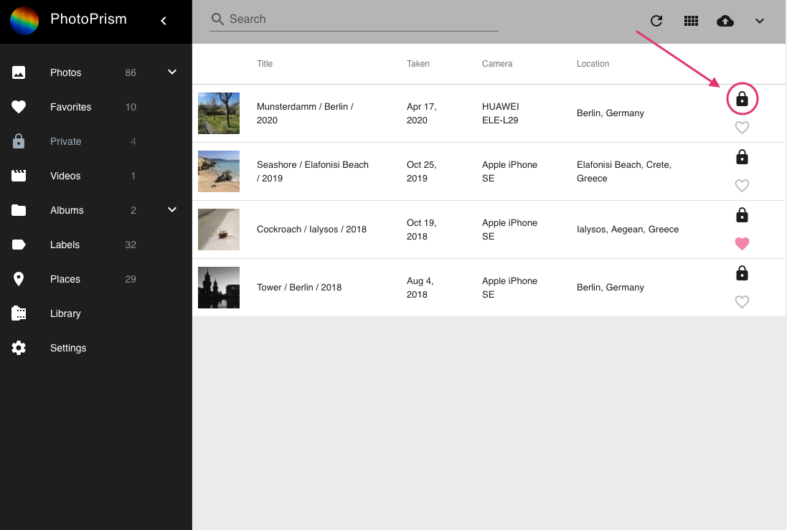
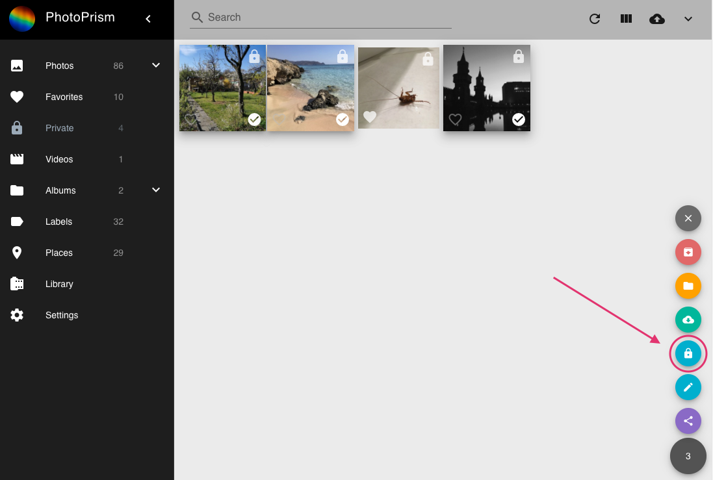

### What does private mean?
Some of your photos might be private for personal reasons. 
Our private functionality provides you with a solution to hide private photos or videos from some sections.
This way you can let family and friends browse through your photos without risking that they see photos you do not want them to see.

By default, photos marked as private will not appear in the following sections:

 * Photos
 * Videos
 * Labels
 * Places
 * Favorites
 * Shared albums
 
!!! info
    In case you want private content to appear everywhere you can configure that in the [settings](settings/ui.md).
 
### Mark photos as private
When adding/indexing new photos potentially private photos are marked as private automatically.
Be aware this algorithm is still in beta mode.

@Micha Können wir das optional machen? Also dem Nutzer die möglichkeit geben die private Funktion zu nutzen, aber ausschließlich manuell das private flag setzen?

#### Mark single photos/videos as private

1. Go to Photos.
2. Make sure you are in list view.
3. Click private on the right.

#### Mark multiple photos as private

1. Go to Photos.
2. Select photos/videos.
3. Click context menu.
4. Click private.

#### Remove the private flag from single photo

1. Go to Private.
2. Make sure you are in list view.
3. Click the private on the right.

#### Remove the private flag from multiple photos/videos

1. Go to Private.
2. Select photos/videos.
3. Click context menu.
4. Click private.

