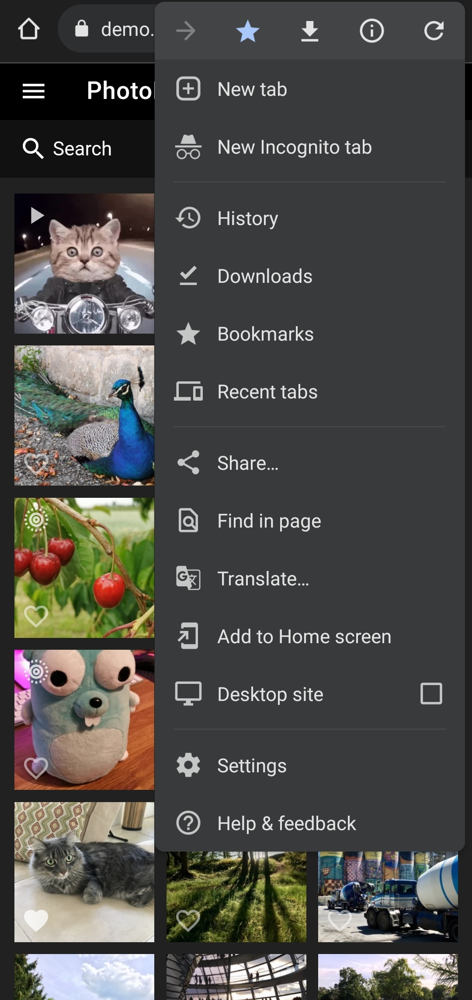

# Mobile App (PWA) #

PhotoPrism does not yet have an official native mobile app, but you can install it as a Progressive Web App.

!!! info ""
    You can add the PWA to the home screen of your mobile phone, tablet or the desktop of your computer.

## Install PWA
=== "iOS/Safari"

    1. Open PhotoPrism on your device's browser (on iOS, use Safari)
    2. Click :material-export-variant:

        {: style="width:35%"}

    3. Click *Add to Home Screen*

        {: style="width:35%"}

    4. Choose a name and click *Add*

        {: style="width:35%"}

=== "Android/Firefox/Chrome"

    1. Open PhotoPrism on your device's browser
    2. Click :material-dots-vertical:

        {: style="width:35%"} 

    3. Click *Add to Home screen*

        {: style="width:35%"}

    4. Choose a name and click *Add*

        {: style="width:35%"}

PhotoPrism is now available on the home screen of your phone or tablet, or on the desktop of your computer.

{: style="width:35%"}
