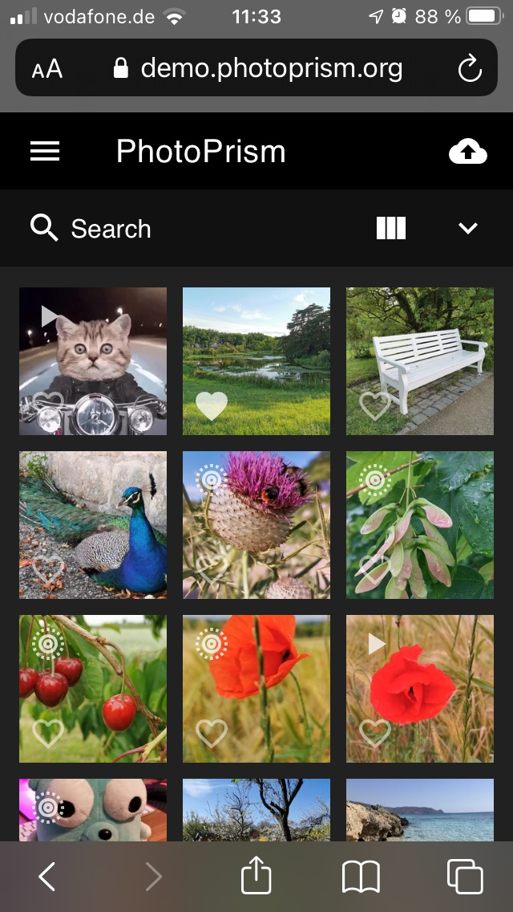
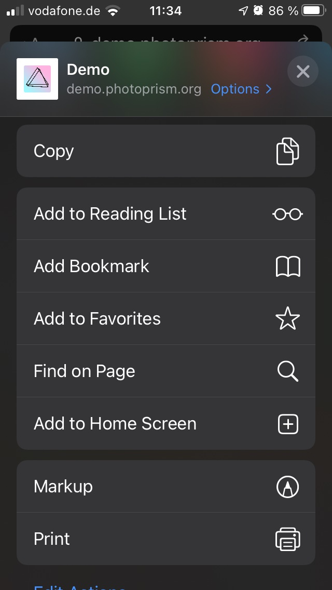
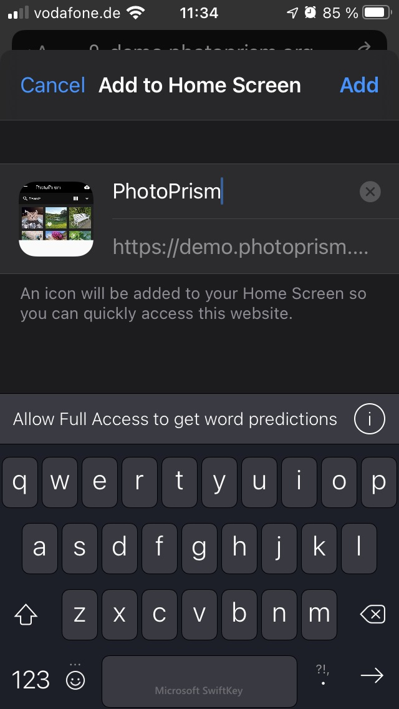
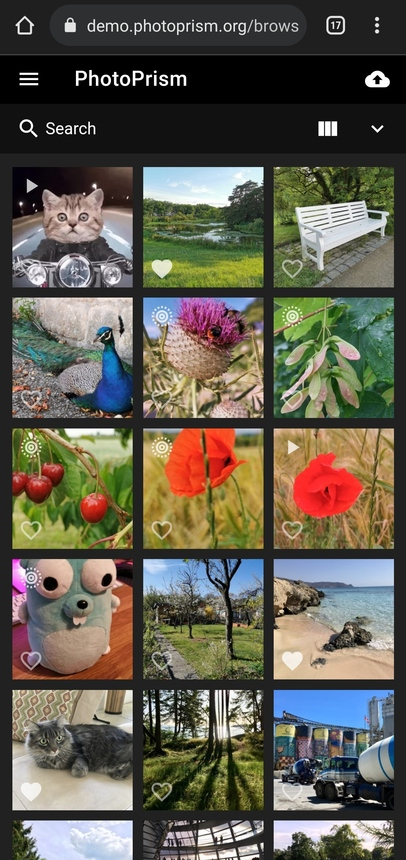
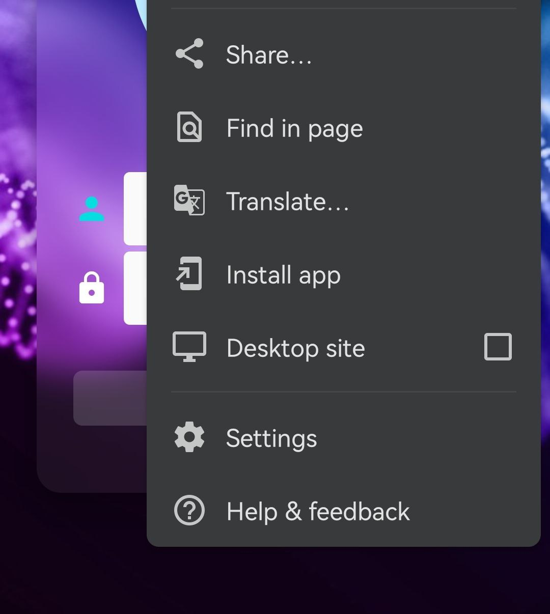
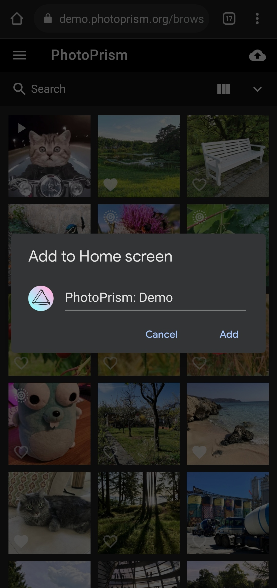
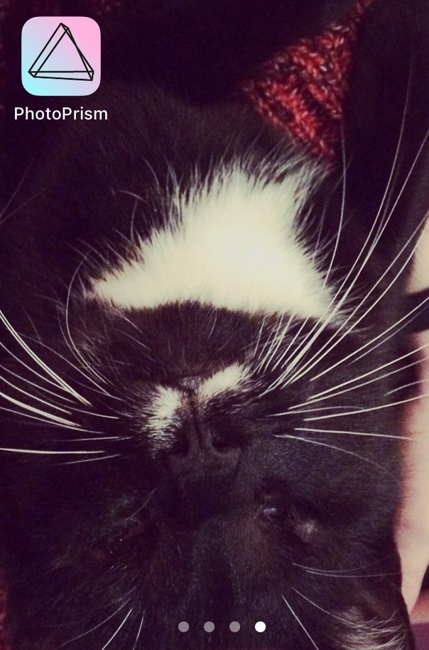

# Mobile App (PWA) #

At the moment, PhotoPrism doesn't have a native mobile app that can be installed through an official app store.
However, our Progressive Web App (PWA) offers an almost native app-like experience. 
You can conveniently install it on the home screen of all major operating systems and mobile devices.

## Installation Requirements

The compatibility of our PWA has been tested with Apple Safari and Google Chrome, but other modern browsers like Firefox or Microsoft Edge may generally be compatible as well.

!!! note ""
    When self-hosting PhotoPrism, please make sure the [site URL is configured correctly](../getting-started/config-options.md#site-information). In addition, PWAs must be hosted on a dedicated domain with HTTPS in order to be installed. If that is not possible, you can still choose "Create Shortcut...", "Add to Home Screen...", or a similarly named action from the browser menu to make the app accessible from your home screen.

## Step-by-Step Instructions

=== "Apple Safari (iOS)"

    1. Open PhotoPrism in Safari
    2. Click :material-export-variant:

        {: style="width:35%" class="shadow"}

    3. Click *Add to Home Screen*

        {: style="width:35%" class="shadow"}

    4. Choose a name and click *Add*

        {: style="width:35%" class="shadow"}

=== "Google Chrome (Android)"

    1. Open PhotoPrism in Chrome
    2. Click :material-dots-vertical:

        {: style="width:35%" class="shadow"} 

    3. Click *Install app*

        {: style="width:35%" class="shadow"}

    4. Choose a name and click *Add*

        {: style="width:35%" class="shadow"}

The PWA is now installed on the home screen of your device and can be launched from there.

{: style="width:35%" class="shadow"}
