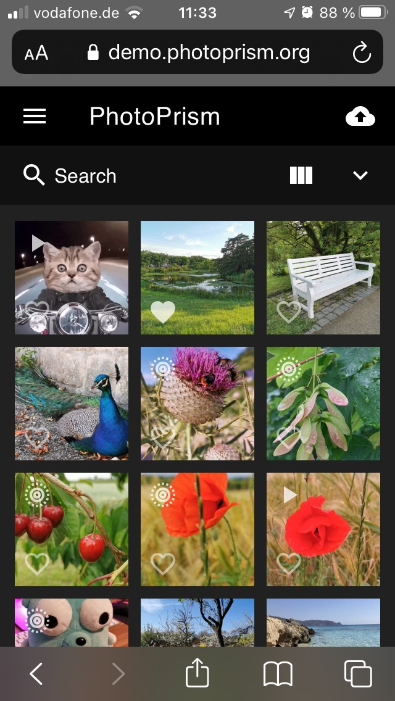
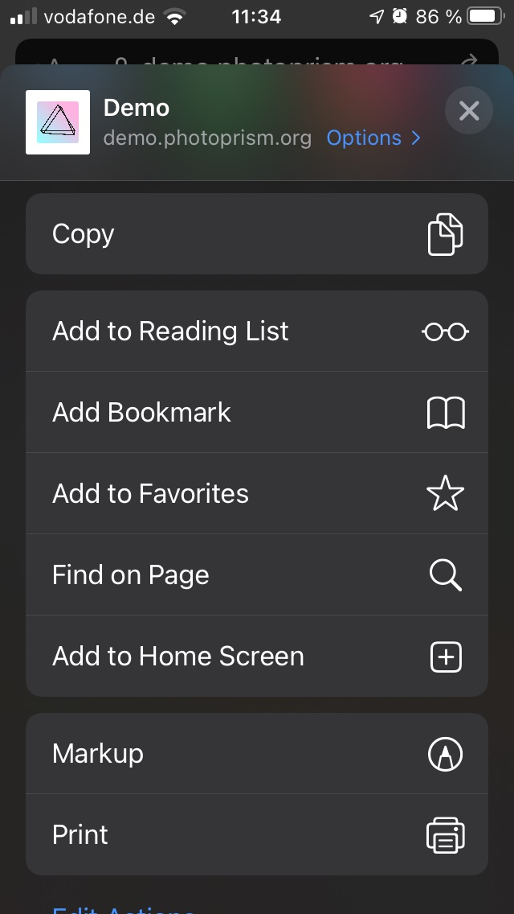
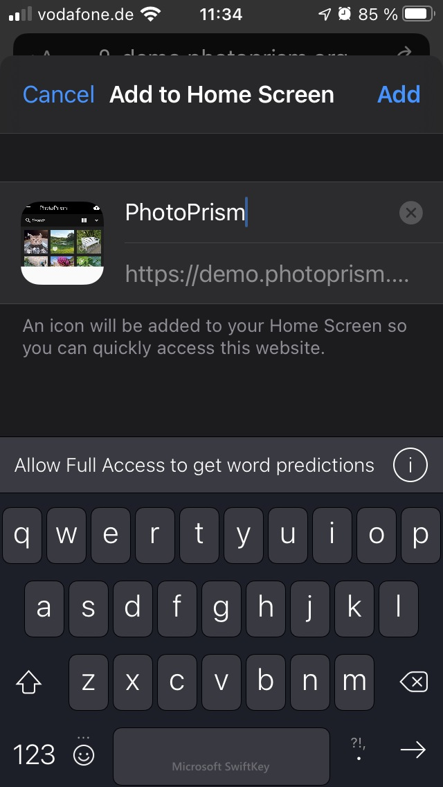
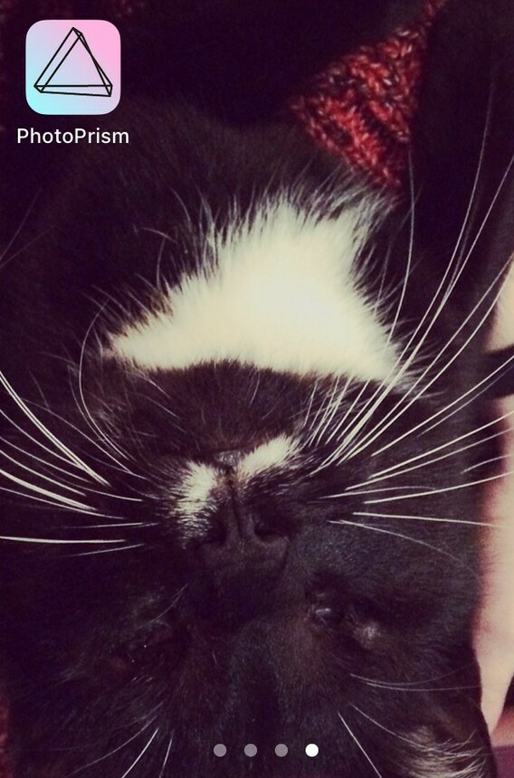
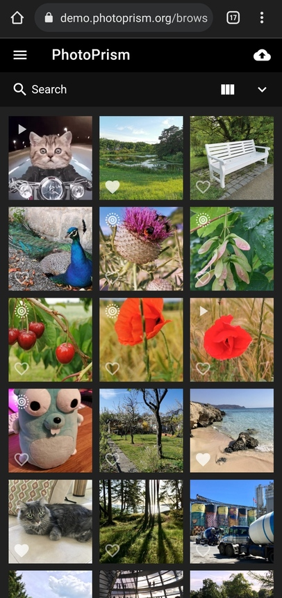
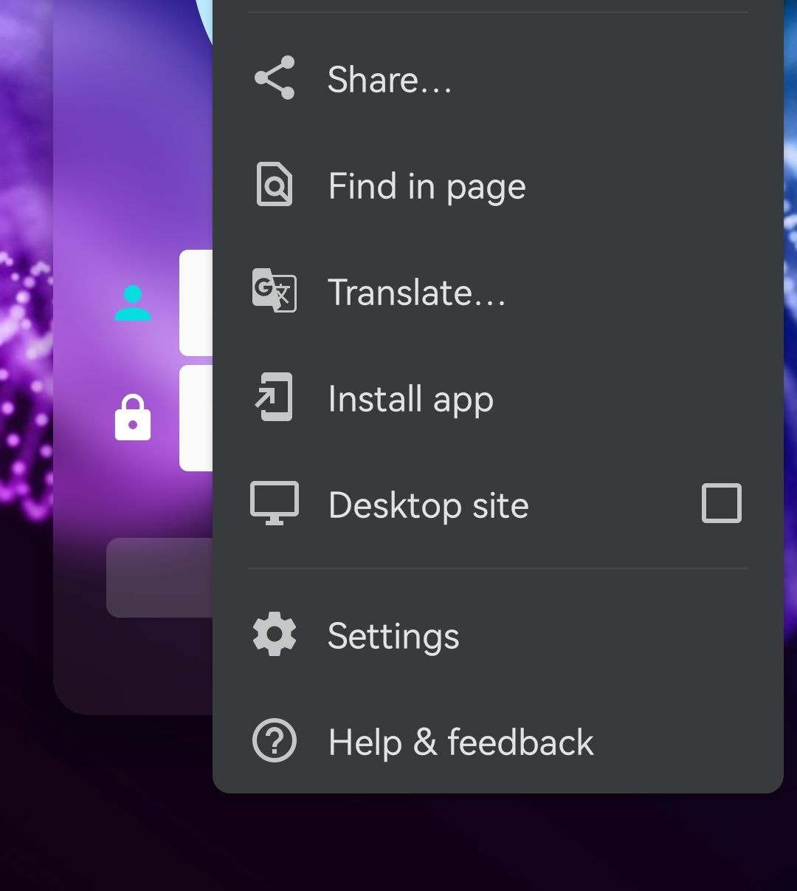
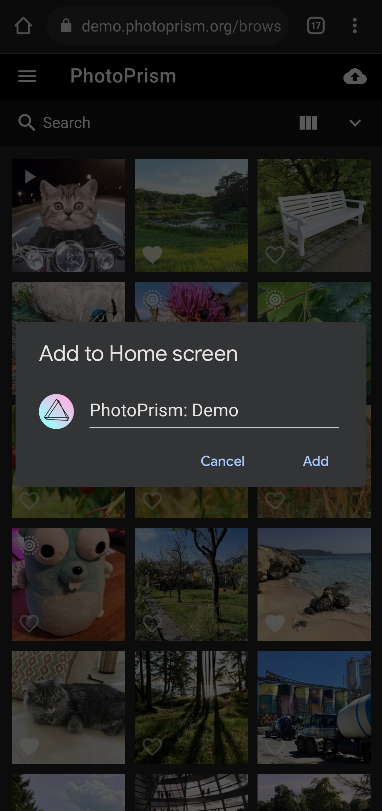

# Mobile App (PWA)

PhotoPrism currently does not include a native app that can be installed through an app store. However, there are [many compatible apps](https://www.photoprism.app/partners/), and you can conveniently install our Progressive Web App (PWA) on your desktop or home screen for an almost native app-like experience.

## Installation Requirements

The compatibility of our PWA has been tested with Apple Safari and Google Chrome, but other modern browsers like Firefox or Microsoft Edge may generally be compatible as well.

!!! note ""
    When self-hosting PhotoPrism, please make sure the [site URL is configured correctly](../getting-started/config-options.md#site-information). In addition, PWAs must be hosted on a dedicated domain with HTTPS in order to be installed. If that is not possible, you can still choose "Create Shortcut...", "Add to Home Screen...", or a similarly named action from the browser menu to make the app accessible from your home screen.

## Step-by-Step Instructions

=== "Apple Safari (iOS)"

    1. Open PhotoPrism in Safari
    2. Click :material-export-variant:

        {: style="width:35%" class="shadow"}

    3. Click *Add to Home Screen*

        {: style="width:35%" class="shadow"}

    4. Choose a name and click *Add*

        {: style="width:35%" class="shadow"}

    5. The PWA is now installed on the home screen of your device and can be launched from there.

        {: style="width:35%" class="shadow"}

    !!! info "Preserve Original Format When Uploading on iOS"
        iOS may convert photos and videos to a more compatible format **before** they are uploaded via Safari or the PhotoPrism PWA, so PhotoPrism will receive and store the already converted files.

        To preserve the original format:

        - In the iOS Photos picker, tap the three-dot menu (…) → *Options* → set **Format** to **Current** instead of **Automatic** so your files are uploaded in the original format.
        - Alternatively, use dedicated sync apps like [PhotoSync](./sync/mobile-devices.md#using-photosync), which can upload files in their original format via WebDAV.

=== "Google Chrome (Android)"

    1. Open PhotoPrism in Chrome
    2. Click :material-dots-vertical: (of the Chrome, not website)

        {: style="width:35%" class="shadow"} 

    3. Click *Install app*

        {: style="width:35%" class="shadow"}

    4. Choose a name and click *Add*

        {: style="width:35%" class="shadow"}
