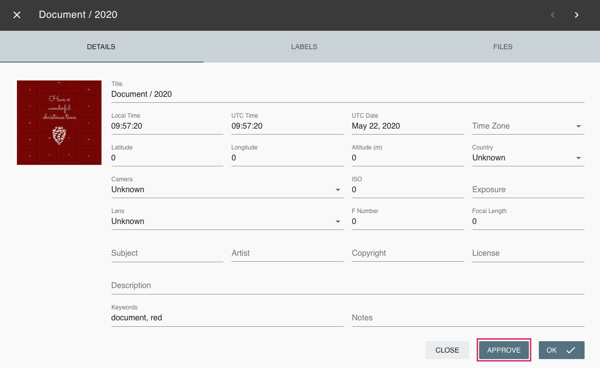

When adding new photos a quality score is created automatically.
The score ranges from 0 - 5.
Photos with a quality score lower than 3 do not appear in Photos until you approve them.

The quality score depends on the following:

* Taken at date is known
* Location is known
* Photo has at least 2 MP resolution (if taken after 2012)
* Photo is not classified as info or screenshot
* User likes the photo

!!! info
    In case you do not need the review mechanism you can turn it off in the [settings](settings.md)

## Review photos
Photos that are in Review can either be approved (photos appear in Photos) or archived (photos appear in Archive).

**To approve or archive photos either:**

1. Switch to the card view.
2. Click approve button or archive button button on the photo.

Or select photos --> open context menu --> click approve or archive

One of those NEEDS TO BE IMPLEMENTED

**Or:**

1. Open the photo's  [edit dialogue](edit.md).
2. Click approve or archive (Button needs to be implemented).

    

!!! attention
    The quality score is constantly updated. 
    If you add date or location information to a photo or like it, the quality score increases automatically. 
    In case the new score is equal or greater than 3 the photo is approved automatically.

