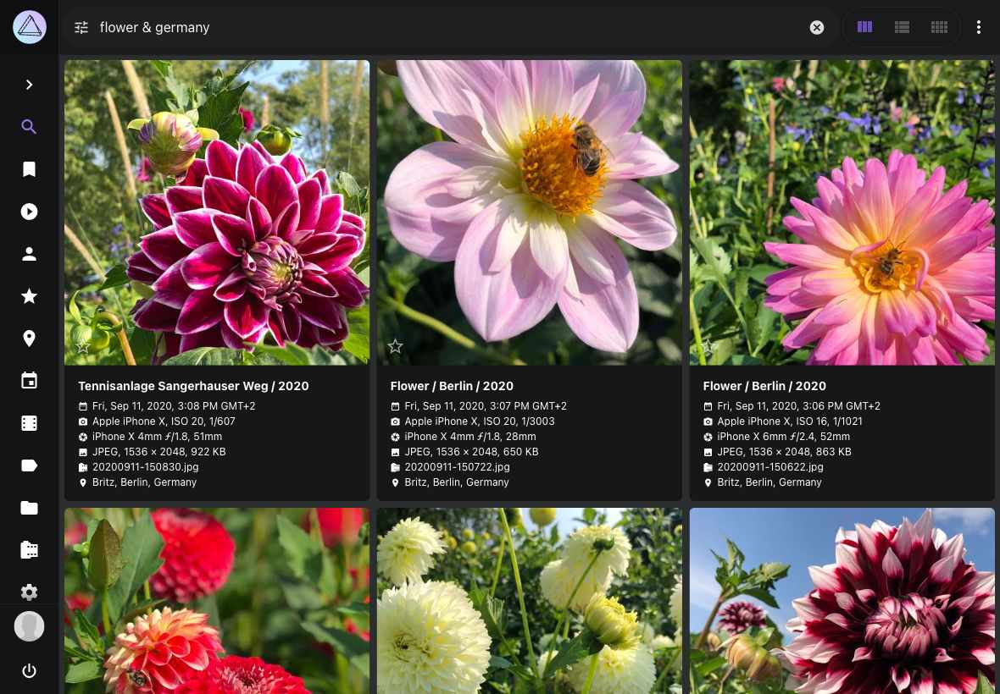
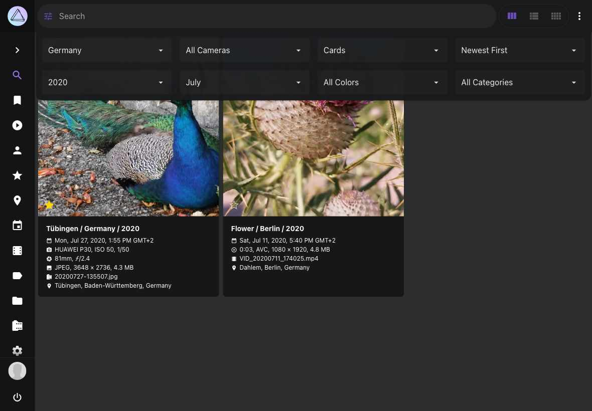

# Using Search Filters

Powerful search filters let you easily find specific photos and videos, for example:

* Persons visible on a picture
* Objects that are displayed on a picture
* The [main color](../../developer-guide/metadata/colors.md#standard-colors) of a picture
* The file or folder name of a picture
* Location where a picture has been taken
* Other metadata such as camera, lens, chroma...

Just give it a try!

{ class="shadow" }

## Introduction ##

The following filters can be set via dropdowns in the search toolbar:

* Country, Year, Month, Order, Camera, [Color](../../developer-guide/metadata/colors.md#standard-colors), Category.

If you set multiple filters, only pictures that meet all filter criteria will be displayed in the search result. Filters can generally be combined unless they contradict each other.

 { class="shadow" }

In addition, these and many other filters can be entered into the toolbar search box as follows:

```
label:cat color:green type:live
```

A complete overview of the [available search filters](#filter-reference) can be found below.

{ class="shadow" }

### AND Search ###

To combine different filters use a space as separator:

```
mono:true review:false
```

The search result shows pictures that are monochrome **and** not in review.

Additionally some filters can be combined with `&` as follows:

```
keywords:buffalo&water
```

or:

```
keywords:"buffalo & water"
```

This query will show all photos that have the keywords water **and** buffalo.

& is supported by the following filters:

* albums, keywords, subject/person, subjects/people.

!!!info ""
    The label filter does not support &. You can use the keywords filter instead, as all labels are keywords as well.

### OR Search ###

An OR search is possible using `|`:

```
label:cat|dog
```

This will show all photos that have either the label cat **or** dog.

The following filters work with |:

* albums, color, country, state, city, day, month, year, keywords, label, path, subject/person, subjects/people, title, type, name, filename, original, hash

### Wildcard ###

The `*` character will act as a wildcard:

```
name:"IMG_23*"
```

This will show all photos which name start with `IMG_23`.

```
name:"*_23*"
```

This will show all photos which name contain `_23`, like `IMG_2356.MOV` , `2021_02_23.jpg`, etc.

!!!info ""
    Wildcards can be combined with & or |: `filename:"*IMG123*|*_22F6FC19.jpg"`

## Filter Reference

This is a complete list of supported search filters with examples. Filters can generally be combined unless they contradict each other, e.g. results cannot be monochrome and have high color saturation at the same time.

|   Filter    |   Type    |               Examples                |                                                                   Notes                                                                   |
|-------------|-----------|---------------------------------------|-------------------------------------------------------------------------------------------------------------------------------------------|
| dist        | decimal   | dist:50                               | Maximum Distance to Position in km                                                                                                        |
| lat         | decimal   | lat:41.894043                         | Position Latitude (-90.0 to 90.0 deg)                                                                                                     |
| lng         | decimal   | lng:-87.62448                         | Position Longitude (-180.0 to 180.0 deg)                                                                                                  |
| chroma      | number    | chroma:70                             | Chroma (0-100)                                                                                                                            |
| diff        | number    | diff:-1 diff:2                        | Differential Perceptual Hash (000000-FFFFFF)                                                                                              |
| quality     | number    | quality:0 quality:3                   | Minimum quality score (1-7)                                                                                                               |
| album       | string    | album:berlin                          | Album UID or Name, supports * wildcards                                                                                                   |
| albums      | string    | albums:"South Africa & Birds"         | Album Names (combinable with & and \|)                                                                                                    |
| alt         | string    | alt:300-500                           | Altitude (m)                                                                                                                              |
| camera      | string    | camera:canon                          | Camera Make/Model Name                                                                                                                    |
| caption     | string    | caption:"Lake*"                       | Searches Captions (separate terms with \| or use false to find pictures without a Caption)                                                |
| category    | string    | category:airport                      | Location Category                                                                                                                         |
| city        | string    | city:"Berlin"                         | Location City (separated by \|)                                                                                                           |
| codec       | string    | codec:avc1                            | Media Codec (e.g. jpeg, avc1, hvc1); separate with \|                                                                                     |
| color       | string    | color:"red\|blue"                     | Color Name (purple, magenta, pink, red, orange, gold, yellow, lime, green, teal, cyan, blue, brown, white, grey, black) (separated by \|) |
| country     | string    | country:"de\|us"                      | Location Country Code (separated by \|)                                                                                                   |
| day         | string    | day:3\|13                             | Day of Month (1-31, separate with \|)                                                                                                     |
| description | string    | description:"Lake*"                   | Searches Titles and Captions (separate terms with \| or use false to find pictures without a Title or Caption)                            |
| f           | string    | f:2.8-4.5                             | Aperture (f-number)                                                                                                                       |
| face        | string    | face:PN6QO5INYTUSAATOFL43LL2ABAV5ACZG | Face ID, yes, no, new, or kind                                                                                                            |
| faces       | string    | faces:yes faces:3                     | Minimum number of Faces (yes = 1)                                                                                                         |
| favorite    | string    | favorite:true favorite:false          | Finds favorites                                                                                                                           |
| filename    | string    | filename:"2021/07/12345.jpg"          | File Name with path and extension (separated by \|)                                                                                       |
| folder      | string    | folder:"*/2020"                       | Path Name (separated by \|), supports * wildcards                                                                                         |
| geo         | string    | geo:yes                               | Pictures with or without Position                                                                                                         |
| hash        | string    | hash:2fd4e1c67a2d                     | SHA1 File Hash (separated by \|)                                                                                                          |
| id          | string    | id:123e4567-e89b-...                  | Exif UID, XMP Document ID or Instance ID                                                                                                  |
| iso         | string    | iso:200-400                           | ISO Number (light sensitivity)                                                                                                            |
| keywords    | string    | keywords:"sand&water"                 | Keywords (combinable with & and \|)                                                                                                       |
| label       | string    | label:cat\|dog                        | Label Names (separated by \|)                                                                                                             |
| latlng      | string    | latlng:49.4,13.41,46.5,2.331          | Position Bounding Box (Lat N, Lng E, Lat S, Lng W)                                                                                        |
| lens        | string    | lens:ef24                             | Lens Make/Model Name                                                                                                                      |
| mm          | string    | mm:28-35                              | Focal Length (35mm equivalent)                                                                                                            |
| month       | string    | month:7\|10                           | Month (1-12, separate with \|)                                                                                                            |
| mp          | string    | mp:3-6                                | Resolution in Megapixels (MP)                                                                                                             |
| name        | string    | name:"IMG_9831-112*"                  | File Name without path and extension (separated by \|)                                                                                    |
| near        | string    | near:pqbcf5j446s0futy                 | Finds nearby pictures (UID)                                                                                                               |
| olc         | string    | olc:8FWCHX7W+                         | Open Location Code (OLC)                                                                                                                  |
| original    | string    | original:"IMG_9831-112*"              | Original file name of imported files (separated by \|)                                                                                    |
| path        | string    | path:2020/Holiday                     | Path Name (separated by \|), supports * wildcards                                                                                         |
| people      | string    | people:"Jane & John"                  | Subject Names (combinable with & and \|)                                                                                                  |
| person      | string    | person:"Jane Doe & John Doe"          | Subject Names, exact matches (combinable with & and \|)                                                                                   |
| s2          | string    | s2:4799e370ca54c8b9                   | Position (S2 Cell ID)                                                                                                                     |
| scan        | string    | scan:true scan:false                  | Finds scanned photos and documents                                                                                                        |
| state       | string    | state:"Baden-Württemberg"             | Location State (separated by \|)                                                                                                          |
| subject     | string    | subject:"Jane Doe & John Doe"         | Alias for person                                                                                                                          |
| subjects    | string    | subjects:"Jane & John"                | Alias for people                                                                                                                          |
| title       | string    | title:"Lake*"                         | Searches Titles (separate terms with \| or use false to find pictures without a Title)                                                    |
| type        | string    | type:raw                              | Media Type (image, video, raw, live, animated); separate with \|                                                                          |
| uid         | string    | uid:pqbcf5j446s0futy                  | Limits results to the specified internal unique IDs                                                                                       |
| year        | string    | year:1990\|2003                       | Year (separated by \|)                                                                                                                    |
| animated    | switch    | animated:yes                          | Finds animated content only                                                                                                               |
| archived    | switch    | archived:yes                          | Archived pictures                                                                                                                         |
| audio       | switch    | audio:yes                             | Finds audio content only                                                                                                                  |
| document    | switch    | document:yes                          | Finds PDF documents only                                                                                                                  |
| error       | switch    | error:yes                             | Pictures with errors                                                                                                                      |
| hidden      | switch    | hidden:yes                            | Finds hidden pictures (broken or unsupported)                                                                                             |
| image       | switch    | image:yes                             | Finds regular photos and images only                                                                                                      |
| landscape   | switch    | landscape:yes                         | Landscape format                                                                                                                          |
| live        | switch    | live:yes                              | Finds Live Photos and short videos                                                                                                        |
| media       | switch    | media:yes                             | Finds Live Photos, videos, audio and animated content                                                                                     |
| mono        | switch    | mono:yes                              | Pictures with few or no colors                                                                                                            |
| panorama    | switch    | panorama:yes                          | Pictures with an aspect ratio > 1.9:1                                                                                                     |
| photo       | switch    | photo:yes                             | Finds regular photos and images, as well as RAW and Live Photos                                                                           |
| portrait    | switch    | portrait:yes                          | Portrait format                                                                                                                           |
| primary     | switch    | primary:yes                           | Finds primary JPEG files only                                                                                                             |
| private     | switch    | private:yes                           | Private pictures                                                                                                                          |
| public      | switch    | public:yes                            | Excludes private pictures                                                                                                                 |
| raw         | switch    | raw:yes                               | Finds RAW photos only                                                                                                                     |
| review      | switch    | review:yes                            | Pictures in review                                                                                                                        |
| square      | switch    | square:yes                            | Aspect ratio of 1:1                                                                                                                       |
| stack       | switch    | stack:yes                             | Pictures with more than one media file                                                                                                    |
| stackable   | switch    | stackable:yes                         | Pictures that can be stacked with additional media files                                                                                  |
| unsorted    | switch    | unsorted:yes                          | Pictures not in an album                                                                                                                  |
| unstacked   | switch    | unstacked:yes                         | Pictures with a file that has been removed from a stack                                                                                   |
| vector      | switch    | vector:yes                            | Finds vector graphics only                                                                                                                |
| video       | switch    | video:yes                             | Finds videos not categorized as Live Photos                                                                                               |
| added       | timestamp | added:"2006-01-02T15:04:05Z"          | Pictures added at or after this time                                                                                                      |
| after       | timestamp | after:"2022-01-30"                    | Pictures taken on or after this date                                                                                                      |
| before      | timestamp | before:"2022-01-30"                   | Pictures taken on or before this date                                                                                                     |
| edited      | timestamp | edited:"2006-01-02T15:04:05Z"         | Pictures edited at or after this time                                                                                                     |
| taken       | timestamp | taken:"2022-01-30"                    | Pictures taken on the specified date                                                                                                      |
| updated     | timestamp | updated:"2006-01-02T15:04:05Z"        | Pictures updated at or after this time                                                                                                    |


!!! question "Why can't I play live photos or find stacks when I search for specific images?"
    Our search API and user interface perform a file search. This is intentional since "stacks" can contain files of different types and properties, such as color.

    For example, there may be color and monochrome versions. Now, when you search for them or sort them by color, the user interface must display individual files. Otherwise, the results showing a color image/video when you filter by monochrome would make no sense.
    
    Likewise, if you search for `filename.mp4.*`, you will find only JPEGs without video, because the video file extension is `.mp4` without an extra dot at the end.

    We recommend using the `path:` and/or `name:` filters with wildcards if searching for individual files limits the search results too much. Most users will want to find all related files so that they can be displayed together, e.g. as live photos consisting of a video and an image.
    
    You can combine these filters with other filters such as `live` to ensure that the results include only pictures with a specific media type. Alternatively, you can use the `filename:` filter with a more permissive wildcard that excludes the file extension.
