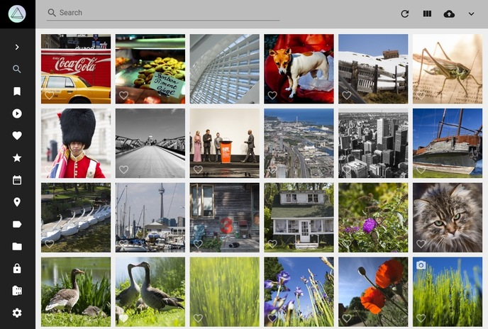
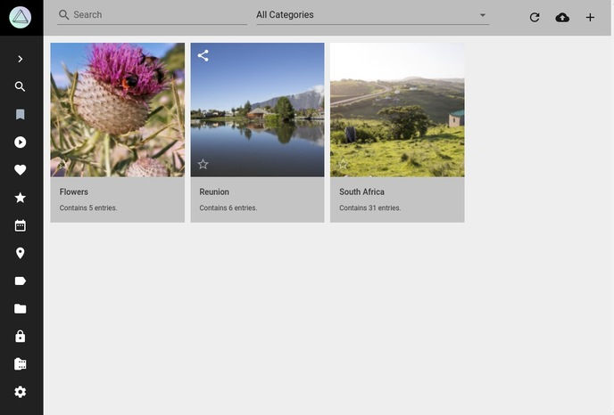
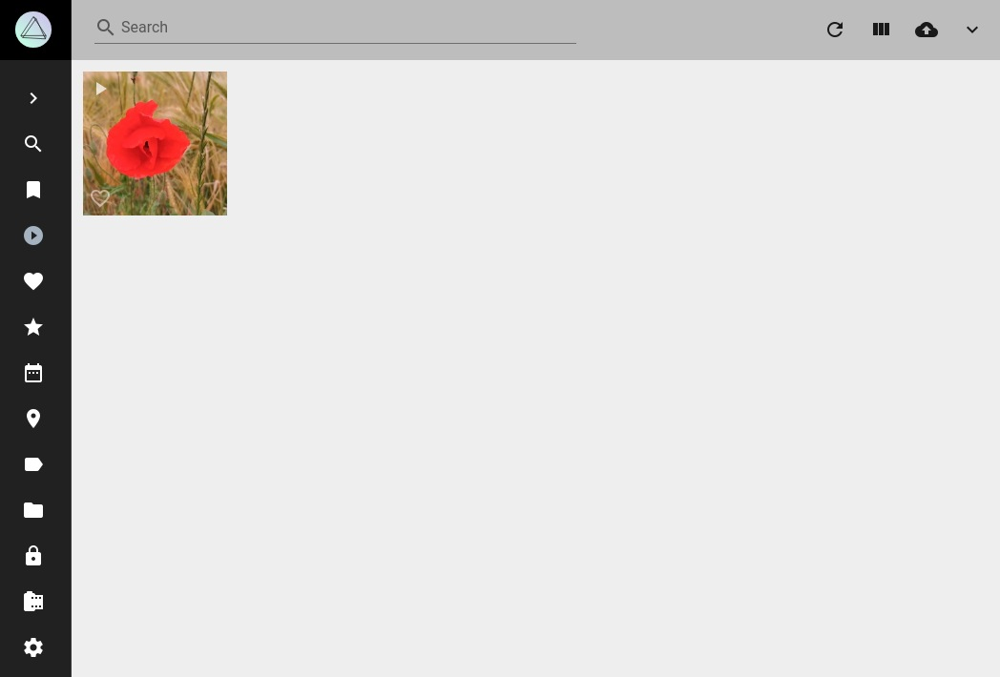
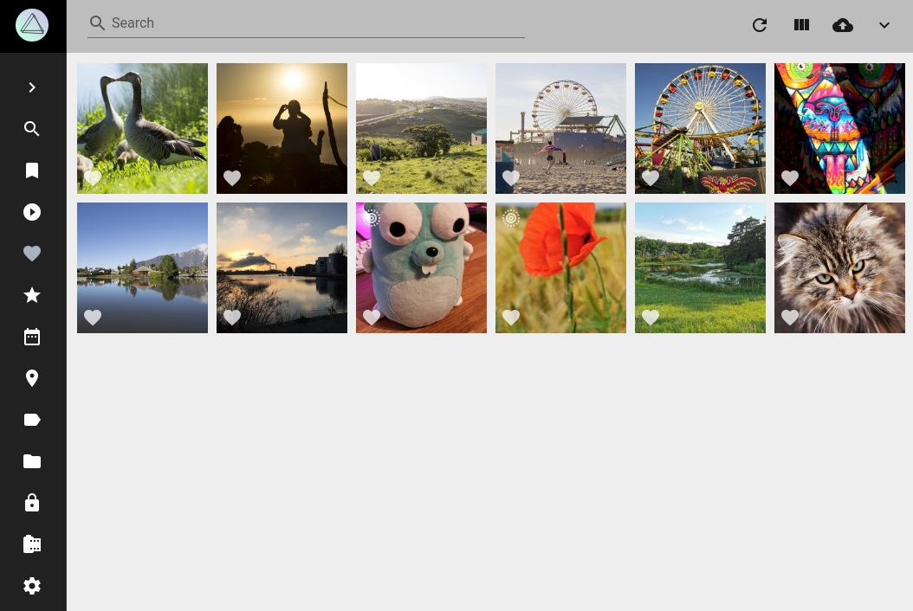
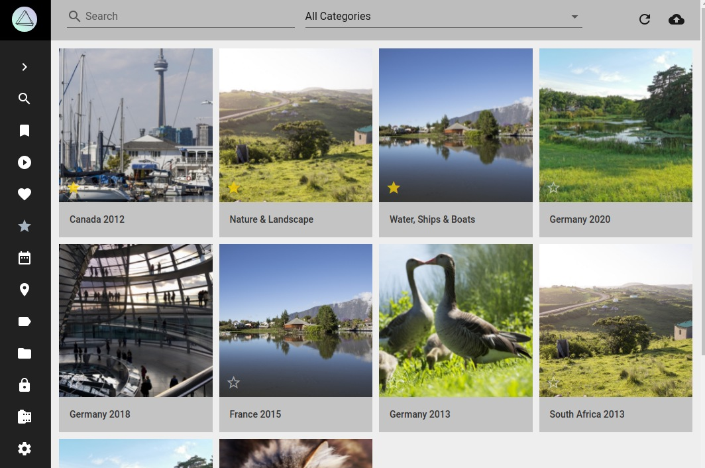
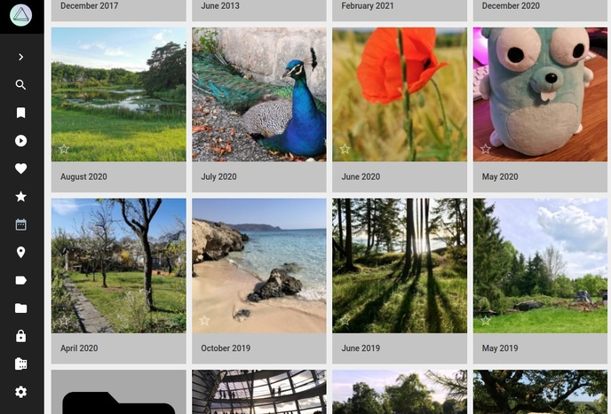
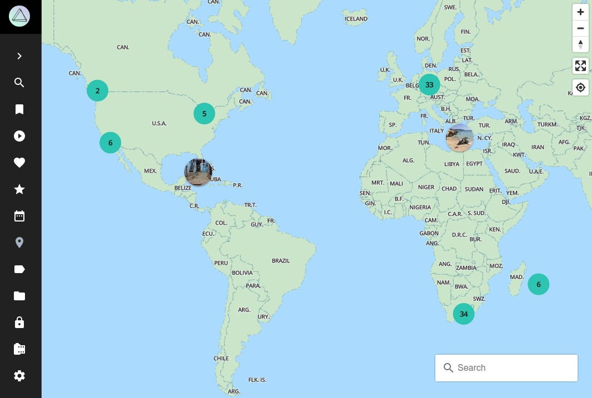
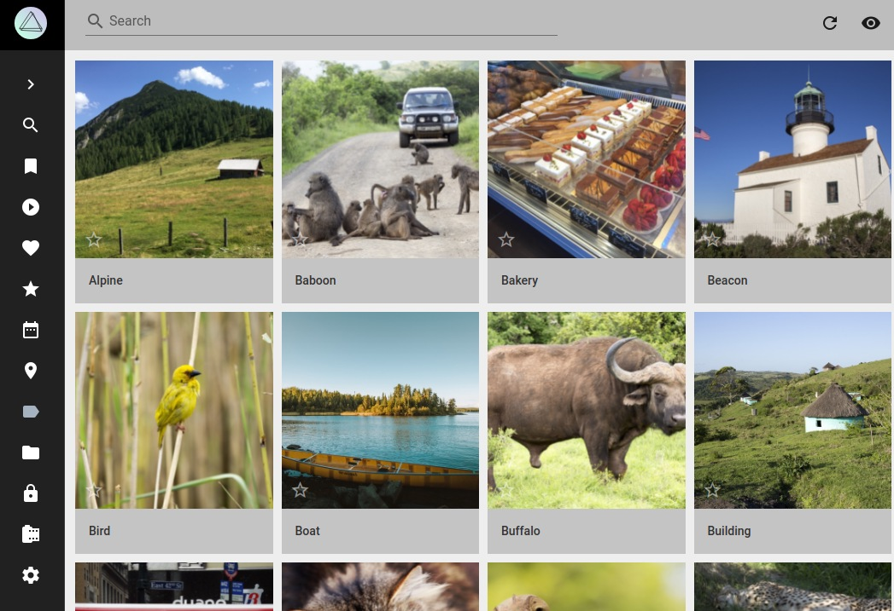
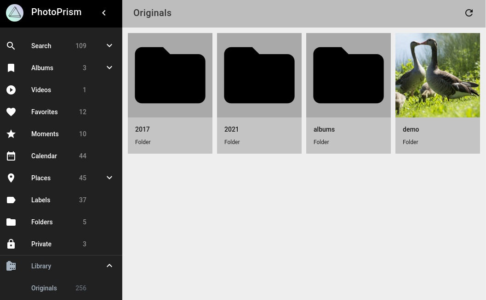
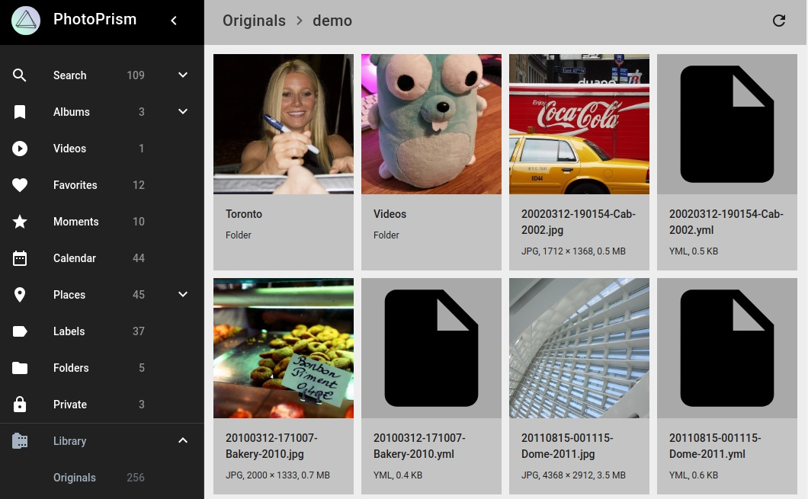

# Browsing and Searching Your Library

PhotoPrism offers many views and search filters so you can explore your photo collection in multiple dimensions instead of just scrolling through it day by day.

This helps you rediscover long-forgotten shots, find specific pictures, or quickly create albums based on search results.

## Views and Filters

Using the main navigation you can visit the different sections of your photo library:

### :material-magnify: Search

Shows all photos and videos that are not in review or archived or private.

!!! hint ""
    In case the review, private or archive functions are turned off - Search displays those photos and videos as well.

{ class="shadow" }

#### Monochrome

Shows all monochrome photos and videos.

#### [Panoramas](../organize/panoramas.md)

Shows all panorama photos.

#### [Stacks](../organize/stacks.md)

Shows all stacked photos.

#### [Scans](../organize/scans.md)

Shows all scans.

#### [Review](../organize/review.md)

Shows all photos that are in review.

#### [Archive](../organize/archive.md)

Shows archived photos.

### :material-image-album: [Albums](../organize/albums.md)

Shows albums you created.

{ class="shadow" }

#### Unsorted

Shows all photos that are not part of an album.

### :material-movie: [Videos](../organize/video.md)

Shows videos that are not in review or archived or private.

{ class="shadow" }

### :material-account: People

Shows photos and videos grouped by people on it.

### :material-heart: Favorites

Shows all photos and videos you liked.

{ class="shadow" }

### :material-compass: [Moments](../organize/moments.md)

Discover albums we automatically create for you.

{ class="shadow" }

### :material-calendar-range: [Calendar](../organize/calendar.md)

Organizes your photos due to time taken.

{ class="shadow" }

### :material-map-marker: [Places](../organize/places.md)

Displays all photos and videos with location information on a worldmap.

{ class="shadow" }

#### States

Shows your photos grouped by location.

### :material-label: [Labels](../organize/labels.md)

Shows your photos and videos grouped by labels like cat, dog or beach.

{ class="shadow" }

### :material-folder: [Folders](../organize/folders.md)

Displays all folders of your originals directory.

### :material-lock: [Private](../organize/private.md)

Shows photos and videos marked as private.

### :material-film: [Originals](../library/files.md)

Hierarchical view of your originals directory.

{ class="shadow" }

{ class="shadow" }

    
