# Browsing and Searching Your Library

With its many views and search filters, PhotoPrism allows you to explore your photo collection in multiple ways instead of just scrolling through it day by day.

These features help you rediscover long-forgotten shots, find specific pictures, and quickly create albums based on search results.

## Views and Filters

Using the main navigation you can visit the different sections of your photo library:

### :material-magnify: Search

This section shows all photos and videos that are not in review, archived, or private.

!!! hint ""
    In case the review, private or archive functions are turned off - Search displays those photos and videos as well.

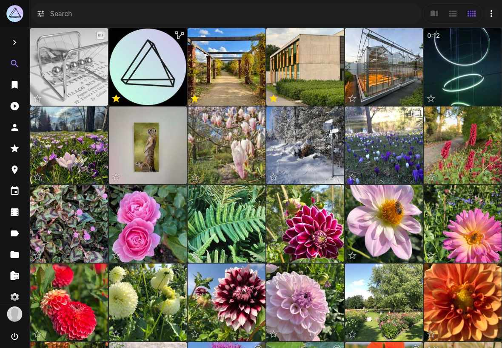{ class="shadow" }

#### Monochrome

Shows monochrome pictures with little or no color.

#### [Panoramas](../organize/panoramas.md)

Shows only panoramic pictures with a wide aspect ratio.

#### [Stacks](../organize/stacks.md)

Shows photos consisting of multiple image files, such as burst shots and edits.

#### [Vectors](filters.md#filter-reference)

Shows vector graphics, such as SVG and Adobe Illustrator files.

#### [Scans](../organize/scans.md)

Shows scanned pictures and documents.

#### [Documents](../organize/documents.md)

Shows PDF documents and other content classified as documents.

#### [Review](../organize/review.md)

Shows pictures that require approval before they appear in search results.

#### [Archive](../organize/archive.md)

Shows archived pictures so you can restore or permanently delete them.

### :material-bookmark: [Albums](../organize/albums.md)

Shows manually curated albums.

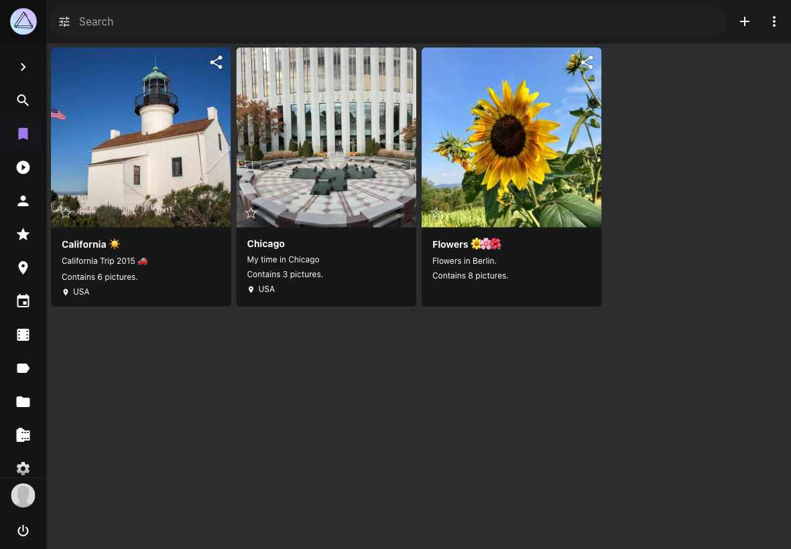{ class="shadow" }

#### Unsorted

Shows all photos that are not part of an album.

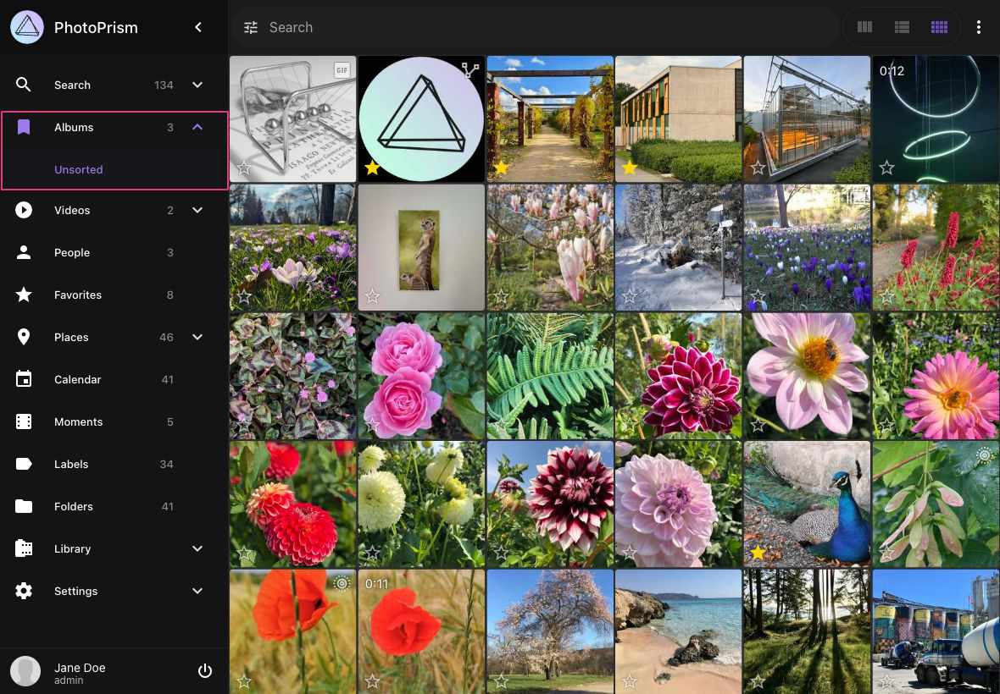{ class="shadow" }

### :material-play-circle: [Videos](../organize/video.md)

Shows videos that are not in review or archived or private.

#### Live Photos

Shows all short videos up to 3 seconds.

### :material-account: People

Shows photos and videos grouped by people on it.

### :material-star: Favorites

Shows all photos and videos you liked.

### :material-filmstrip-box: [Moments](../organize/moments.md)

Discover albums we automatically create for you.

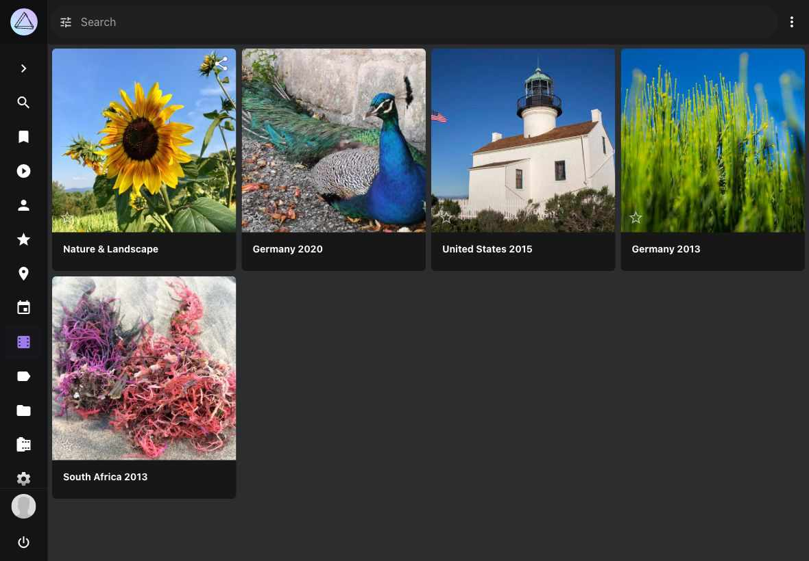{ class="shadow" }

### :material-calendar: [Calendar](../organize/calendar.md)

Organizes your photos due to time taken.

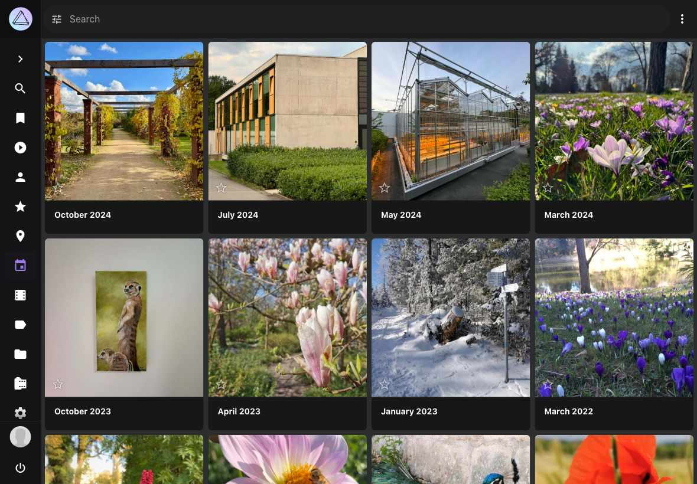{ class="shadow" }

### :material-map-marker: [Places](../organize/places.md)

Displays all photos and videos with location information on a worldmap.

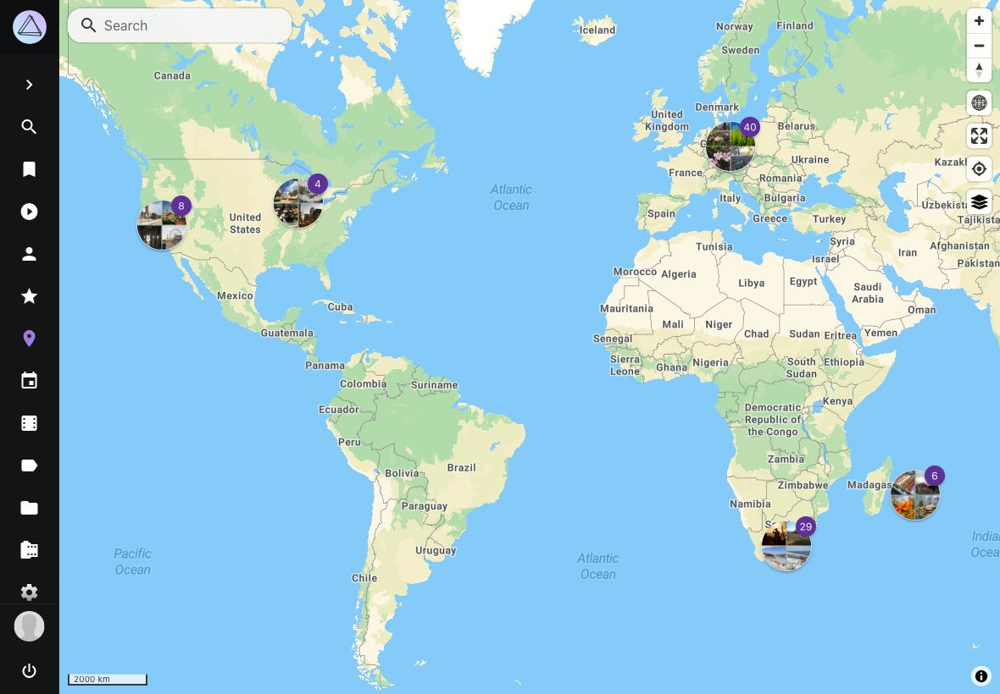{ class="shadow" }

#### Regions {#regions}

Shows your photos grouped by location.

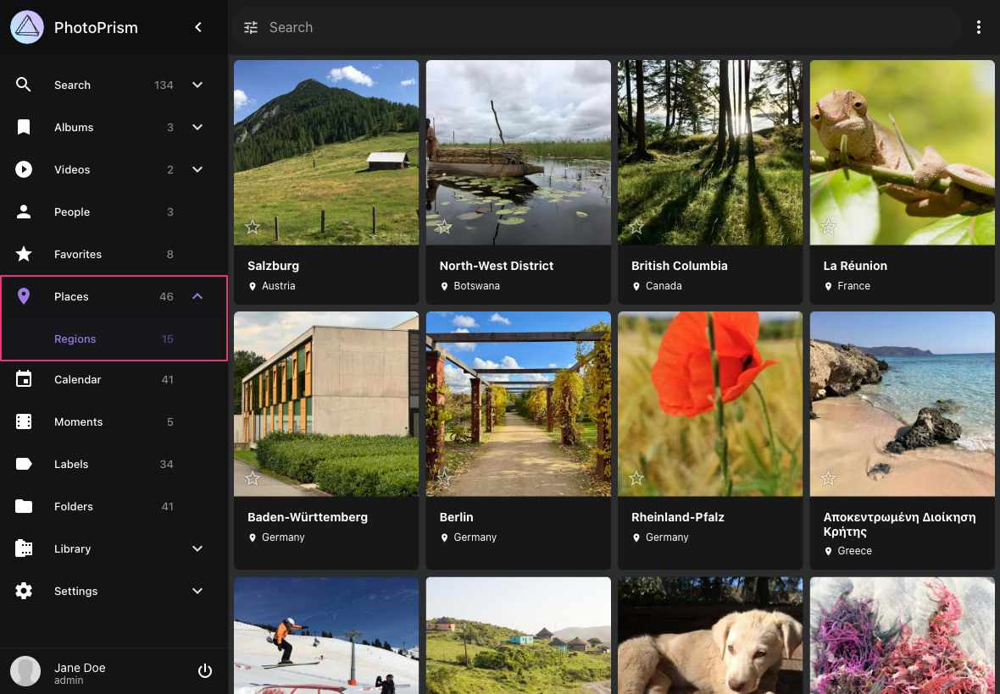{ class="shadow" }

### :material-label: [Labels](../organize/labels.md)

Shows your photos and videos grouped by labels like cat, dog or beach.

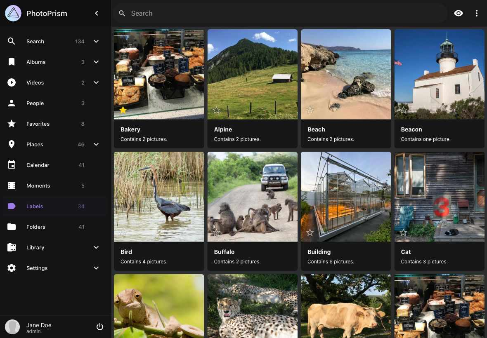{ class="shadow" }

### :material-folder: [Folders](../organize/folders.md)

Displays all folders of your originals directory.

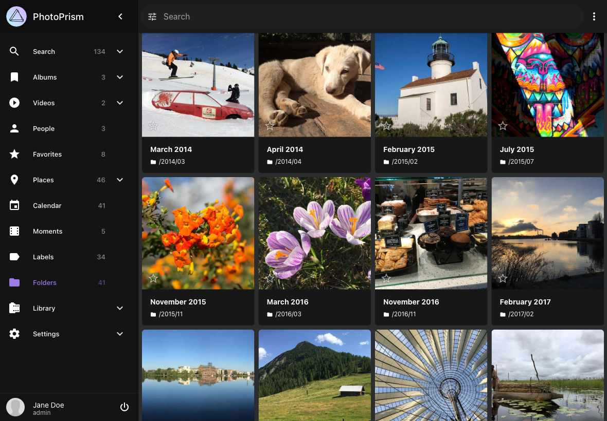{ class="shadow" }

### :material-lock: [Private](../organize/private.md)

Shows photos and videos marked as private.

### :material-film: [Originals](../library/files.md)

Hierarchical view of your originals directory.

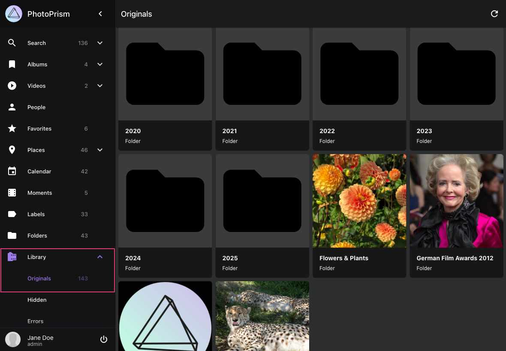{ class="shadow" }

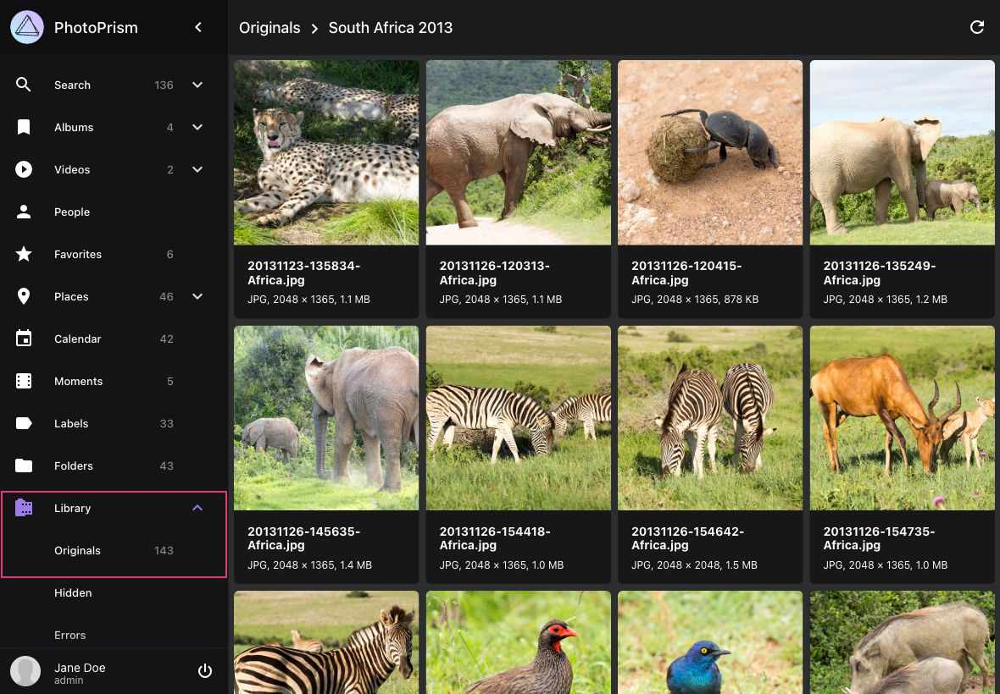{ class="shadow" }
