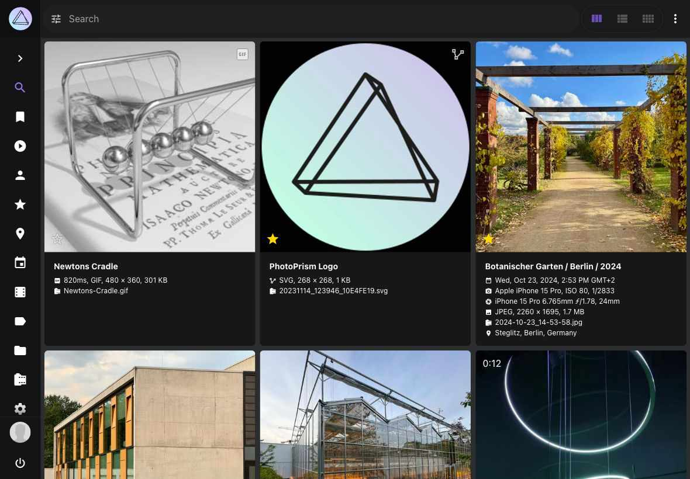
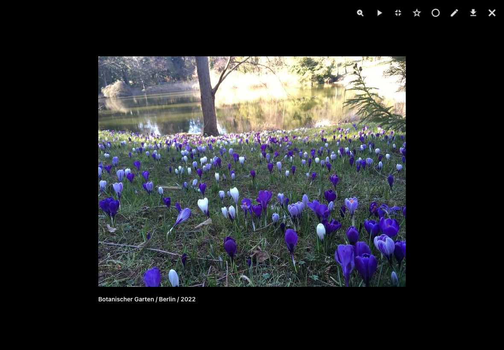

# Search Result Views

PhotoPrism offers you three different views to browse your photos and videos. In addition you can choose between multiple light and dark themes.

=== "Cards View"

    The *cards view* displays important metadata like title, time and location next to the photos

    { class="shadow" }

=== "Mosaic View"

    The *mosaic view* lets you enjoy your photos without distraction

    { class="shadow" }

=== "List View"

    The *list view* provides you photos and metadata in a  well-arranged list

    { class="shadow" }

To switch between views you can either use the filter in the filter bar or the view button (:material-view-column:, :material-view-comfy:, :material-view-list:) in the upper right corner.

Additionally, you can open your photos/videos in *fullscreen mode* and start a slideshow (:material-play:).

{ class="shadow" }
