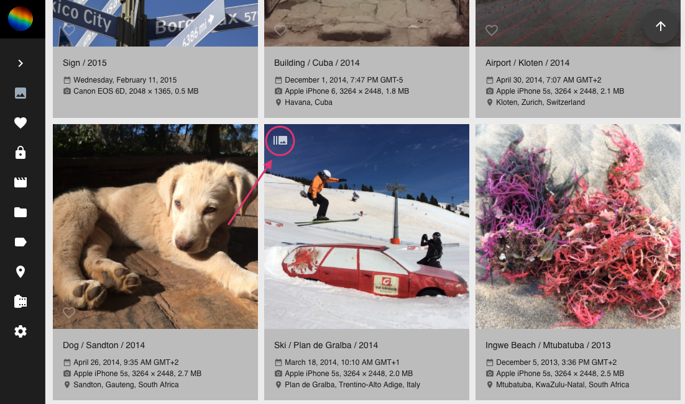
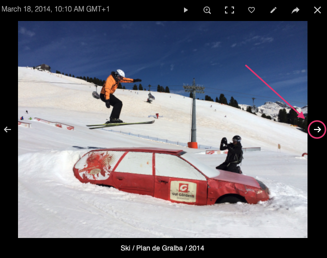
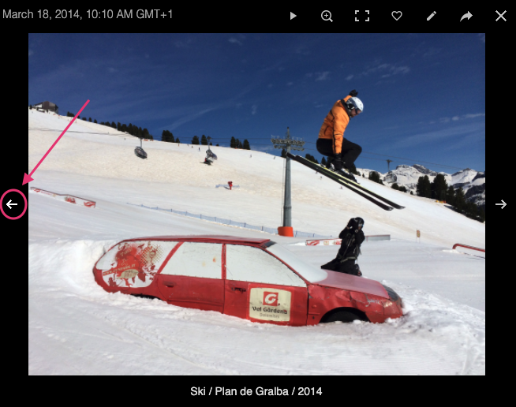

In Settings you can configure properties of your photo library, user interface and places.

### Library Settings
#### Hide Private
Photos/videos marked as private do NOT appear in Photos, Videos, Favorites, Labels, Places and shared albums in case this option is selected.

#### Quality Filter
When selected, non-photographic photos/videos like screenshots and low-quality photos need to be [reviewed](review.md) before they appear in Photos or Videos.

#### Convert to JPEG
JPEGs are created for RAW files during [indexing](index.md) in case they do not yet exist. JPEGs will be stored in the same folder next to the original.

!!! attention
    In case this is disabled and there is a RAW file without a JPEG there will be no preview.
    
#### Group Sequential
Related files will be grouped when selected.
Grouped files will have one primary file that is shown in our views.

#####Browse through related files

1. Click on sequence.

    
    
2. Use arrows to see all photos of the sequence.

     

!!! info
    Files are grouped in two cases:
    
    1. Filenames are related: 'IMG_1234 (2)' or 'IMG_1234 copy 2' are assumed to belong to the same photo.
    2. Photos that have been taken at the same location AND in the same second.
    
### User Interface Settings
You can change the theme and language of the User interface.

To make PhotoPrism suite your individual needs the following sections and functionalities can be en- or disabled.
Disables sections do not appear in the main navigation.

#### Upload
When disabled, uploading files via [upload](upload.md) is not possible. 
This might be useful when you grant others access to your PhotoPrism but do not want them to upload photos.

#### Download
When disabled, no files can be downloaded.

#### Share
When disabled, album sharing and upload to remote services like Nextcloud is not possible.

#### Import
When disabled, there is no possibility to [import](import.md) photos. You need to use [index](index.md) instead to add new photos.

#### Archive
When disabled, there is no Archive. Photos that have been archived beforehand will appear in Photos/Videos.

#### Edit
When disabled, it is not possible to edit photo information.

#### Labels
When disabled, there is no Labels section and you cannot add or edit labels.

#### Logs
When disabled, server logs are not shown.

#### Places
When disabled, there is no Places section.

### Places Settings
You can configure a map style and the speed of the places animation.