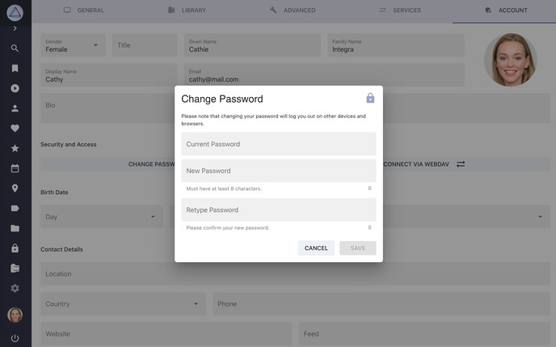
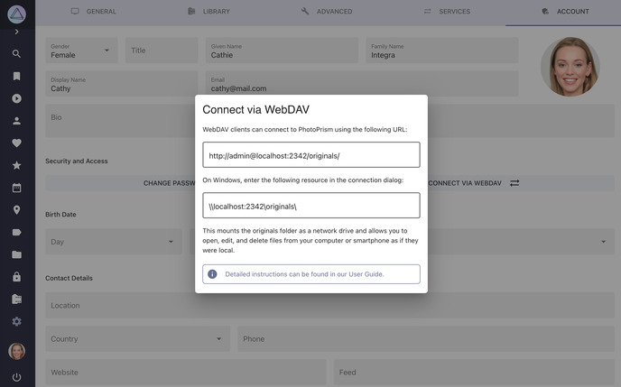

# Account Settings #

!!! tldr ""
    For security reasons, changing account-related settings through the user interface requires password authentication, so these settings will not be available to you when [public mode](../../getting-started/config-options.md#authentication) is enabled.

{ class="shadow" }

## Change Password ##

1. Go to *Settings*
2. Open *Account* tab
3. Click *Change Password*
4. Enter your current password
5. Enter your new password twice
6. Click *Change*

{ class="shadow" }

## 2-Factor Authentication

With 2-Factor Authentication (2FA), also known as two-step verification, you can add an extra layer of security to your account in case your password is stolen. When enabled, you will need a randomly generated verification code in addition to your password to log in.

[Learn more ›](../users/2fa.md)

## Apps and Devices

With 2FA enabled for your account, any apps you use will no longer be able to log in to your account as they will not have access to the codes generated with your authenticator app.

Instead of using your own password, you can therefore create app-specific passwords for them by navigating to *Settings > Account* and then clicking the *Apps and Devices* button (even if 2FA is not enabled).

For example, this will create an app password for WebDAV sync apps like PhotoSync:

{ class="shadow" }

!!! tldr ""
    By selecting the *WebDAV* scope, you make sure that the app password cannot be used to log in through the regular user interface to perform other changes. Apps will also not be able to change your password or manage user accounts, even if you grant them *Full Access*.  

## Connect via WebDAV ##

To open a dialog that shows you the URLs required to connect an app or computer via WebDAV:

1. Go to *Settings*
2. Open *Account* tab
3. Click *Connect via WebDAV*

{ class="shadow" }