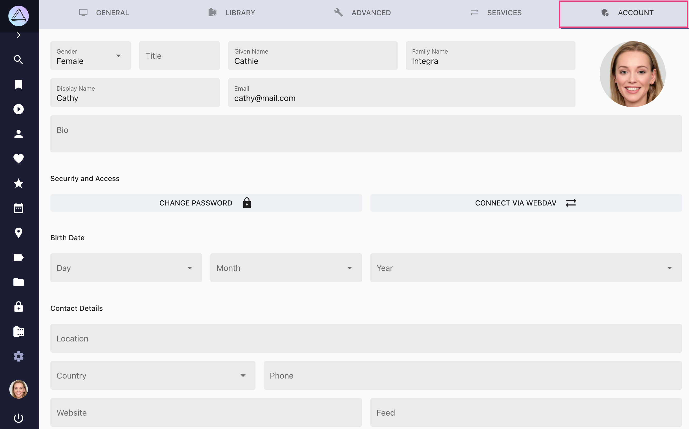
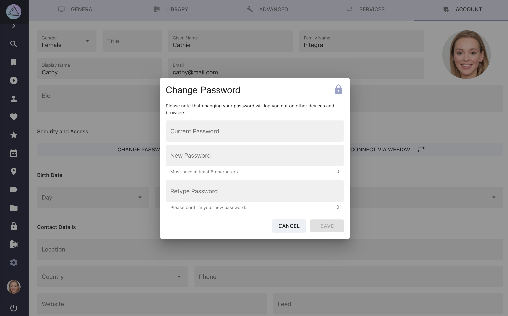
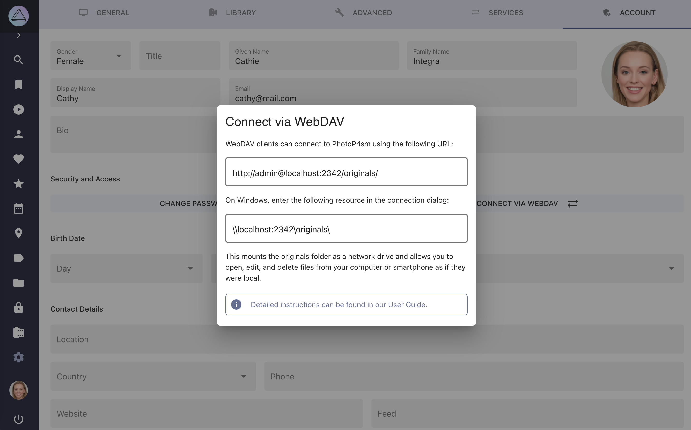

# Account Settings #

!!! tldr ""
    Since they are not needed, these settings are not available when running in [public mode](../../getting-started/config-options.md#authentication).

{ class="shadow" }

## Change Password ##

1. Go to *Settings*
2. Open *Account* tab
3. Click *Change Password*
4. Enter your current password
5. Enter your new password twice
6. Click *Change*

{ class="shadow" }

## Show WebDAV Url ##

1. Go to *Settings*
2. Open *Account* tab
3. Click *Connect via WebDAV*

{ class="shadow" }