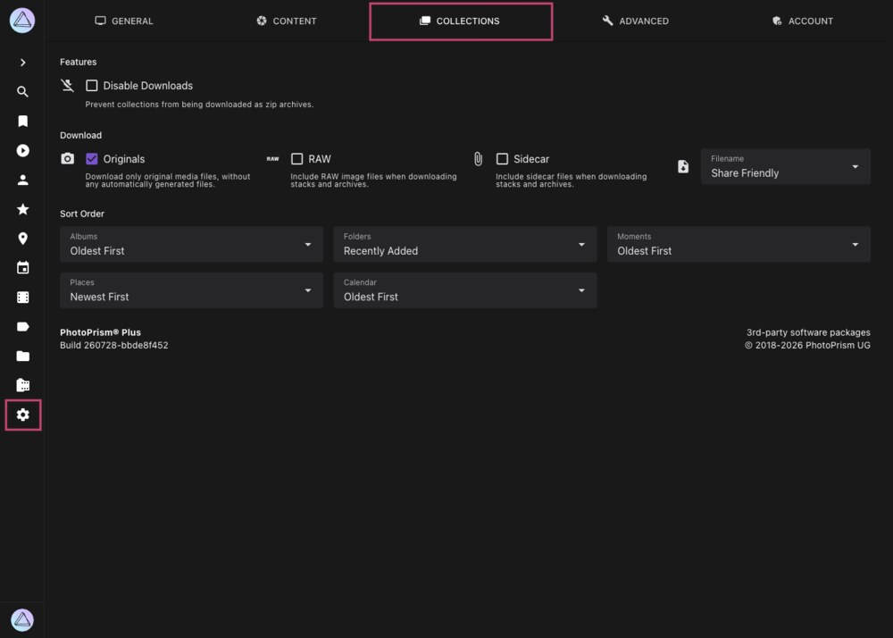

# Collections Settings

The *Collections* settings tab configures how albums, folders, moments, calendar months, and places behave:
whether they can be downloaded as ZIP archives, which files such an archive contains, and the sort order that
newly created collections start with.

{ class="shadow" }

!!! info ""
    This tab is only shown to super admins. The *Download* options additionally require the [*Download* feature](general.md#download) to be enabled in the [*General*](general.md) settings tab.

## Features ##

#### :material-download-off: Disable Downloads ####

Prevents entire collections from being downloaded as ZIP archives, for example through the download button on an album.
Individual pictures can still be downloaded as long as the [*Download* feature](general.md#download) is enabled.

## Download ##

These options determine which files are added to a ZIP archive when a whole collection is downloaded.
They are only shown when downloads have not been disabled above.

#### :material-camera: Originals ####

Only files in the *originals* folder are included, not the automatically generated files in the *sidecar* folder.
This is the recommended default.

#### :material-raw: RAW ####

Includes RAW image files. Since a RAW file is typically much larger than the JPEG rendered from it, enabling this
option can increase the size of an archive considerably.

#### :material-paperclip: Sidecar ####

Includes sidecar files such as XMP metadata. This is generally not recommended except for specific professional workflows.

#### :material-file-download: Filename ####

Determines how the files inside the archive are named:

| Option         | Filenames                                                                                                     |
|----------------|---------------------------------------------------------------------------------------------------------------|
| Current Name   | The name the file currently has in your library                                                               |
| Original Name  | The name the file had when it was uploaded or imported, falling back to the current name                      |
| Share Friendly | A normalized name composed of the capture time and the picture title, e.g. `20260728-181530-Sunset-Beach.jpg` |

!!! note ""
    The same three content options are also available for downloading individual pictures and stacks in the [*Content*](library.md#download) settings tab. The options here apply to complete collections only.

## Sort Order ##

Sets the order in which pictures are arranged inside **newly created** collections. Each collection stores its own
sort order, so changing a value here leaves existing albums untouched. To change one of those, open its *Edit Album*
dialog and pick a different *Sort Order* there.

| Setting                             | Applies To                                          | Default        |
|-------------------------------------|-----------------------------------------------------|----------------|
| [Albums](../organize/albums.md)     | Albums you create manually                          | Oldest First   |
| [Folders](../organize/folders.md)   | Folder albums created from your directory structure | Recently Added |
| [Moments](../organize/moments.md)   | Smart albums grouped by occasion, trip, or location | Oldest First   |
| Regions                             | Smart albums grouped by state or region             | Newest First   |
| [Calendar](../organize/calendar.md) | Smart albums grouped by year and month              | Oldest First   |

Available sort orders are *Newest First*, *Oldest First*, *Recently Added*, *Picture Title*, *File Name*, *File Size*,
*Video Duration*, and *Most Relevant*.

!!! tldr ""
    These values can also be set directly in the `settings.yml` file in your config folder. [Learn more ›](../../getting-started/config-files/settings.md#albums)
