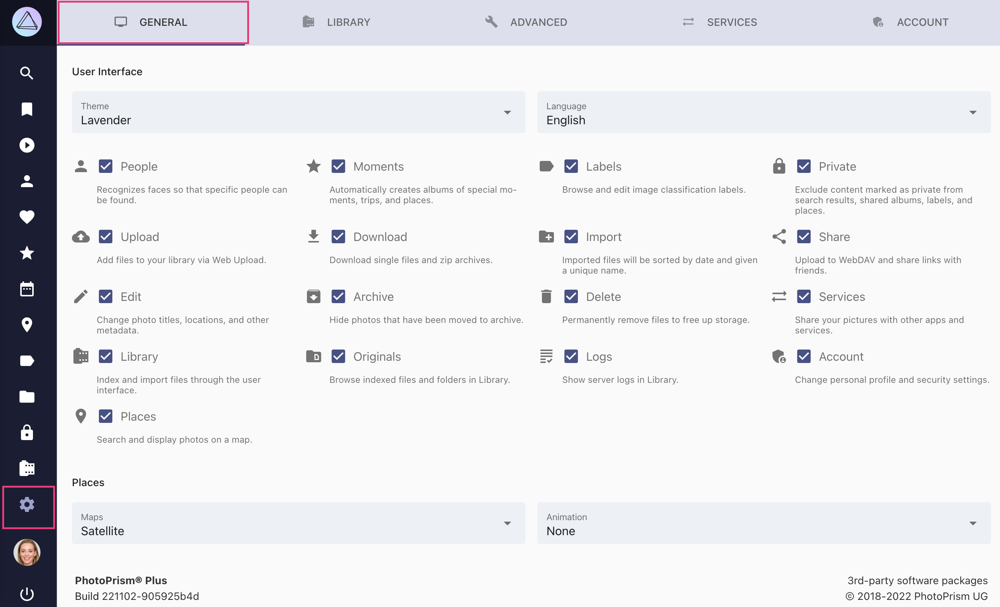

# General Settings

In the *General* settings tab, you can configure basic user interface settings as well as the maps in *Places*:

{ class="shadow" }

## User Interface ##
You can change the *theme* and *language* of the User interface.

To make PhotoPrism suite your individual needs the following sections and functionalities can be en- or disabled.
Disabled sections do not appear in the main navigation.

#### :material-cloud-upload: Upload ####
When disabled, uploading files via [*upload*](../library/upload.md) is not possible. 
This might be useful when you grant others access to your PhotoPrism but do not want them to upload photos.

#### :material-download: Download ####
When disabled, no files can be downloaded.

#### :material-share-variant: Share ####
When disabled, album sharing and upload to remote services like ownCloud is not possible.

#### :material-account: People ####
When disabled, the people section is hidden. To disable face detection while indexing, you may set `PHOTOPRISM_DISABLE_FACES` and/or `PHOTOPRISM_DISABLE_TENSORFLOW` to `"true"` in your [config](../../getting-started/config-options.md).

#### :material-lock: Hide Private ####
Excludes content marked as private from search results, shared albums, labels and places.

#### :material-archive-arrow-down: Archive ####
When disabled, there is no *Archive*. Photos that have been archived beforehand will appear again in search results.

#### :material-pencil: Edit ####
When disabled, it is not possible to edit photo information.

#### :material-delete: Delete ####
When disabled, permanent deletion of files from the archive is not possible.

#### :material-file: Originals ####
When disabled, there is no *Originals* section.

#### :material-compass: Moments ####
When disabled, there is no *Moments* section.

#### :material-label: Labels ####
When disabled, there is no *Labels* section and you cannot add or edit labels.

#### :material-film: Library ####
When disabled, there is no *Library* section.

#### :material-folder-plus: Import ####
When disabled, there is no possibility to [*import*](../library/import.md) photos. You need to use [*index*](../library/originals.md) instead to add new photos.

#### :material-text: Logs ####
When disabled, server logs are not shown.

#### :material-map-marker: Places ####
When disabled, there is no *Places* section.

## Places ##

At the bottom of the *General* settings tab, you may choose your preferred map style and animation length for *Places*.
PhotoPrism includes four high-resolution world maps to see where you've been, and for rediscovering long-forgotten shots.

To enhance your photos with location data such as state, city and category, we've also launched our own geo-information service based on OpenStreetMap.
A future release will additionally provide public events' data, so that albums of popular music festivals, or sports gatherings, can be created automatically.
