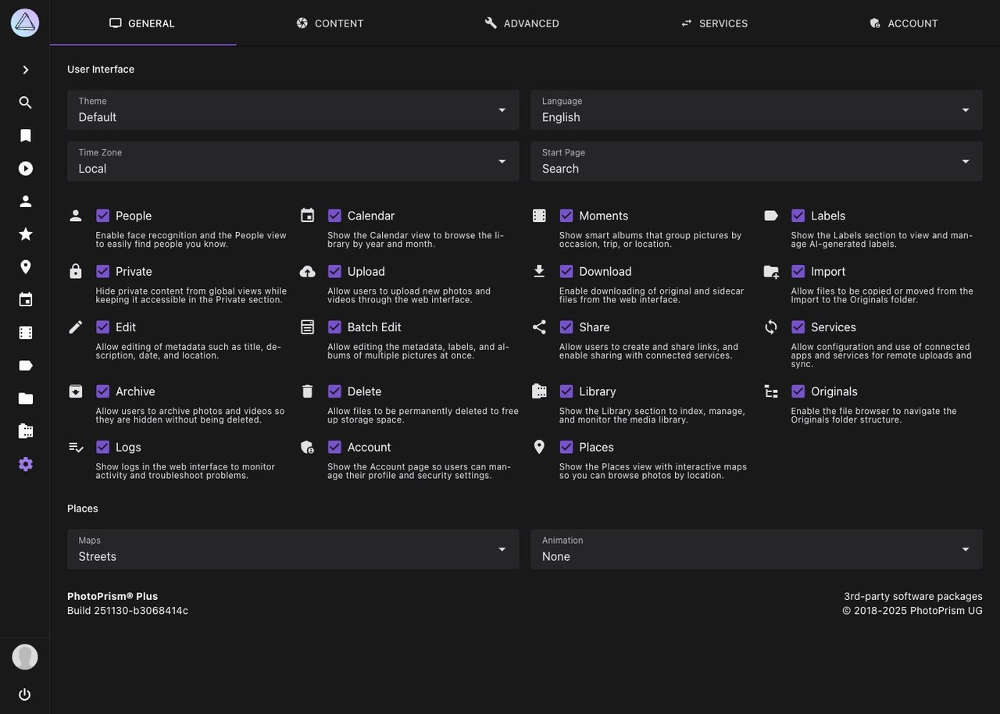

# General Settings

In the *General* settings tab, you can configure basic user interface settings, accessibility options, and the maps shown in *Places*:

{ class="shadow" }

!!! info ""
    Feature switches in this tab are primarily intended for instance-wide customization. Some options are only shown to super admins and are not available in every edition or session type.

## User Interface ##
You can change the *theme* and *language* of the user interface and define a *start page* and *time zone*.

To make PhotoPrism suit your individual needs, the following sections and features can be enabled or disabled.
Disabled sections do not appear in the main navigation.

#### :material-bookmark: Albums ####
When disabled, there is no *Albums* section for manually browsing and organizing pictures.

#### :material-star: Favorites ####
When disabled, there is no *Favorites* section for quickly accessing your starred pictures.

#### :material-folder: Folders ####
When disabled, there is no *Folders* section for browsing pictures by directory structure.

#### :material-play-circle: Media ####
When disabled, there is no *Media* section for browsing videos, live photos, and animations.

#### :material-account: People ####
When disabled, the people section is hidden. To disable face detection while indexing, you may set `PHOTOPRISM_DISABLE_FACES` and/or `PHOTOPRISM_DISABLE_TENSORFLOW` to `"true"` in your [config](../../getting-started/config-options.md).

#### :material-calendar: Calendar ####
When disabled, there is no *Calendar* section.

#### :material-filmstrip-box: Moments ####
When disabled, there is no *Moments* section.

#### :material-label: Labels ####
When disabled, there is no *Labels* section and you cannot add or edit labels.

#### :material-lock: Private ####
Hides content marked as private from global views while keeping it accessible in the *Private* section.

#### :material-cloud-upload: Upload ####
When disabled, uploading files via [Web Upload](../library/upload.md) is not possible.
This can be useful when you grant others access to your instance but do not want them to upload files.

#### :material-download: Download ####
When disabled, no files can be downloaded from the PhotoPrism web interface. Please note that browser features such as saving already displayed content may still work.

Which files are included in a download, and whether entire collections can be downloaded as ZIP archives, is configured in the [*Collections*](collections.md) and [*Content*](library.md#download) settings tabs.

#### :material-folder-plus: Import ####
When disabled, files can no longer be [imported](../library/import.md) from the import folder. You must use [indexing](../library/originals.md) instead to discover newly added originals.

#### :material-pencil: Edit ####
When disabled, it is not possible to edit photo details.

#### :material-form-select: Batch Edit ####
When disabled, it is not possible to batch edit photo details.

#### :material-share-variant: Share ####
When disabled, users cannot create share links or share content with connected services.

#### :material-sync: Services ####
Allows configuration and use of connected [apps and services](sync.md) for remote uploads and synchronization.

#### :material-package-down: Archive ####
When disabled, there is no *Archive* section. Pictures that were archived before will appear in search results again.

#### :material-delete: Delete ####
When disabled, files can no longer be permanently deleted from the archive.

#### :material-film: Library ####
When disabled, there is no *Library* section for indexing and maintenance tasks.

#### :material-file-tree: Originals ####
When disabled, there is no *Originals* file-browser section.

#### :material-playlist-check: Logs ####
When disabled, logs are not shown in the web interface.

#### :material-shield-account-variant: Account ####
When disabled, there is no *Account* section.

#### :material-map-marker: Places ####
When disabled, there is no *Places* section.

## Accessibility ##

The options in the *Accessibility* section adjust how the interface responds to input and motion.
They are instance-wide defaults set by super admins, and they are not per-user preferences.

#### :material-cursor-default-click-outline: Open on Hover ####
When enabled, menus open as soon as the mouse cursor moves over them instead of waiting for a click.
Disable this option if menus keep opening unintentionally while you move the pointer across the page.
Touch devices always open menus on tap, so this option has no effect on phones and tablets.

Changes take effect immediately, without reloading the page.

#### :material-motion-pause-outline: Reduce Motion ####
Shortens or removes interface animations and transitions, including the fly-to animation on the maps in [*Places*](../organize/places.md).
Your preferred map animation length is kept and applies again when you turn *Reduce Motion* off.

Changes take effect immediately, except for a map that is already open. It follows the new setting the next time you open it.

#### :material-arrow-up-down: Hide Scrollbar ####
Hides the permanent scrollbar that some desktop browsers reserve space for.
Mobile browsers show a scrollbar only while scrolling, so this option makes no visible difference there.

Changes take effect after the page has been reloaded.

#### :material-magnify-plus-outline: Allow Page Zoom ####
Allows the page to be zoomed with pinch gestures on mobile devices.
It is disabled by default so that pinch gestures zoom pictures instead of the interface around them.

Changes take effect after the page has been reloaded.

## Places ##

At the bottom of the *General* settings tab, you can choose your preferred map style and animation length for *Places*.
PhotoPrism includes multiple high-resolution world maps so you can browse your library by location.

To enhance your photos with location data such as country, state, city, and category, PhotoPrism also includes reverse geocoding based on OpenStreetMap data.
