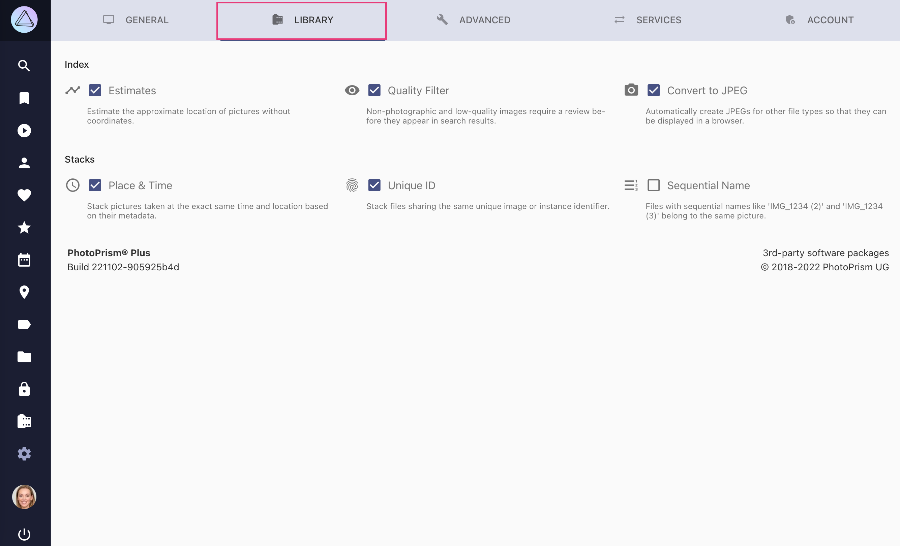

# Library Settings

{ class="shadow" }

## Index ##

#### :material-chart-timeline-variant: Estimates ####

Estimate the approximate location of pictures without coordinates.

#### :material-eye: Quality Filter ####

Non-photographic and low-quality images require a [review](../organize/review.md) before they appear in search results.

#### :material-camera: Convert to JPEG ####

Automatically creates JPEGs for other file types so that they can be displayed in a browser.

!!! attention ""
    *Convert to JPEG* should not be disabled, as this effectively prevents PhotoPrism from indexing file types other than JPEG unless the files have already been converted to JPEG and saved under the same filename prefix.

## Stacks ##

Stacks group files with a similar frame of reference, but differences of quality, format, size or color.
Go to *Photos > [Stacks](../organize/stacks.md)* to see all photo stacks in your library.

PhotoPrism offers three methods for stacking files:

* :material-clock-outline: Place & Time 
* :material-fingerprint: Unique ID
* :material-format-list-numbered-rtl: Sequential Name

!!! attention ""
    Changing stacking settings won't unstack already stacked files.
