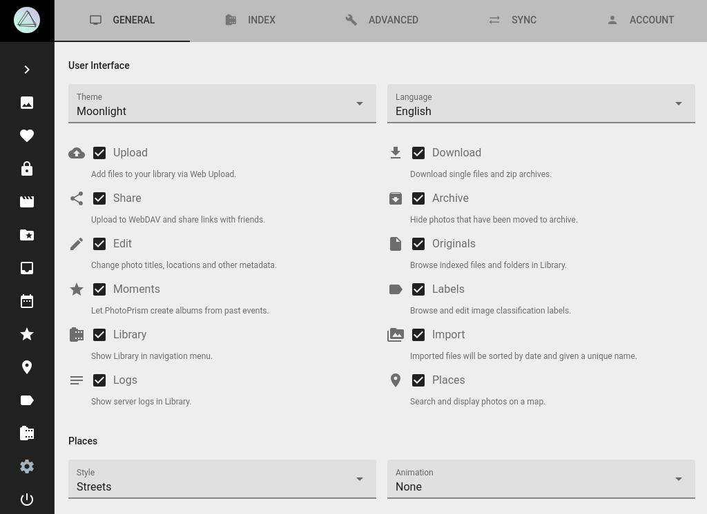

# Maps & Places

PhotoPrism includes four high-resolution world maps to see where you've been, and for rediscovering long-forgotten shots.
You may choose your preferred map style and animation length in the *General* settings tab:

To enhance your photos with location data such as state, city and category, we've also launched our own geo-information service based on OpenStreetMap.
A future release will additionally provide public events' data, so that albums of popular music festivals, or sports gatherings, can be created automatically.
