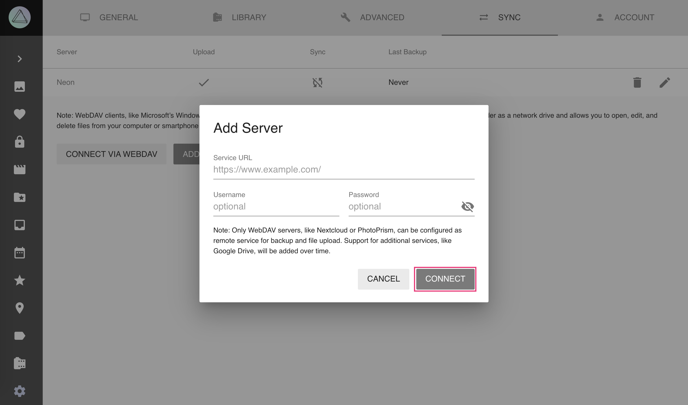
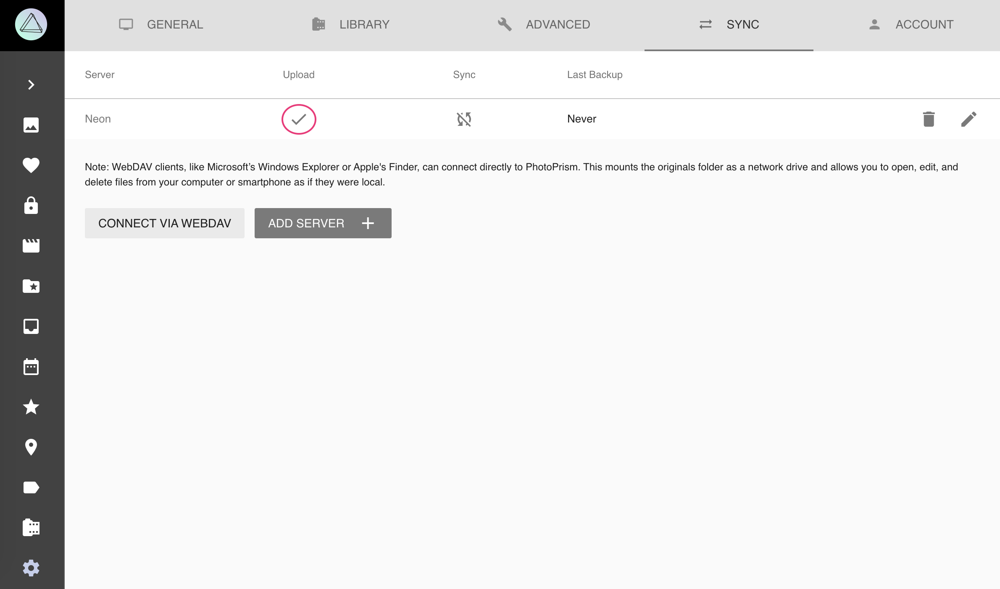
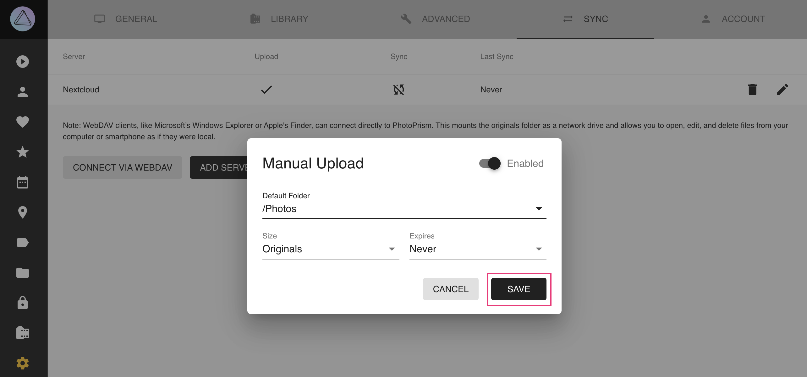
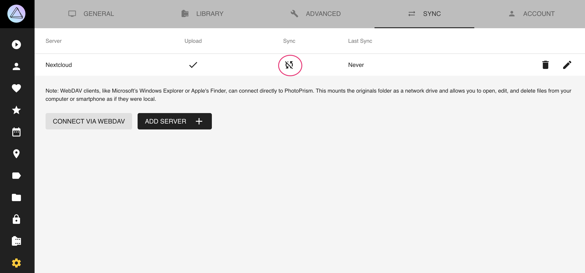
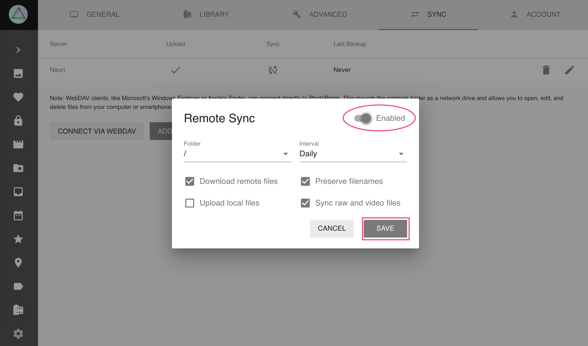

# Sync Settings

This page describes how PhotoPrism can sync files *from* an external storage system (like ownCloud) via WebDAV.

!!! note ""
    PhotoPrism can also serve/share files via WebDAV to be browsed on macOS or Windows.
    See [instructions](/user-guide/sync/webdav/).

## Connect to a WebDAV Server ##

PhotoPrism may connect with WebDAV servers like a second PhotoPrism instance or ownCloud,
so that you can automatically sync your latest pictures.

**To connect:**

1. Go to *Settings*
2. Open *Sync tab*
3. Click *Add Server*
    
4. Fill in your WebDAV server url, username and password
5. Click *connect*
    
6. Now the other WebDAV server is connected with PhotoPrism

## Manually Upload Files to a WebDAV Server ##

**To configure manual upload:**

1. Go to *Settings*
2. Open *Sync* tab
3. Click into the upload cell of your server

4. Select the folder to which photos should be uploaded and click *save*

**To upload files from PhotoPrism to the WebDAV server:**

1. Go to *Search*
2. Select photos you want to upload
3. Open the context menu
4. Click :material-cloud:
5. Select your server account and click *upload*

!!! info ""
    Only JPEGs are copied when uploading manually.
    Support for RAW and video files will be added in a future release.

!!! attention ""
    Due to problems with some Nextcloud settings it might be that uploading to Nextcloud results in 0 byte files. You find information on how to solve it [here](https://github.com/photoprism/photoprism/issues/443).

## Backup/Sync Files with your Server ##

1. Go to *Settings*
2. Open *Sync* tab
3. Click into the sync cell of your server

4. Enable synchronization in the upper right corner
5. Choose the folder in which all your photos are located
6. Select how often you want your files to be synced
7. Select the options that are suitable for you and click *save*

### Remote Sync Options ###

* *Download remote files* will download all files from your server that do not yet exist in PhotoPrism
* *Upload local files* will upload all files from PhotoPrism to your server that do not yet exist there
* *Preserve filenames* will keep filenames from your server without renaming them
* *Sync raw and video files* will upload/download raw and video files alongside with JPEGS

