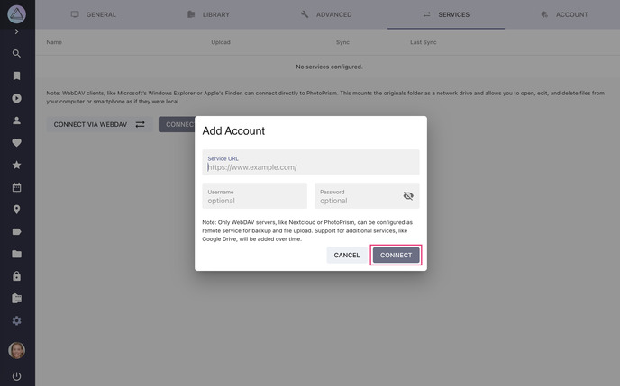
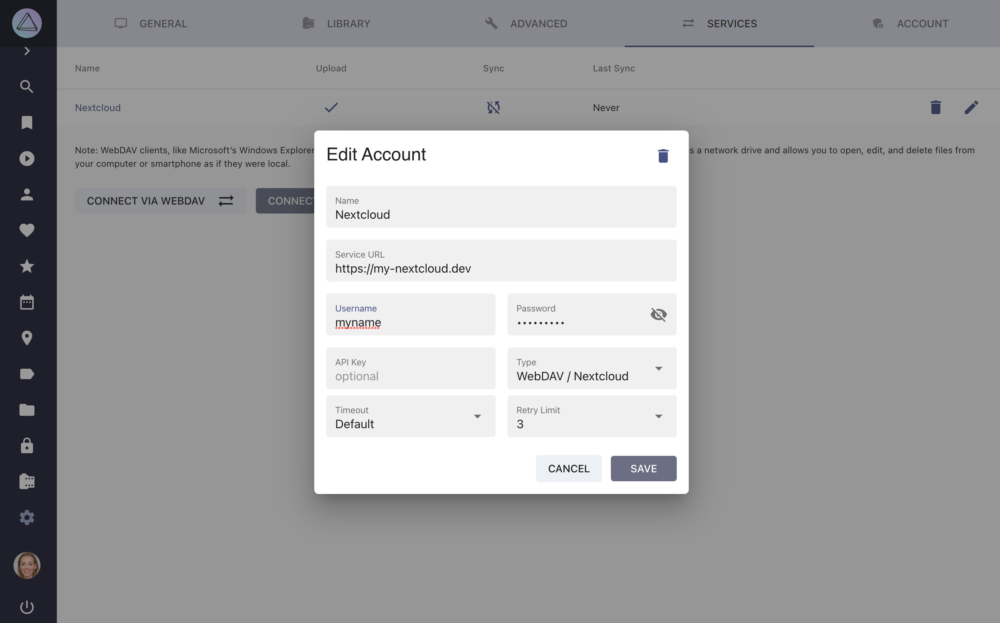
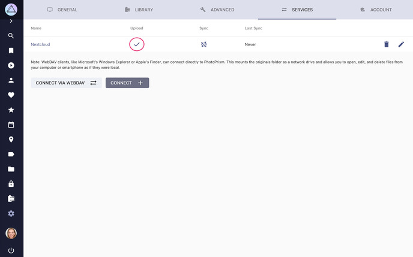
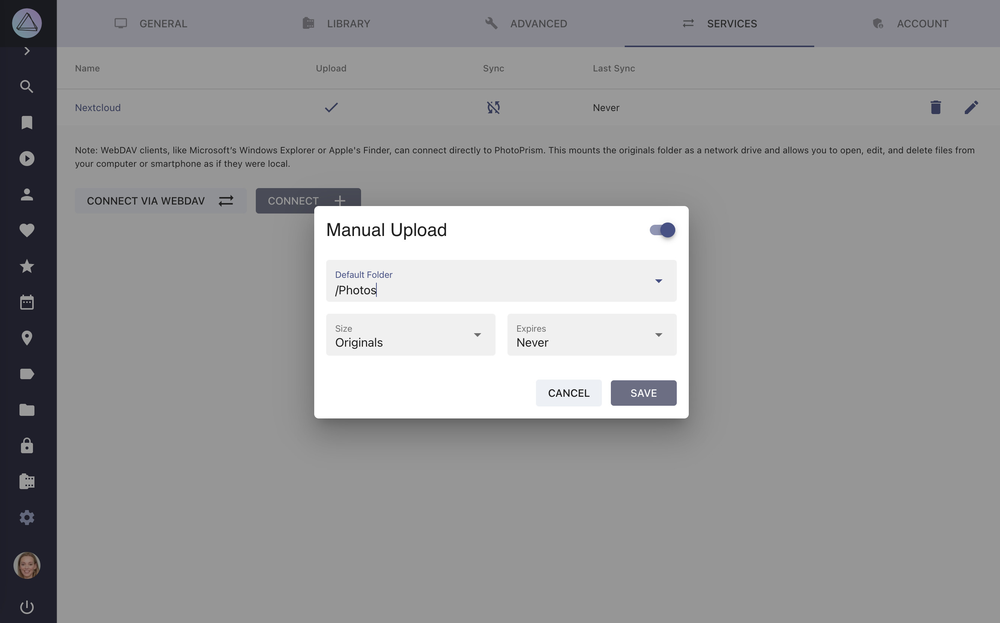
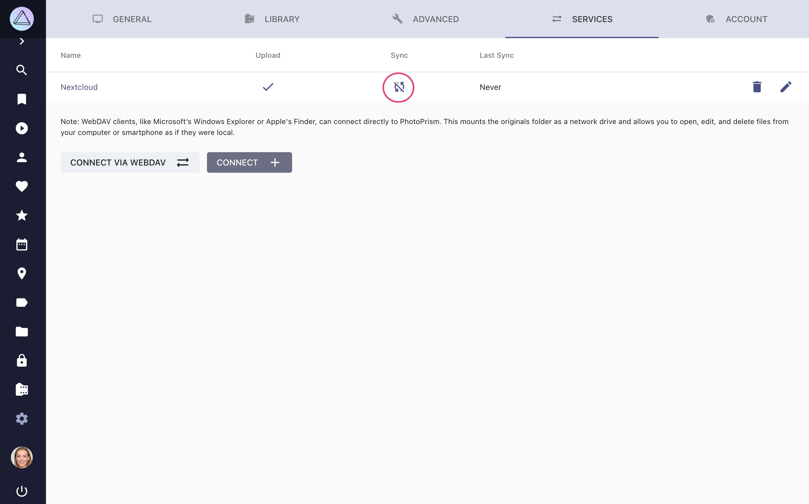
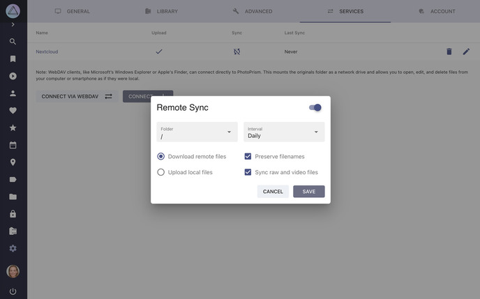

# Services

You can connect your PhotoPrism instance to other services with WebDAV support, such as other PhotoPrism instances, Nextcloud or ownCloud.

This might be useful if you want to [share](../share/services-share.md) or [synchronize](../sync/services-sync.md) files between multiple services.

!!! tldr ""
    Since they are not safe to use without authentication, these settings are not available when running in [public mode](../../getting-started/config-options.md#authentication).

!!! note ""
    PhotoPrism can also serve/share files via WebDAV to be browsed on macOS or Windows.
    See [instructions](/user-guide/sync/webdav/).

## Add Service ##

<! -- PhotoPrism may connect with WebDAV servers like a second PhotoPrism instance or ownCloud,
so that you can automatically sync your latest pictures. -->

1. Go to *Settings*
2. Open *Services tab*
3. Click *Connect*
    { class="shadow" }
4. Fill in your service url, username and password
5. Click *connect*
    { class="shadow" }
6. Now the other service is connected with PhotoPrism

## Edit Connection Details ##
1. Go to *Settings*
2. Open *Services tab*
3. Click :material-pencil:
4. Edit account details and click *Save*

   { class="shadow" }

## Edit Upload Settings ##

1. Go to *Settings*
2. Open *Services* tab
3. Click into the upload cell of your service

{ class="shadow" }
4. Select the folder to which photos should be uploaded and click *save*

{ class="shadow" }

You can now [share albums or files with this service](../share/services-share.md).

!!! attention ""
    Due to problems with some Nextcloud settings it might be that uploading to Nextcloud results in 0 byte files. You find information on how to solve it [here](https://github.com/photoprism/photoprism/issues/443).

## Edit Sync Settings ##

1. Go to *Settings*
2. Open *Services* tab
3. Click into the sync cell of your service
   { class="shadow" }
4. Enable synchronization in the upper right corner
5. Choose a folder from your service
6. Choose a sync interval
7. Select the options that are suitable for you and click *Save*

{ class="shadow" }

### Remote Sync Options ###

* *Download remote files* will download all files from the selected folder of the other service that do not yet exist in PhotoPrism
* *Upload local files* will upload all files (including private or archived ones) from PhotoPrism to your service that do not yet exist there
* *Preserve filenames* will keep filenames without renaming them
* *Sync raw and video files* will upload/download raw and video files alongside with JPEGS

