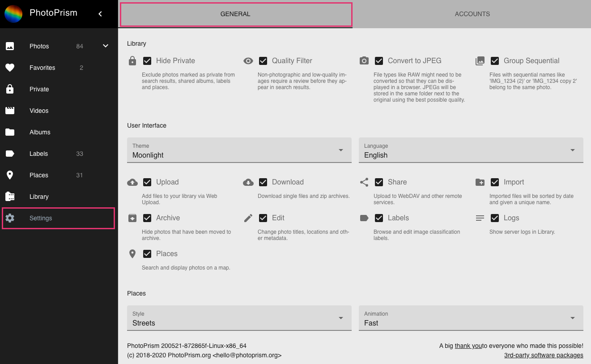

# User Interface Settings #

In *Settings* you can configure properties of your photo library, user interface and places.

### Library Settings ###
#### Hide Private :material-lock: ####
Photos/videos marked as *private* do NOT appear in *Photos*, *Videos*, *Favorites*, *Labels*, *Places* and shared albums in case this option is selected.

#### Quality Filter :material-eye: ####
When selected, non-photographic photos/videos like screenshots and low-quality photos need to be [*reviewed*](../organize/review.md) before they appear in *Photos* or *Videos*.

#### Convert to JPEG :material-camera: ####
*JPEGs* are created for *RAW files* during [*indexing*](../library/indexing.md) in case they do not yet exist. JPEGs will be stored in the same folder next to the original.

!!! attention
    In case this is disabled and there is a RAW file without a JPEG there will be no preview.
    
#### Stacks :material-image-multiple: ####
Related files will be grouped when selected.
Grouped files will have one primary file that is shown in our views. You find your grouped files in [*Stacks*](../organize/stacks.md).

PhotoPrism provides three options to group files: 

* Place & Time 
* Sequential Name
* Unique ID

### User Interface Settings ###
You can change the *theme* and *language* of the User interface.

To make PhotoPrism suite your individual needs the following sections and functionalities can be en- or disabled.
Disabled sections do not appear in the main navigation.

#### Upload :material-cloud-upload: ####
When disabled, uploading files via [*upload*](../library/upload.md) is not possible. 
This might be useful when you grant others access to your PhotoPrism but do not want them to upload photos.

#### Download :material-cloud-download: ####
When disabled, no files can be downloaded.

#### Share :material-share-variant: ####
When disabled, album sharing and upload to remote services like Nextcloud is not possible.

#### Archive :material-archive-arrow-down: ####
When disabled, there is no *Archive*. Photos that have been archived beforehand will appear in *Photos/Videos*.

#### Edit :material-pencil: ####
When disabled, it is not possible to edit photo information.

#### Originals :material-file: ####
When disabled, there is no *Originals* section.

#### Moments :material-star: ####
When disabled, there is no *Moments* section.

#### Labels :material-label: ####
When disabled, there is no *Labels* section and you cannot add or edit labels.

#### Library :material-film: ####
When disabled, there is no *Library* section.

#### Import :material-folder-plus: ####
When disabled, there is no possibility to [*import*](../library/import.md) photos. You need to use [*index*](../library/indexing.md) instead to add new photos.

#### Logs :material-text: ####
When disabled, server logs are not shown.

#### Places :material-map-marker: ####
When disabled, there is no *Places* section.

### Places Settings ####
You can configure a map style and the speed of the places animation.
