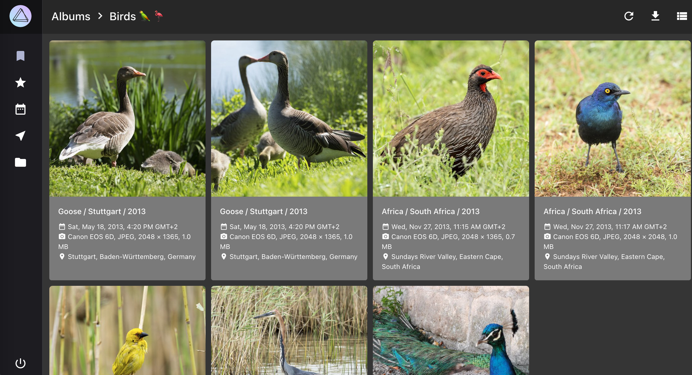
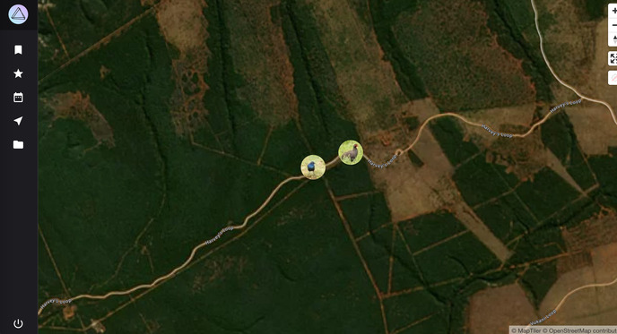
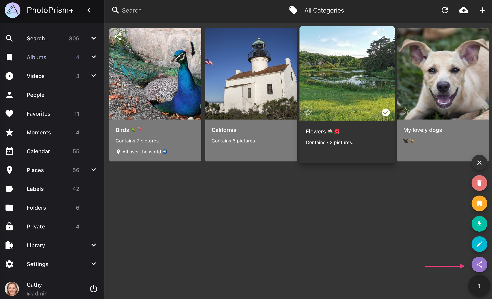
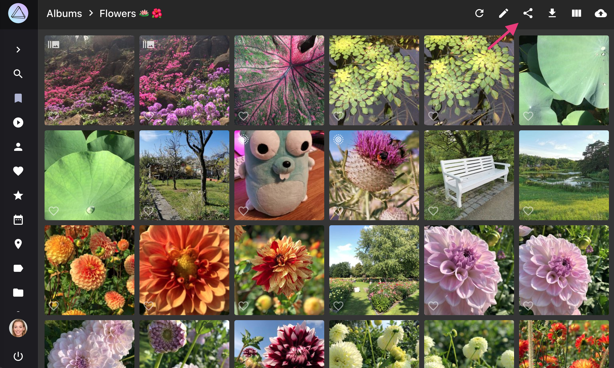
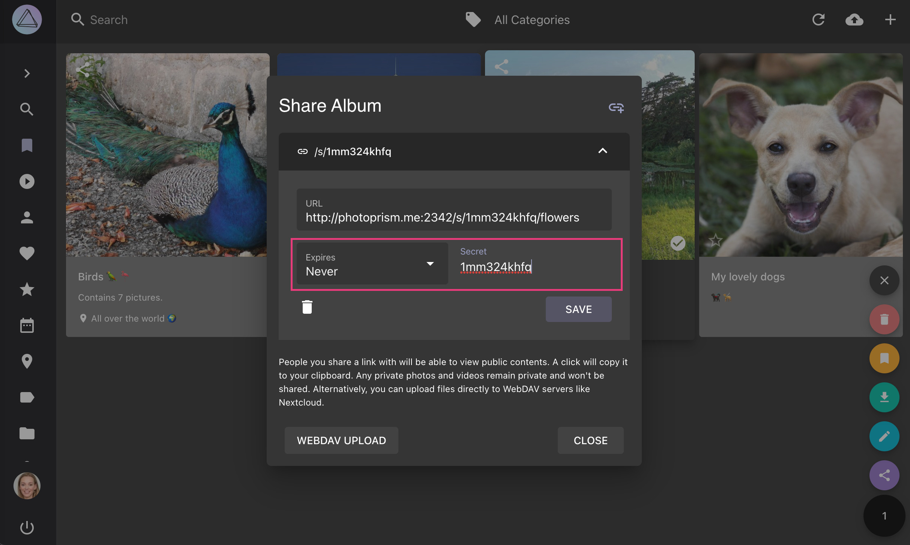
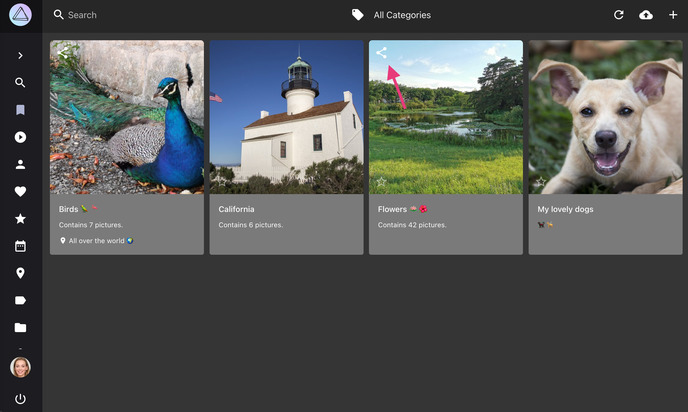
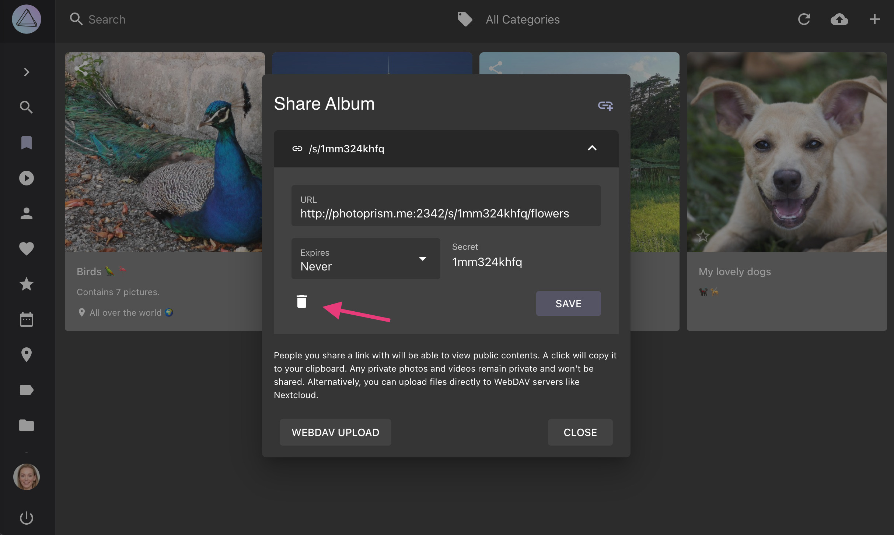

# Creating and Sharing Album Links

Secret links make it easy to share [manually created albums](../organize/albums.md) as well as selected [Moments](../organize/moments.md), [Months](../organize/calendar.md), [States](../search/index.md#states), or [Folders](../organize/folders.md) with your loved ones. You can [create multiple links](#create-sharing-link) for each album and optionally set an expiration date. While no registration is required to use the links, [sharing albums with users who have an account](../users/sharing.md) is also possible this way.

When you share an album, pictures marked as private will not be visible to others. They can view and download the non-private pictures, but they cannot modify them or their metadata.

{ class="shadow" }

!!! info ""
    When link visitors click on the location of a photo, they can view the photos of the shared album in the map view

{ class="shadow" }

Clicking :material-power: allows link visitors to end their session.

Support for optional password protection of sharing links as well as other enhancements are [planned](https://github.com/photoprism/photoprism/issues?q=is%3Aissue+is%3Aopen+sharing+in%3Atitle+label%3Aidea).

## Create Sharing Link ##

=== "Using Context Menu"
     1. Go to *Albums* / *Moments* / *Calendar* / *States* / *Folders*
     2. Select the album you want to share
     3. Open the context menu
     4. Click :material-share-variant:
    
      { class="shadow" }

=== "Via Toolbar"
     1. Go to *Albums* / *Moments* / *Calendar* / *States* / *Folders*
     2. Open the album by clicking on it
     3. Click :material-share-variant:

      { class="shadow" }

Then

5. Click :material-chevron-down: to open the *link details*
6. Set a *secret* and *expiry date*
7. Click *save*
    
    { class="shadow" }
    
8. Copy the link by clicking on it
    
    { class="shadow" }
    
9. Share it with your friends

!!!tip "Share multiple albums with one link"
    You can share multiple albums using the same link by using the same secret.

!!!tip ""
    You can create additional links with different secrets and expiry dates by clicking :material-link-plus:.

## Delete Sharing Link ##

1. Go to *Albums*
2. Click :material-share-variant: on the album cover

    { class="shadow" }
    
3. Click :material-chevron-down:
4. Click :material-delete:

     { class="shadow" }