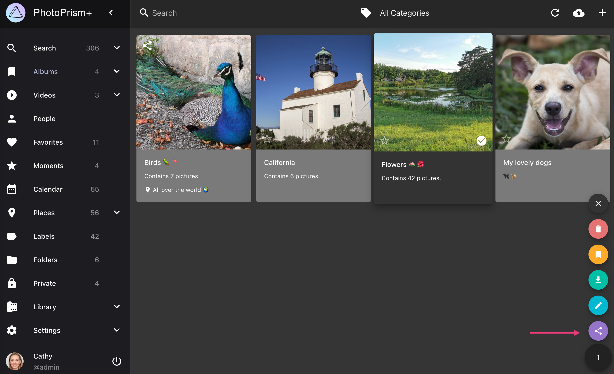
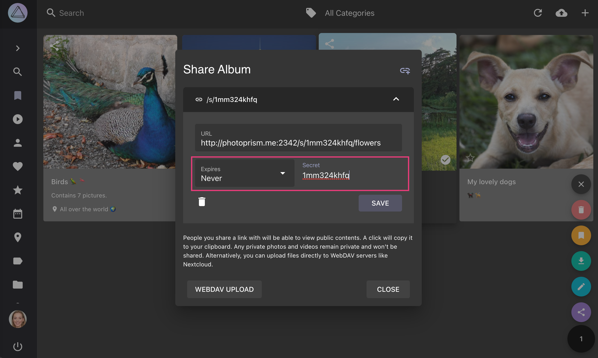
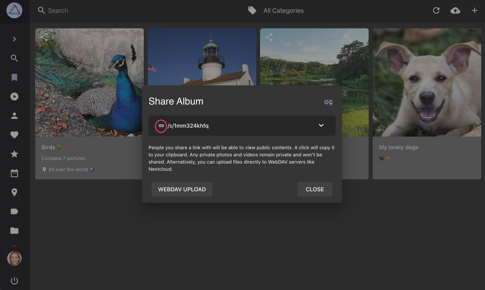
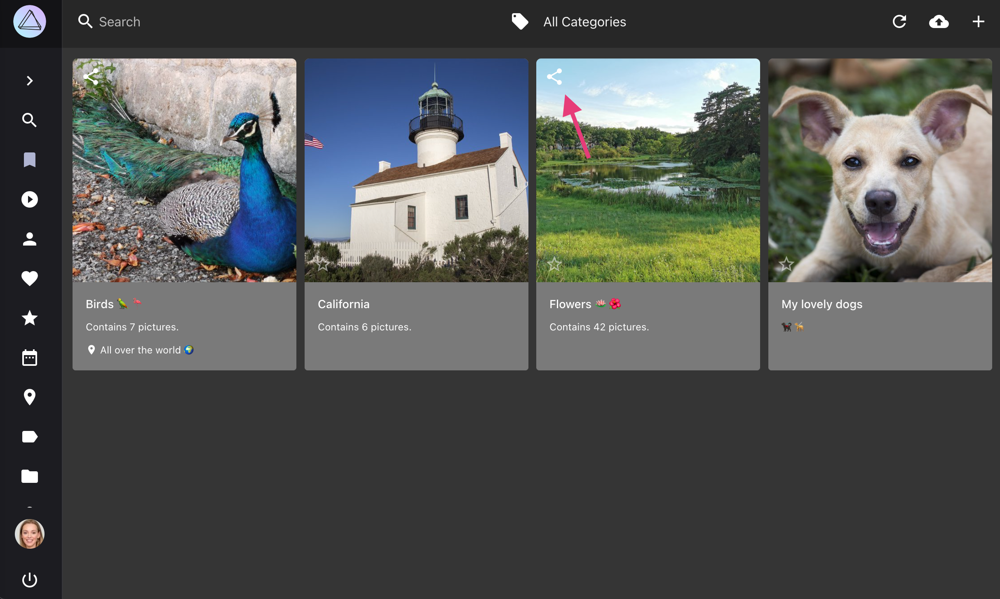

# Sharing Albums via Link #
Create sharing links to share albums, moments or folders with your friends.

Your friends are able to view and download photos from shared albums.
Photos marked as private won't show up.

{ class="shadow" }

{ class="shadow" }

Support for optional password protection of sharing links as well as other enhancements are [planned](https://github.com/photoprism/photoprism/issues?q=is%3Aissue+is%3Aopen+sharing+in%3Atitle+label%3Aidea).
## Create Sharing Link ##

=== "Using Context Menu"
     1. Go to *Albums*
     2. Select the album you want to share
     3. Open the context menu
     4. Click :material-share-variant:
    
      { class="shadow" }

=== "Via Toolbar"
     1. Go to *Albums*
     2. Open the album by clicking on it
     3. Click :material-share-variant:

      { class="shadow" }

Then

5. Click :material-chevron-down: to open the *link details*
6. Set a *secret* and *expiry date*
7. Click *save*
    
    { class="shadow" }
    
8. Copy the link by clicking on it
    
    { class="shadow" }
    
9. Share it with your friends

!!!tip ""
    You can create additional links with different secrets and expiry dates by clicking :material-link-plus:.

## Delete Sharing Link ##

1. Go to *Albums*
2. Click :material-share-variant: on the album cover

    { class="shadow" }
    
3. Click :material-chevron-down:
4. Click :material-delete:

     { class="shadow" }