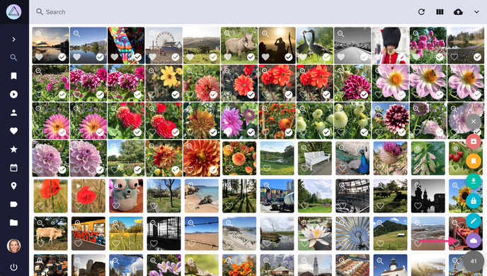
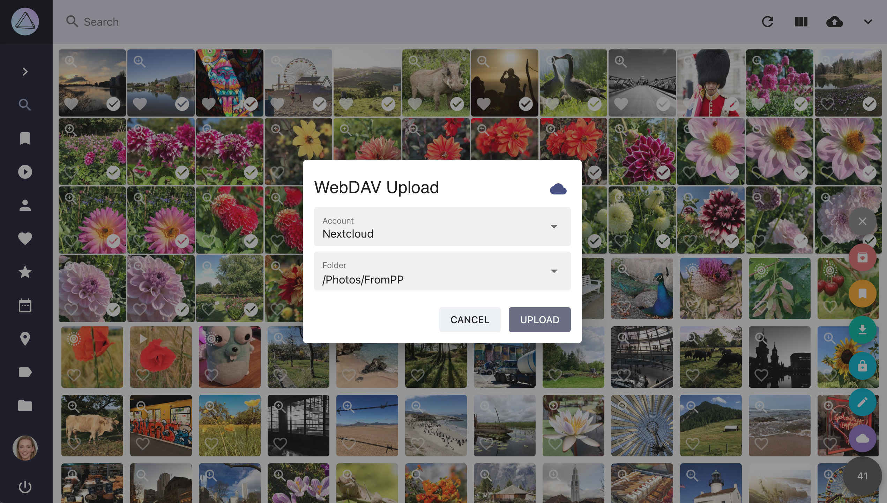
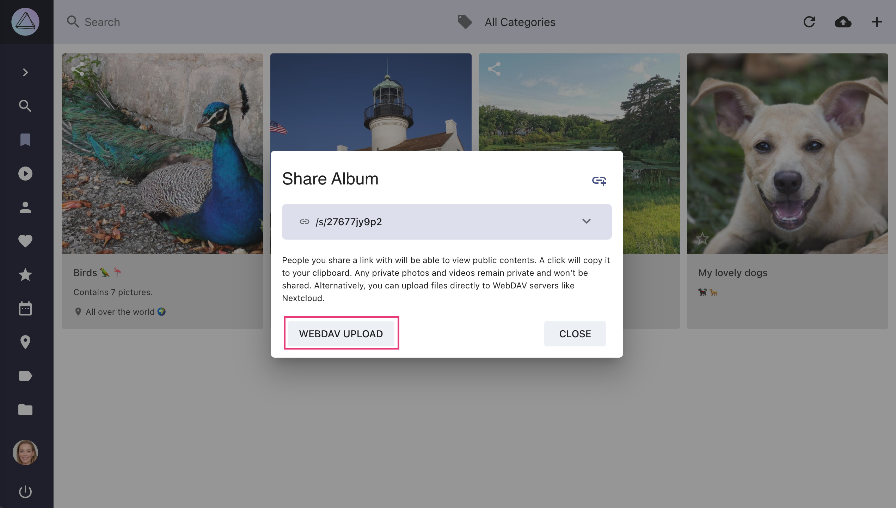
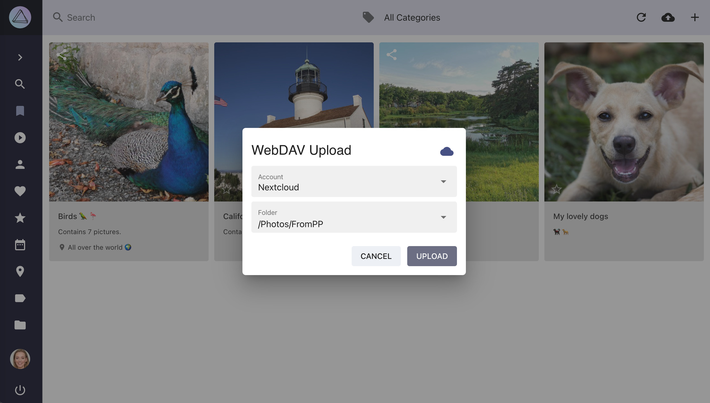

# Share with other Apps #

In [settings](../settings/sync.md) you can connect your PhotoPrism instance to other services with WebDAV support, such as other PhotoPrism instances, Nextcloud or ownCloud.

## Share Files with other Apps ##

1. Go to *Search*
2. Select photos you want to upload
3. Open the context menu
4. Click :material-cloud:
   { class="shadow" }
5. Select your account and click *upload*

{ class="shadow" }

!!! attention ""
      Due to problems with some Nextcloud settings it might be that uploading to Nextcloud results in 0 byte files. You find information on how to solve it [here](https://github.com/photoprism/photoprism/issues/443).

## Share Albums with other Apps ##

1. Go to *Albums* / *Moments* / *Calendar* / *States* / *Folders*
2. Select the album you want to share
3. Open the context menu
4. Click :material-share-variant:
5. Click *WebDAV Upload*
   { class="shadow" }
6. Select your account and click *upload*

{ class="shadow" }